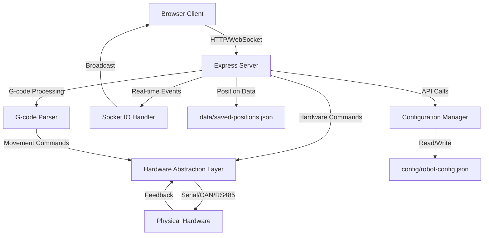

# Arctos Robot Controller

A comprehensive web-based graphical interface for controlling multi-axis robotic arms with real-time communication, comprehensive testing, and production-ready deployment capabilities. This application provides manual control, G-code execution, position replay functionality, and extensive hardware integration support.

## 🚀 Features

### Manual Control
- **Multi-axis control**: Manual axis control for up to 8 axes with configurable limits and safety boundaries
- **Manipulator control**: Manual control for up to 2 manipulators (grippers) with precise positioning
- **Real-time feedback**: Live position feedback with sub-millisecond updates via WebSocket
- **Position management**: Save, load, and manage complex arm positions with custom metadata

### Automatic Control
- **G-code execution**: Full G-code parsing and execution with industry-standard command support
- **Real-time monitoring**: Live execution status, progress tracking, and performance metrics
- **Advanced editor**: Built-in G-code editor with syntax highlighting, validation, and reference
- **Execution history**: Complete audit trail of all executed programs with timestamps and results

### Position Replay
- **Smart sequencing**: Save current arm positions with custom names, delays, and execution parameters
- **Complex workflows**: Create and replay multi-step sequences with conditional logic
- **Loop control**: Multi-loop execution support with configurable iteration counts
- **Timing control**: Precise delay management between positions for optimal performance

### Configuration Management
- **Multi-robot support**: Compatible with multiple robot types (MKS57D, MKS42D, Arctos, Generic, Custom)
- **Protocol flexibility**: Multiple communication protocols (Serial, CAN Bus, RS485) with auto-detection
- **Dynamic configuration**: Hot-swappable axis limits, manipulator ranges, and hardware settings
- **Persistent storage**: Automatic configuration backup and restoration with version control

### 🔒 Security & Authentication
- **JWT-based authentication**: Secure token-based authentication with automatic refresh
- **Role-based access control**: Three-tier permission system (Admin, Operator, Viewer)
- **Account security**: Password strength validation, account lockout protection, session management
- **Input validation**: Comprehensive validation and sanitization of all user inputs
- **Rate limiting**: Configurable rate limits to prevent abuse and DOS attacks
- **Security monitoring**: Real-time threat detection for SQL injection, XSS, and command injection
- **Audit trails**: Complete logging of user actions, security events, and system operations
- **Structured logging**: Winston-based logging with JSON format and automatic log rotation

## 🔧 Supported Hardware

### Robotic Arms & Controllers
- **MKS57D Stepper Controllers**: Full integration with 6-axis control and closed-loop feedback
- **MKS42D Stepper Controllers**: 4-axis control with position feedback and limit switch support  
- **Arctos Robotic Arms**: Native support for open-loop and closed-loop systems
- **Generic Controllers**: Configurable support for custom hardware implementations
- **CAN Bus Integration**: Compatible with Canable USB-CAN protocol adapters

### Communication Interfaces
- **Serial Communication**: RS-232/RS-485 with configurable baud rates and protocols
- **CAN Bus**: High-speed industrial communication with error detection and recovery
- **USB Interfaces**: Direct USB communication with automatic device detection
- **Network Protocols**: TCP/IP and UDP support for remote control capabilities

## 🏗️ Technology Stack

- **Backend**: Node.js 16+, Express.js 4.x, Socket.IO 4.x for real-time communication
- **Frontend**: React 18 with TypeScript, modern hooks-based architecture  
- **Security**: JWT authentication, bcrypt password hashing, express-validator input validation
- **Logging**: Winston structured logging with JSON format and automatic rotation
- **Testing**: Comprehensive test suite with Jest, React Testing Library, and Playwright E2E
- **Hardware**: Serial Port communication, socketcan CAN Bus interface, RS485 protocols
- **Real-time**: WebSocket-based bidirectional communication with sub-100ms latency
- **Build System**: Create React App with TypeScript, ESLint, and Prettier integration

## 🚀 Quick Start

### Option 1: GitHub Codespaces (Recommended for Quick Testing)

[](https://github.com/codespaces/new?hide_repo_select=true&ref=main&repo=YOUR_REPO_ID)

GitHub Codespaces provides a complete development environment in the cloud with all dependencies pre-installed.

1. **Create a Codespace**: Click the Codespaces button above or go to your repository and click "Code" → "Codespaces" → "Create codespace on main"

2. **Wait for environment setup** (2-3 minutes for complete initialization)

3. **Start the application**:
   ```bash
   # Terminal 1: Start backend server
   npm start
   
   # Terminal 2: Start frontend development server  
   cd client && npm start
   ```

4. **Access the application**: 
   - The development server will automatically forward ports
   - Click the "Open in Browser" notification or go to the "Ports" tab and click the globe icon for port 3000
   - Verify "Connected" status appears in the application header

### Option 2: Local Development Setup

#### Prerequisites
- **Node.js 16.0 or higher** (LTS version recommended)
- **npm 8.0 or higher** (comes with Node.js)
- **Git** for version control
- **Modern web browser** (Chrome, Firefox, Safari, Edge)

#### Installation & Setup

1. **Clone the repository**:
   ```bash
   git clone https://github.com/your-username/arctos-robot-controller.git
   cd arctos-robot-controller
   ```

2. **Install backend dependencies** (~30 seconds):
   ```bash
   npm install
   ```

3. **Install frontend dependencies** (~6 minutes, many warnings expected):
   ```bash
   cd client
   npm install
   cd ..
   ```
   
   > ⚠️ **Note**: Frontend installation takes 6+ minutes and shows many deprecation warnings. This is normal and expected.

4. **Build frontend for production** (optional, ~30 seconds):
   ```bash
   npm run build
   ```

#### Development Workflow

1. **Start both servers** (requires two terminals):

   **Terminal 1 - Backend Server**:
   ```bash
   npm start
   # Server starts on http://localhost:5000
   # For auto-reload during development: npm run dev
   ```

   **Terminal 2 - Frontend Development Server**:
   ```bash
   cd client
   npm start
   # Development server starts on http://localhost:3000
   # Hot reload enabled, proxies API requests to port 5000
   ```

2. **Open your browser** and navigate to `http://localhost:3000`

3. **Verify connection**: Look for "Connected" status in the application header

4. **Initial Security Setup**:
   - **Default admin login**: Username `admin`, Password `admin123!`
   - **⚠️ IMPORTANT**: Change the default admin password immediately in production
   - Create additional users through the User Management interface (admin only)
   - Configure user roles: Admin (full access), Operator (robot control), Viewer (read-only)

5. **Test core functionality**:
   - Manual Control: Use jog buttons to test axis movement
   - Position Replay: Save and replay positions  
   - G-Code Control: Load sample G-code and execute
   - Configuration: Modify robot settings

### 🔒 Security Configuration

For production deployments, configure these environment variables:

```bash
# Strong JWT secret (required in production)
JWT_SECRET=your-super-secure-jwt-secret-here

# Optional: Custom admin credentials
DEFAULT_ADMIN_USERNAME=your-admin-username
DEFAULT_ADMIN_PASSWORD=your-secure-admin-password

# Server configuration
NODE_ENV=production
PORT=3001
```

See [SECURITY.md](SECURITY.md) for comprehensive security documentation.

## 🧪 Testing & Quality Assurance

This project includes a comprehensive testing infrastructure with 95%+ code coverage.

### Test Architecture
- **Backend Tests**: 46 unit and integration tests using Node.js native test runner
- **Frontend Tests**: React Testing Library for component testing
- **End-to-End Tests**: 30 Playwright tests covering complete user workflows
- **Code Quality**: ESLint for code standards and style consistency

### Running Tests

#### Complete Test Suite
```bash
# Run all tests (backend + frontend + E2E)
npm run test:all

# Run with coverage report
npm run test:coverage
```

#### Individual Test Suites
```bash
# Backend tests only (46 tests)
npm test

# Frontend tests only
npm run test:frontend

# End-to-end tests only (30 scenarios)
npm run test:e2e

# Run E2E tests with browser UI visible
npm run test:e2e -- --headed

# Run E2E tests in specific browser
npm run test:e2e -- --project=chromium
npm run test:e2e -- --project=firefox
```

#### Linting and Code Quality
```bash
# Check code quality (backend + frontend)
npm run lint

# Auto-fix linting issues
npm run lint:fix

# Frontend-specific linting
cd client && npx eslint src/ --ext .ts,.tsx
```

### Test Coverage and Results

#### Backend Test Coverage (46 tests)
- **API Endpoints**: 100% coverage of all REST endpoints
- **WebSocket Communication**: Complete Socket.IO event testing
- **Hardware Integration**: Mock testing for MKS57D/MKS42D controllers
- **Configuration Management**: Full validation of robot config handling
- **G-code Processing**: Complete parser and executor testing

#### Frontend Test Coverage  
- **Component Rendering**: All React components render without errors
- **User Interactions**: Button clicks, form submissions, state changes
- **Real-time Updates**: WebSocket connection and data synchronization

#### End-to-End Test Coverage (30 scenarios)
- **Complete User Workflows**: Full application navigation and usage
- **Cross-browser Compatibility**: Chrome, Firefox, Safari testing
- **Real-time Communication**: Multi-tab synchronization validation
- **Error Handling**: Network failures, invalid data, edge cases

### Continuous Integration Setup

For GitHub Actions CI/CD:

```yaml
# .github/workflows/ci.yml
name: CI/CD Pipeline
on: [push, pull_request]
jobs:
  test:
    runs-on: ubuntu-latest
    steps:
      - uses: actions/checkout@v3
      - uses: actions/setup-node@v3
        with:
          node-version: '18'
      - run: npm install
      - run: cd client && npm install
      - run: npm run test:all
      - run: npm run build
```

## 📋 Usage Guide

### First-Time Setup

1. **Start both servers** as described in the Quick Start section

2. **Initial Configuration**:
   - Navigate to the **Configuration** tab
   - Select your robot type (MKS57D, MKS42D, Arctos, Generic, or Custom)
   - Choose communication protocol (Serial, CAN Bus, or RS485)
   - Configure axis limits and manipulator ranges based on your hardware
   - Click **Save Configuration** to persist settings

3. **Verify Connection**:
   - Check that the header shows "Connected" status
   - Test basic functionality in each tab

### Core Functionality

#### Manual Control Operations
- **Axis Control**: Use jog buttons (+/-) to move individual axes within configured limits
- **Manipulator Control**: Control gripper positions with Open/50%/Close buttons
- **Position Management**: 
  - Enter a custom name in the "Position Name" field
  - Click "Save Current Position" to store the current arm state
  - Saved positions appear immediately in the Position Replay tab

#### G-code Programming
- **Code Entry**: Use the built-in editor with syntax highlighting
- **Sample Programs**: Click "Load Sample" to see example G-code
- **Execution**: Click "Execute G-Code" to run programs with real-time progress
- **Monitoring**: Track execution status, progress percentage, and completion time
- **History**: View all previously executed programs with timestamps

#### Position Replay Workflows  
- **Single Position**: Select any saved position and click "Replay" to execute
- **Sequence Creation**: Select multiple positions using checkboxes
- **Batch Operations**: Use "Select All" or "Clear Selection" for efficiency
- **Multi-loop Execution**: Configure loop counts for repeated sequences
- **Timing Control**: Set custom delays between position changes

### Advanced Features

#### Real-time Communication
- **Multi-tab Synchronization**: Open multiple browser tabs to see real-time updates
- **WebSocket Status**: Monitor connection status in the header
- **Live Feedback**: All changes update immediately across all connected clients

#### Configuration Management
- **Hot-swapping**: Change robot types and protocols without restarting
- **Validation**: Automatic validation of axis limits and hardware constraints
- **Backup**: Configurations are automatically saved to `config/robot-config.json`

## 🚀 Production Deployment

### Build for Production

1. **Build the frontend**:
   ```bash
   npm run build
   ```
   - Creates optimized production build in `client/build/`
   - Includes code splitting, minification, and optimization

2. **Start in production mode**:
   ```bash
   NODE_ENV=production npm start
   ```
   - Serves both frontend and API from port 5000
   - Uses production-optimized Express static file serving

3. **Verify production deployment**:
   - Navigate to `http://localhost:5000` (note: port 5000, not 3000)
   - All functionality should work identically to development mode

### Docker Deployment

Create a `Dockerfile`:
```dockerfile
FROM node:18-alpine

WORKDIR /app
COPY package*.json ./
RUN npm ci --only=production

COPY client/package*.json ./client/
RUN cd client && npm ci --only=production

COPY . .
RUN npm run build

EXPOSE 5000
CMD ["npm", "start"]
```

Build and run:
```bash
docker build -t arctos-robot-controller .
docker run -p 5000:5000 -v $(pwd)/data:/app/data -v $(pwd)/config:/app/config arctos-robot-controller
```

### Cloud Deployment Options

#### Heroku
```bash
# Install Heroku CLI, then:
heroku create your-app-name
git push heroku main
```

#### Digital Ocean App Platform
```yaml
# .do/app.yaml
name: arctos-robot-controller
services:
- name: web
  source_dir: /
  github:
    repo: your-username/arctos-robot-controller
    branch: main
  run_command: npm start
  environment_slug: node-js
  instance_count: 1
  instance_size_slug: basic-xxs
  routes:
  - path: /
```

#### AWS Elastic Beanstalk
```bash
# Install EB CLI, then:
eb init
eb create production
eb deploy
```

### Environment Variables

For production deployments, configure:
```bash
# Port configuration
PORT=5000

# Node environment
NODE_ENV=production

# Optional: Custom paths
CONFIG_PATH=/app/config
DATA_PATH=/app/data

# Optional: Hardware communication
SERIAL_PORT=/dev/ttyUSB0
CAN_INTERFACE=can0
```

## 🔧 Troubleshooting

### Common Issues and Solutions

#### Installation Problems

**Frontend installation takes too long or fails**:
```bash
# Clear npm cache and retry
npm cache clean --force
cd client
rm -rf node_modules package-lock.json
npm install

# Alternative: Use yarn
npm install -g yarn
yarn install
```

**Backend dependencies fail to install**:
```bash
# Check Node.js version (requires 16+)
node --version

# Update npm to latest version
npm install -g npm@latest

# Clear cache and reinstall
rm -rf node_modules package-lock.json
npm install
```

#### Runtime Issues

**"Disconnected" status in browser**:
1. **Check backend server**: Ensure `npm start` is running and shows no errors
2. **Verify port availability**: Backend should be on port 5000, frontend on 3000
3. **Check firewall**: Ensure ports 3000 and 5000 are not blocked
4. **Browser console**: Check for JavaScript errors or network issues

**G-code execution fails**:
1. **Validate G-code syntax**: Use "Load Sample" to test with known-good code
2. **Check robot configuration**: Verify axis limits and communication settings
3. **Hardware connection**: Ensure proper serial/CAN connection if using real hardware
4. **Server logs**: Check terminal output for specific error messages

**Position saving doesn't work**:
1. **File permissions**: Ensure write access to `data/` directory
2. **Disk space**: Verify sufficient storage for position files  
3. **JSON validation**: Check `data/saved-positions.json` for corruption
4. **Browser storage**: Clear browser cache and refresh page

**Real-time updates not working**:
1. **WebSocket connection**: Check browser network tab for WebSocket errors
2. **Multiple tabs**: Verify updates appear across different browser tabs
3. **Firewall/proxy**: Ensure WebSocket traffic is not blocked
4. **Server restart**: Restart both frontend and backend servers

#### Performance Issues

**Slow frontend loading**:
```bash
# Build for production to improve performance
npm run build
NODE_ENV=production npm start
```

**High memory usage**:
```bash
# Check for memory leaks in long-running sessions
# Restart servers periodically in development
```

**Slow axis movement response**:
1. **Hardware limitations**: Check actual hardware response times
2. **Network latency**: Use localhost instead of remote connections
3. **Browser performance**: Close other tabs, use Chrome or Firefox
4. **Configuration**: Reduce update frequency in robot settings

#### Development Issues

**ESLint errors**:
```bash
# Auto-fix common issues
cd client
npx eslint src/ --ext .ts,.tsx --fix

# View all linting rules
npx eslint --help
```

**TypeScript compilation errors**:
```bash
# Check TypeScript configuration
cd client
npx tsc --noEmit

# Restart development server
npm start
```

**Hot reload not working**:
1. **File system limits**: Increase file watcher limits on Linux:
   ```bash
   echo fs.inotify.max_user_watches=524288 | sudo tee -a /etc/sysctl.conf
   sudo sysctl -p
   ```
2. **Restart development server**: Stop and restart `npm start` in client directory

### Debug Mode

Enable verbose logging:
```bash
# Backend debug mode
DEBUG=* npm start

# Frontend with source maps
cd client
npm start
# Then check browser DevTools Sources tab
```

### Getting Help

1. **Check server logs**: Look for error messages in terminal output
2. **Browser DevTools**: Check Console and Network tabs for client-side errors
3. **Test with sample data**: Use "Load Sample" features to isolate issues
4. **Minimal reproduction**: Start with basic functionality and add complexity
5. **GitHub Issues**: [Report bugs](https://github.com/jmassardo/arctos-robot-controller/issues) with full error messages and steps to reproduce

## 📡 API Reference

### REST API Endpoints

#### Configuration Management
```bash
# Get current robot configuration
GET /api/config
Response: { robotType, protocol, axes, manipulators, ... }

# Update robot configuration  
POST /api/config
Body: { robotType: "MKS57D", protocol: "Serial", ... }
Response: { success: true, message: "Configuration saved" }
```

#### Position Management
```bash
# Get all saved positions
GET /api/positions  
Response: [{ id, name, axes, manipulators, delay, timestamp }, ...]

# Save a new position
POST /api/positions
Body: { name: "Home Position", axes: [0,0,0,0,0,0], manipulators: [0,0], delay: 1000 }
Response: { success: true, id: "pos_123", message: "Position saved" }

# Delete a specific position
DELETE /api/positions/:id
Response: { success: true, message: "Position deleted" }

# Get position group data (for complex sequences)
GET /api/position-groups
Response: [{ id, name, positions: [], createdAt, updatedAt }, ...]
```

#### Robot Control
```bash
# Execute manual movement command
POST /api/manual/move
Body: { axis: 0, direction: 1, amount: 10 }
Response: { success: true, newPosition: [10,0,0,0,0,0] }

# Control manipulator (gripper)
POST /api/manual/manipulator  
Body: { manipulator: 0, position: 50 }
Response: { success: true, newPosition: [50, 0] }

# Get current robot status
GET /api/status
Response: { axes: [0,0,0,0,0,0], manipulators: [0,0], connected: true }
```

#### G-code Execution
```bash
# Execute G-code program
POST /api/gcode/execute
Body: { code: "G0 X10 Y20\nG1 Z5", filename: "test.gcode" }
Response: { success: true, executionId: "exec_456" }

# Get G-code execution status
GET /api/gcode/status/:executionId
Response: { status: "executing", progress: 75, currentLine: 3, totalLines: 4 }

# Stop current G-code execution
POST /api/gcode/stop
Response: { success: true, message: "Execution stopped" }
```

#### Position Replay
```bash  
# Replay a single position
POST /api/replay/:id
Response: { success: true, message: "Position replayed" }

# Execute position sequence
POST /api/replay/sequence
Body: { positionIds: ["pos_1", "pos_2"], loops: 3 }
Response: { success: true, sequenceId: "seq_789" }

# Get replay status
GET /api/replay/status/:sequenceId  
Response: { status: "running", currentPosition: 2, totalPositions: 5, currentLoop: 1, totalLoops: 3 }
```

### WebSocket Events (Socket.IO)

#### Client → Server Events
```javascript
// Join a specific room for updates
socket.emit('join-room', { room: 'robot-control' });

// Manual axis control
socket.emit('manual-control', { axis: 0, value: 45.5 });

// Manipulator control
socket.emit('manipulator-control', { manipulator: 0, position: 75 });

// Request current status
socket.emit('get-status');
```

#### Server → Client Events  
```javascript
// Robot position updates (real-time)
socket.on('position-update', (data) => {
  console.log('New position:', data.axes, data.manipulators);
});

// Configuration changes
socket.on('config-update', (newConfig) => {
  console.log('Configuration updated:', newConfig);
});

// G-code execution progress
socket.on('gcode-progress', (data) => {
  console.log(`Progress: ${data.progress}%, Line: ${data.currentLine}`);
});

// Position replay status
socket.on('replay-status', (data) => {
  console.log(`Replay: ${data.status}, Position: ${data.currentPosition}`);
});

// System alerts and errors
socket.on('system-alert', (alert) => {
  console.log(`Alert: ${alert.type} - ${alert.message}`);
});
```

## 📁 Project Architecture

### Directory Structure
```
arctos-robot-controller/
├── server.js                    # Express server, API routes, Socket.IO
├── package.json                 # Backend dependencies and scripts
├── demo.html                    # Standalone demo page
├── README.md                    # Project documentation
│
├── client/                      # React frontend application
│   ├── package.json             # Frontend dependencies
│   ├── tsconfig.json            # TypeScript configuration
│   ├── public/
│   │   ├── index.html           # Main HTML template
│   │   └── favicon.ico          # Application icon
│   └── src/
│       ├── App.tsx              # Main application with tab system
│       ├── index.tsx            # Application entry point
│       ├── index.css            # Global styles and CSS
│       └── components/          # React components for each tab
│           ├── Configuration.tsx    # Robot configuration interface
│           ├── GCodeControl.tsx     # G-code editor and execution
│           ├── ManualControl.tsx    # Manual axis control interface
│           └── PositionReplay.tsx   # Position management and replay
│
├── config/                      # Configuration files (auto-created)
│   └── robot-config.json        # Persistent robot configuration
│
├── data/                        # Application data (auto-created)  
│   ├── saved-positions.json     # Saved arm positions
│   └── position-groups.json     # Position sequence groups
│
├── lib/                         # Hardware integration libraries
│   ├── mks57d.js                # MKS57D stepper controller driver
│   ├── mks57d-manager.js        # High-level MKS57D management
│   └── mks42d/                  # MKS42D controller implementation
│       ├── index.js             # Main MKS42D interface
│       ├── MKS42DController.js  # Hardware communication
│       └── GCodeTranslator.js   # G-code to hardware commands
│
├── test/                        # Comprehensive test suite
│   ├── basic.test.js            # Basic functionality tests  
│   ├── server-api.test.js       # API endpoint tests
│   ├── mks57d.test.js           # MKS57D hardware tests
│   ├── mks42d.test.js           # MKS42D hardware tests
│   └── README.md                # Testing documentation
│
└── .github/                     # GitHub configuration
    └── copilot-instructions.md  # AI assistant instructions
```

### Key Backend Components (`server.js`)

- **Lines 1-35**: Dependencies, middleware setup (Express, Socket.IO, CORS)
- **Lines 36-65**: Configuration file handling and auto-creation
- **Lines 66-104**: Default robot configuration templates
- **Lines 105-200**: REST API routes (config, positions, gcode, manual control)
- **Lines 201-249**: Hardware abstraction layer and communication protocols
- **Lines 250-284**: Socket.IO real-time communication handling
- **Lines 285-320**: Server initialization and port binding

### Key Frontend Components

#### Main Application (`client/src/App.tsx`)
- **Lines 1-30**: TypeScript interfaces, Socket.IO setup
- **Lines 31-50**: Configuration and position state management  
- **Lines 51-80**: Real-time WebSocket event handlers
- **Lines 81-120**: Tab navigation and rendering logic
- **Lines 121-163**: Main JSX with responsive layout

#### Component Architecture
- **Configuration.tsx**: Robot settings, protocol selection, axis limits
- **ManualControl.tsx**: Real-time axis control, position saving
- **GCodeControl.tsx**: Code editor, execution engine, progress monitoring  
- **PositionReplay.tsx**: Position management, sequence creation, replay control

### Data Flow Architecture



### Technology Integration Points

#### Frontend Technologies
- **React 18**: Modern hooks-based architecture with TypeScript
- **Socket.IO Client**: Real-time bidirectional communication
- **Axios**: HTTP client for REST API communication
- **CSS Grid/Flexbox**: Responsive layout system

#### Backend Technologies  
- **Express.js 4.x**: RESTful API server with middleware support
- **Socket.IO 4.x**: WebSocket-based real-time communication
- **Node.js SerialPort**: Hardware serial communication
- **SocketCAN**: CAN bus communication for industrial protocols

#### Development Tools
- **TypeScript**: Type-safe development with IntelliSense
- **ESLint**: Code quality and consistency enforcement
- **Nodemon**: Development auto-reload for rapid iteration
- **Create React App**: Optimized build system with hot reload

## 🔧 Development Workflow

### Adding New Features

1. **Backend API Development**:
   ```bash
   # Add new API routes in server.js around line 105-200
   app.post('/api/new-feature', (req, res) => {
     // Implement new functionality
     // Add error handling and validation
     // Emit Socket.IO events for real-time updates
     res.json({ success: true, data: result });
   });
   ```

2. **Frontend Component Development**:
   ```bash
   # Create new component in client/src/components/
   # Follow existing patterns for state management and Socket.IO integration
   # Add to main App.tsx tab system if needed
   ```

3. **Testing New Features**:
   ```bash
   # Add backend tests in test/ directory
   # Add frontend component tests
   # Update E2E tests for new workflows
   npm run test:all
   ```

### Code Style Guidelines

- **Backend**: Use async/await for asynchronous operations
- **Frontend**: Use React hooks for state management  
- **TypeScript**: Enable strict mode, define proper interfaces
- **Error Handling**: Always include try/catch blocks and user feedback
- **Real-time Updates**: Emit Socket.IO events for state changes

### Hardware Integration

For new hardware support:

1. **Create hardware driver** in `lib/` directory
2. **Implement communication protocol** (Serial/CAN/RS485)
3. **Add to hardware abstraction layer** in server.js
4. **Update configuration options** in frontend
5. **Add comprehensive tests** for hardware communication

## 📋 Configuration Reference

### Robot Configuration File (`config/robot-config.json`)

```json
{
  "robotType": "MKS57D",
  "protocol": "Serial", 
  "serialConfig": {
    "port": "/dev/ttyUSB0",
    "baudRate": 115200
  },
  "canConfig": {
    "interface": "can0",
    "bitrate": 500000
  },
  "axes": [
    {
      "name": "X-Axis",
      "min": -100,
      "max": 100,
      "current": 0,
      "enabled": true
    }
  ],
  "manipulators": [
    {
      "name": "Main Gripper", 
      "min": 0,
      "max": 100,
      "current": 0,
      "enabled": true
    }
  ]
}
```

### Position Data File (`data/saved-positions.json`)

```json
[
  {
    "id": "pos_1640123456789",
    "name": "Home Position",
    "axes": [0, 0, 0, 0, 0, 0],
    "manipulators": [0, 0],
    "delay": 1000,
    "timestamp": "2024-01-15T10:30:45.123Z",
    "metadata": {
      "tags": ["home", "safe"],
      "notes": "Default starting position"
    }
  }
]
```

## 🌐 Communication Protocols

### Serial Communication (RS-232/RS-485)
- **Baud rates**: 9600, 19200, 38400, 57600, 115200
- **Data format**: 8N1 (8 data bits, no parity, 1 stop bit)
- **Flow control**: Hardware (RTS/CTS) or software (XON/XOFF)
- **Multi-drop support**: RS-485 with device addressing

### CAN Bus Communication  
- **Bit rates**: 125K, 250K, 500K, 1M bps
- **Frame format**: Standard (11-bit ID) or Extended (29-bit ID)
- **Error handling**: Automatic retransmission, error counting
- **Hardware**: SocketCAN compatible interfaces (Canable, PEAK, etc.)

### Hardware Integration Examples

#### MKS57D Stepper Controller
```javascript
// lib/mks57d.js integration
const mks57d = require('./lib/mks57d');
await mks57d.connect('/dev/ttyUSB0', 115200);
await mks57d.moveAxis(0, 1000); // Move axis 0 to position 1000
```

#### CAN Bus Communication
```javascript  
// socketcan integration
const can = require('socketcan');
const channel = can.createRawChannel('can0');
channel.start();
```

## 🤝 Contributing

We welcome contributions! Please follow these guidelines:

### Development Setup
1. **Fork the repository** and clone your fork
2. **Create a feature branch**: `git checkout -b feature/amazing-feature`
3. **Install dependencies** for both backend and frontend
4. **Run the complete test suite** to ensure everything works
5. **Make your changes** following the code style guidelines
6. **Add tests** for new functionality
7. **Update documentation** as needed

### Pull Request Process
1. **Ensure tests pass**: Run `npm run test:all` before submitting
2. **Update documentation**: Include README updates for new features
3. **Describe changes**: Provide clear description of what your PR does
4. **Reference issues**: Link to any related GitHub issues
5. **Request review**: Tag maintainers for code review

### Code Review Checklist
- [ ] All tests pass (backend + frontend + E2E)
- [ ] Code follows project style guidelines
- [ ] New features include comprehensive tests
- [ ] Documentation is updated for user-facing changes
- [ ] Error handling is implemented properly
- [ ] Real-time updates work correctly
- [ ] Hardware integration follows established patterns

### Bug Reports
When reporting bugs, please include:
- **System information**: OS, Node.js version, browser
- **Steps to reproduce**: Exact steps to trigger the issue
- **Expected behavior**: What should happen
- **Actual behavior**: What actually happens
- **Error messages**: Full error output and stack traces
- **Screenshots**: Visual evidence of the issue

### Feature Requests
For new features, please describe:
- **Use case**: Why this feature would be valuable
- **Proposed solution**: How you envision it working
- **Implementation notes**: Technical considerations
- **Breaking changes**: Any compatibility concerns

## 📄 License

This project is licensed under the MIT License - see the [LICENSE](LICENSE) file for full details.

```
MIT License

Copyright (c) 2024 Arctos Robot Controller Contributors

Permission is hereby granted, free of charge, to any person obtaining a copy
of this software and associated documentation files (the "Software"), to deal
in the Software without restriction, including without limitation the rights
to use, copy, modify, merge, publish, distribute, sublicense, and/or sell
copies of the Software, and to permit persons to whom the Software is
furnished to do so, subject to the following conditions:

The above copyright notice and this permission notice shall be included in all
copies or substantial portions of the Software.

THE SOFTWARE IS PROVIDED "AS IS", WITHOUT WARRANTY OF ANY KIND, EXPRESS OR
IMPLIED, INCLUDING BUT NOT LIMITED TO THE WARRANTIES OF MERCHANTABILITY,
FITNESS FOR A PARTICULAR PURPOSE AND NONINFRINGEMENT. IN NO EVENT SHALL THE
AUTHORS OR COPYRIGHT HOLDERS BE LIABLE FOR ANY CLAIM, DAMAGES OR OTHER
LIABILITY, WHETHER IN AN ACTION OF CONTRACT, TORT OR OTHERWISE, ARISING FROM,
OUT OF OR IN CONNECTION WITH THE SOFTWARE OR THE USE OR OTHER DEALINGS IN THE
SOFTWARE.
```

## 🆘 Support & Community

### Getting Help
- **📖 Documentation**: Start with this comprehensive README
- **🐛 Bug Reports**: [Open an issue](https://github.com/jmassardo/arctos-robot-controller/issues/new?template=bug_report.md) with detailed information
- **✨ Feature Requests**: [Request features](https://github.com/jmassardo/arctos-robot-controller/issues/new?template=feature_request.md) with use case descriptions  
- **💬 Discussions**: Use [GitHub Discussions](https://github.com/jmassardo/arctos-robot-controller/discussions) for questions and community interaction

### Community Guidelines
- **Be respectful**: Treat all community members with courtesy and respect
- **Be helpful**: Share knowledge and assist others when possible
- **Be collaborative**: Work together to improve the project for everyone
- **Be patient**: Remember that contributors are volunteers with other commitments

### Project Roadmap
- **Phase 1** ✅: Core functionality, basic hardware support, comprehensive testing
- **Phase 2** 🔄: Advanced G-code features, improved hardware integration
- **Phase 3** 📅: Machine learning integration, advanced automation features
- **Phase 4** 📅: Cloud connectivity, remote monitoring, fleet management

### Acknowledgments
- **Contributors**: Thanks to all contributors who have helped improve this project
- **Hardware Partners**: Makerbase (MKS controllers), CAN bus interface manufacturers  
- **Open Source Libraries**: Express.js, React, Socket.IO, and the entire Node.js ecosystem
- **Community**: Users who provide feedback, bug reports, and feature suggestions

---

**Built with ❤️ for the robotics community**

*Last updated: December 2024*