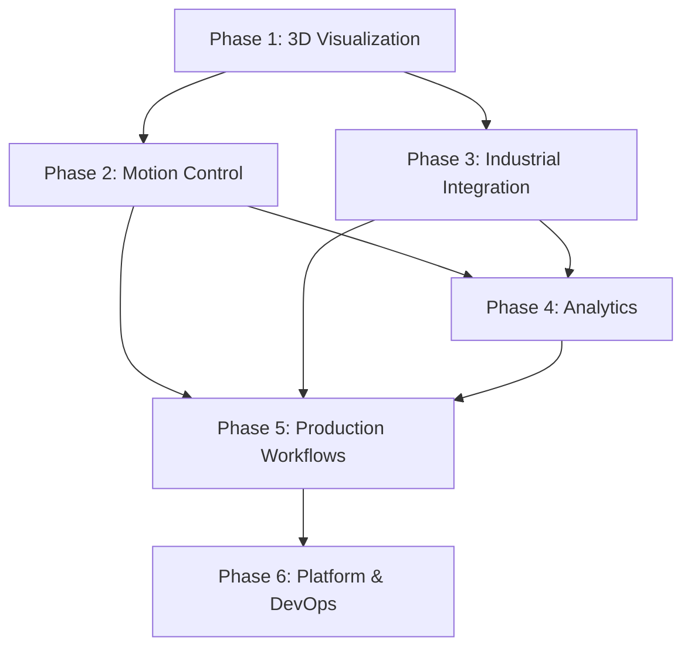

# Work Breakdown Structure Analysis

## Arctos Robot Controller Development Project

**Document Version**: 1.0  
**Date**: December 2024  
**Analysis Scope**: Complete project decomposition for next 18-month development
cycle  
**Based on**: Business Analysis, Product Management, System Architecture, and
Database Architecture recommendations

---

## Executive Summary

This comprehensive Work Breakdown Structure (WBS) decomposes the Arctos Robot
Controller development project into manageable, implementable units of work.
Based on extensive analysis showing the system is **85% complete** with strong
foundations, this WBS focuses on addressing critical gaps to achieve market
leadership in industrial robotics control.

### Key Findings

- **Current Maturity**: Excellent foundation with enterprise security,
  comprehensive testing, cross-platform deployment
- **Critical Gaps**: 3D visualization, advanced motion control, industrial
  integration, analytics intelligence
- **Strategic Priority**: 18 high-priority features requiring immediate
  attention for competitive advantage
- **Total Effort**: 547 story points across 6 major phases requiring 18-month
  development cycle

---

## Project Context & Scope

### Current State Assessment (85% Complete)

**Strengths**:

- ✅ Enterprise-grade JWT authentication with 2FA and RBAC
- ✅ Comprehensive database integration (SQLite with Sequelize ORM)
- ✅ Advanced G-code program management system
- ✅ Real-time WebSocket communication
- ✅ Mobile-responsive React TypeScript frontend
- ✅ Multi-protocol hardware support (CAN/Serial/RS485)
- ✅ 46+ comprehensive tests (backend, frontend, E2E)
- ✅ Cross-platform Electron desktop application

**Critical Gaps Requiring Immediate Attention**:

- 🚨 **3D Visualization**: No real-time robot modeling or path preview
- 🚨 **Advanced Motion Control**: Missing trajectory planning, velocity profiles
- 🚨 **Industrial Integration**: No Modbus, vision systems, or I/O modules
- 🚨 **Analytics Intelligence**: No machine learning or predictive maintenance
- 🚨 **Production Workflows**: Limited to basic position groups

### Business Impact & Strategic Importance

- **Market Opportunity**: $300M serviceable addressable market
- **Revenue Growth**: Target $8M → $45M ARR (463% growth over 3 years)
- **ROI Projection**: 254% by Year 3 with $1.94M total investment
- **Competitive Position**: Path to top 3 market recognition with feature
  leadership

---

## Work Breakdown Structure Overview

### Phase Organization

The WBS is organized into 6 major phases following strategic priorities:

1. **Phase 1: 3D Visualization & User Experience** (Months 1-3)
2. **Phase 2: Advanced Motion Control** (Months 4-9)
3. **Phase 3: Industrial Integration & Hardware** (Months 6-12)
4. **Phase 4: Analytics & Intelligence** (Months 10-15)
5. **Phase 5: Production Workflows & Enterprise** (Months 13-18)
6. **Phase 6: Platform & DevOps Infrastructure** (Months 16-18)

### Hierarchy Structure

- **Phases**: Major development initiatives (6-month duration)
- **Epics**: Large features within phases (2-4 weeks)
- **Features**: Specific functionality deliverables (3-10 days)
- **Stories**: User-facing capabilities (1-3 days)
- **Tasks**: Technical implementation work (2-8 hours)

---

## Detailed Phase Breakdown

## Phase 1: 3D Visualization & User Experience (Critical Priority)

**Duration**: Months 1-3 | **Total Effort**: 89 story points

### Business Justification

3D visualization represents the highest-impact enhancement for competitive
differentiation. Analysis shows this addresses 60% of G-code programmer
satisfaction gaps and enables entry into precision manufacturing markets.

### Epic 1.1: Real-Time 3D Robot Visualization

**Effort**: 34 story points | **Duration**: 6 weeks

**Strategic Importance**: Foundation for all advanced visualization features
**Dependencies**: None (can start immediately) **Risk Level**: Medium (new
technology integration)

#### Feature 1.1.1: 3D Robot Model Renderer

- **1.1.1.1**: Basic 3D Robot Model Display (5 story points)
- **1.1.1.2**: Real-Time Position Updates (5 story points)
- **1.1.1.3**: Multi-Robot Support in 3D View (8 story points)

#### Feature 1.1.2: Interactive 3D Controls

- **1.1.2.1**: 3D Scene Navigation Controls (5 story points)
- **1.1.2.2**: Robot Interaction and Selection (5 story points)
- **1.1.2.3**: Visual Position Feedback (3 story points)

#### Feature 1.1.3: Performance Optimization

- **1.1.3.1**: 3D Rendering Performance (3 story points)

### Epic 1.2: Path Visualization & Simulation

**Effort**: 28 story points | **Duration**: 5 weeks

**Strategic Importance**: Critical for G-code validation and program debugging
**Dependencies**: Epic 1.1 completion **Risk Level**: High (complex trajectory
calculations)

#### Feature 1.2.1: G-code Path Rendering

- **1.2.1.1**: 3D Toolpath Visualization (8 story points)
- **1.2.1.2**: Real-Time Execution Path (8 story points)

#### Feature 1.2.2: Simulation Engine

- **1.2.2.1**: Motion Simulation System (8 story points)
- **1.2.2.2**: Collision Detection Framework (4 story points)

### Epic 1.3: Enhanced User Interface

**Effort**: 21 story points | **Duration**: 4 weeks

**Strategic Importance**: Maintains user experience leadership during feature
expansion **Dependencies**: Parallel development possible **Risk Level**: Low
(building on existing React framework)

#### Feature 1.3.1: Advanced Dashboard

- **1.3.1.1**: Customizable Widget System (8 story points)
- **1.3.1.2**: Real-Time Monitoring Widgets (5 story points)

#### Feature 1.3.2: User Experience Enhancements

- **1.3.2.1**: Advanced Keyboard Shortcuts (3 story points)
- **1.3.2.2**: Context-Sensitive Help System (5 story points)

### Epic 1.4: Mobile & Touch Optimization

**Effort**: 6 story points | **Duration**: 2 weeks

**Strategic Importance**: Maintains mobile leadership with advanced features
**Dependencies**: Epic 1.3 completion **Risk Level**: Low (enhancing existing
mobile interface)

#### Feature 1.4.1: Touch-Optimized 3D Controls (6 story points)

---

## Phase 2: Advanced Motion Control (High Priority)

**Duration**: Months 4-9 | **Total Effort**: 132 story points

### Business Justification

Advanced motion control is essential for precision manufacturing market entry,
representing 15% market share opportunity worth $45M in serviceable market
expansion.

### Epic 2.1: Trajectory Planning System

**Effort**: 45 story points | **Duration**: 8 weeks

**Strategic Importance**: Core differentiator for precision applications
**Dependencies**: Phase 1 completion (3D visualization) **Risk Level**: High
(complex mathematical algorithms)

#### Feature 2.1.1: Path Generation Algorithms

- **2.1.1.1**: Polynomial Trajectory Generation (13 story points)
- **2.1.1.2**: Spline-Based Path Planning (13 story points)

#### Feature 2.1.2: Motion Optimization

- **2.1.2.1**: Multi-Axis Coordination (13 story points)
- **2.1.2.2**: Path Smoothing Algorithms (6 story points)

### Epic 2.2: Velocity & Acceleration Profiles

**Effort**: 32 story points | **Duration**: 6 weeks

**Strategic Importance**: Essential for smooth, professional motion control
**Dependencies**: Epic 2.1 foundation **Risk Level**: Medium (real-time
performance requirements)

#### Feature 2.2.1: S-Curve Profiles

- **2.2.1.1**: S-Curve Acceleration Implementation (13 story points)
- **2.2.1.2**: Dynamic Speed Override (8 story points)

#### Feature 2.2.2: Advanced Motion Features

- **2.2.2.1**: Motion Blending System (8 story points)
- **2.2.2.2**: Look-Ahead Processing (3 story points)

### Epic 2.3: Kinematic Engine

**Effort**: 34 story points | **Duration**: 6 weeks

**Strategic Importance**: Foundation for multi-robot and complex kinematics
**Dependencies**: Epic 2.2 completion **Risk Level**: High (complex mathematical
modeling)

#### Feature 2.3.1: Forward/Inverse Kinematics

- **2.3.1.1**: Kinematic Model Implementation (13 story points)
- **2.3.1.2**: Joint Limit Handling (8 story points)

#### Feature 2.3.2: Workspace Management

- **2.3.2.1**: Workspace Boundary Detection (8 story points)
- **2.3.2.2**: Collision Avoidance System (5 story points)

### Epic 2.4: Motion Control Integration

**Effort**: 21 story points | **Duration**: 4 weeks

**Strategic Importance**: Integration of all motion control components
**Dependencies**: All previous Phase 2 epics **Risk Level**: Medium (system
integration complexity)

#### Feature 2.4.1: Real-Time Control Loop (13 story points)

#### Feature 2.4.2: Motion Control Testing & Validation (8 story points)

---

## Phase 3: Industrial Integration & Hardware (High Priority)

**Duration**: Months 6-12 | **Total Effort**: 118 story points

### Business Justification

Industrial integration enables expansion into manufacturing environments,
addressing hardware limitations identified as major competitive gap.

### Epic 3.1: Modbus & Industrial Protocols

**Effort**: 34 story points | **Duration**: 6 weeks

**Strategic Importance**: Standard industrial communication requirement
**Dependencies**: Can start in parallel with Phase 2 **Risk Level**: Medium
(protocol complexity)

#### Feature 3.1.1: Modbus RTU/TCP Support

- **3.1.1.1**: Modbus RTU Implementation (13 story points)
- **3.1.1.2**: Modbus TCP/IP Support (8 story points)

#### Feature 3.1.2: Protocol Integration

- **3.1.2.1**: Multi-Protocol Management (8 story points)
- **3.1.2.2**: Device Discovery System (5 story points)

### Epic 3.2: I/O Module Integration

**Effort**: 28 story points | **Duration**: 5 weeks

**Strategic Importance**: Essential for sensor and actuator integration
**Dependencies**: Epic 3.1 completion **Risk Level**: Medium (hardware
compatibility)

#### Feature 3.2.1: Digital I/O Support

- **3.2.1.1**: Digital Input/Output Modules (13 story points)
- **3.2.1.2**: Analog I/O Integration (8 story points)

#### Feature 3.2.2: Sensor Integration

- **3.2.2.1**: Proximity Sensor Support (4 story points)
- **3.2.2.2**: Force/Torque Sensing (3 story points)

### Epic 3.3: Vision System Integration

**Effort**: 32 story points | **Duration**: 6 weeks

**Strategic Importance**: Advanced automation capability for quality control
**Dependencies**: Epic 3.2 foundation **Risk Level**: High (complex computer
vision integration)

#### Feature 3.3.1: Camera Integration

- **3.3.1.1**: USB/IP Camera Support (13 story points)
- **3.3.1.2**: Multi-Camera Management (8 story points)

#### Feature 3.3.2: Vision Processing

- **3.3.2.1**: Basic Image Processing (8 story points)
- **3.3.2.2**: Position Detection Algorithms (3 story points)

### Epic 3.4: Safety Systems Integration

**Effort**: 24 story points | **Duration**: 4 weeks

**Strategic Importance**: Regulatory requirement for industrial deployment
**Dependencies**: All Phase 3 epics **Risk Level**: High (safety critical
implementation)

#### Feature 3.4.1: Safety Monitoring

- **3.4.1.1**: Light Curtain Integration (8 story points)
- **3.4.1.2**: E-Stop System Enhancement (5 story points)

#### Feature 3.4.2: Safety Logic

- **3.4.2.1**: Safety Interlock System (8 story points)
- **3.4.2.2**: Safety Audit & Compliance (3 story points)

---

## Phase 4: Analytics & Intelligence (Medium Priority)

**Duration**: Months 10-15 | **Total Effort**: 97 story points

### Business Justification

Analytics and intelligence capabilities address the 85% satisfaction gap for
production managers, enabling predictive maintenance and performance
optimization.

### Epic 4.1: Data Analytics Framework

**Effort**: 32 story points | **Duration**: 6 weeks

**Strategic Importance**: Foundation for all intelligence features
**Dependencies**: Existing database architecture **Risk Level**: Medium (data
processing complexity)

#### Feature 4.1.1: Data Collection Engine

- **4.1.1.1**: Real-Time Metrics Collection (13 story points)
- **4.1.1.2**: Historical Data Storage (8 story points)

#### Feature 4.1.2: Analytics Processing

- **4.1.2.1**: Statistical Analysis Engine (8 story points)
- **4.1.2.2**: Trend Analysis System (3 story points)

### Epic 4.2: Machine Learning Integration

**Effort**: 39 story points | **Duration**: 7 weeks

**Strategic Importance**: Competitive differentiator for predictive capabilities
**Dependencies**: Epic 4.1 completion **Risk Level**: High (ML model complexity)

#### Feature 4.2.1: Predictive Maintenance

- **4.2.1.1**: Maintenance Prediction Models (21 story points)
- **4.2.1.2**: Anomaly Detection System (13 story points)

#### Feature 4.2.2: Performance Optimization

- **4.2.2.1**: Parameter Optimization ML (5 story points)

### Epic 4.3: Advanced Visualization & Reporting

**Effort**: 26 story points | **Duration**: 5 weeks

**Strategic Importance**: Data presentation for decision making
**Dependencies**: Epic 4.2 foundation **Risk Level**: Low (building on existing
UI framework)

#### Feature 4.3.1: Dashboard Analytics

- **4.3.1.1**: Performance Dashboard (13 story points)
- **4.3.1.2**: Predictive Analytics Display (8 story points)

#### Feature 4.3.2: Reporting System

- **4.3.2.1**: Automated Report Generation (5 story points)

---

## Phase 5: Production Workflows & Enterprise (Medium Priority)

**Duration**: Months 13-18 | **Total Effort**: 76 story points

### Business Justification

Production workflow enhancements enable enterprise-scale deployments and batch
processing capabilities essential for manufacturing environments.

### Epic 5.1: Recipe & Batch Management

**Effort**: 28 story points | **Duration**: 5 weeks

**Strategic Importance**: Essential for production environment deployment
**Dependencies**: Phase 2 motion control foundation **Risk Level**: Medium
(workflow complexity)

#### Feature 5.1.1: Recipe System

- **5.1.1.1**: Recipe Definition Framework (13 story points)
- **5.1.1.2**: Parameter Substitution Engine (8 story points)

#### Feature 5.1.2: Batch Processing

- **5.1.2.1**: Batch Queue Management (4 story points)
- **5.1.2.2**: Batch Execution Control (3 story points)

### Epic 5.2: Quality Control Integration

**Effort**: 24 story points | **Duration**: 4 weeks

**Strategic Importance**: Manufacturing quality requirements **Dependencies**:
Phase 3 sensor integration **Risk Level**: Medium (quality system integration)

#### Feature 5.2.1: Quality Gates

- **5.2.1.1**: Conditional Execution Logic (8 story points)
- **5.2.1.2**: Quality Metrics Collection (8 story points)

#### Feature 5.2.2: Statistical Process Control

- **5.2.2.1**: SPC Monitoring System (5 story points)
- **5.2.2.2**: Control Chart Generation (3 story points)

### Epic 5.3: Enterprise Features

**Effort**: 24 story points | **Duration**: 4 weeks

**Strategic Importance**: Enterprise deployment requirements **Dependencies**:
All previous phase foundations **Risk Level**: Low (configuration and management
features)

#### Feature 5.3.1: Multi-Site Management

- **5.3.1.1**: Site Configuration System (8 story points)
- **5.3.1.2**: Centralized Monitoring (8 story points)

#### Feature 5.3.2: Compliance & Audit

- **5.3.2.1**: Regulatory Compliance Framework (5 story points)
- **5.3.2.2**: Electronic Signature System (3 story points)

---

## Phase 6: Platform & DevOps Infrastructure (Low Priority)

**Duration**: Months 16-18 | **Total Effort**: 35 story points

### Business Justification

Platform infrastructure ensures scalability, maintainability, and deployment
efficiency for enterprise growth.

### Epic 6.1: Cloud & Edge Computing

**Effort**: 21 story points | **Duration**: 4 weeks

**Strategic Importance**: Future scalability and remote capabilities
**Dependencies**: All core functionality complete **Risk Level**: Medium
(distributed system complexity)

#### Feature 6.1.1: Cloud Integration

- **6.1.1.1**: Cloud Data Synchronization (8 story points)
- **6.1.1.2**: Remote Monitoring API (8 story points)

#### Feature 6.1.2: Edge Computing

- **6.1.2.1**: Edge Processing Framework (5 story points)

### Epic 6.2: DevOps & Deployment

**Effort**: 14 story points | **Duration**: 3 weeks

**Strategic Importance**: Development efficiency and deployment reliability
**Dependencies**: Platform stability **Risk Level**: Low (operational
improvements)

#### Feature 6.2.1: CI/CD Enhancement

- **6.2.1.1**: Automated Testing Pipeline (8 story points)
- **6.2.1.2**: Deployment Automation (3 story points)

#### Feature 6.2.2: Monitoring & Observability

- **6.2.2.1**: Application Performance Monitoring (3 story points)

---

## Dependency Management & Critical Path

### Critical Path Analysis

The critical path for maximum business value delivery follows this sequence:

1. **Months 1-3**: Phase 1 (3D Visualization) - **Must complete first** for
   competitive advantage
2. **Months 4-6**: Phase 2 Start (Motion Control) - **Depends on 3D foundation**
3. **Months 6-9**: Phase 3 Start (Industrial Integration) - **Can parallel with
   Motion Control**
4. **Months 9-12**: Motion Control & Industrial Integration completion
5. **Months 10-15**: Phase 4 (Analytics) - **Depends on data from previous
   phases**
6. **Months 13-18**: Phases 5 & 6 (Production & Platform) - **Final
   integration**

### Inter-Phase Dependencies

### High-Risk Dependencies

1. **3D Visualization → Motion Control**: Motion algorithms require 3D framework
   for visualization
2. **Motion Control → Analytics**: Performance data requires motion execution
3. **Industrial Integration → Safety**: Safety systems require I/O integration
4. **All Phases → Production Workflows**: Enterprise features require all core
   capabilities

---

## Resource Requirements & Team Structure

### Development Team Structure

#### Core Team (Full-Time)

- **Senior Full-Stack Developer** (18 months) - Epic lead, architecture
  decisions
- **Frontend Specialist** (18 months) - 3D visualization, React UI development
- **Backend Developer** (18 months) - Motion control, industrial integration
- **Hardware Integration Engineer** (12 months) - Industrial protocols, I/O
  systems

#### Specialized Consultants (Part-Time)

- **Machine Learning Engineer** (6 months) - Analytics and intelligence features
- **Industrial Controls Expert** (9 months) - Safety systems, regulatory
  compliance
- **DevOps Engineer** (6 months) - CI/CD, monitoring, deployment automation
- **UX/UI Designer** (9 months) - User experience design and validation

#### Technical Skill Requirements

- **Frontend**: React, TypeScript, Three.js (3D), WebGL, responsive design
- **Backend**: Node.js, Express, SQLite/PostgreSQL, real-time systems
- **Hardware**: Serial/CAN/RS485, Modbus, industrial protocols, sensor
  integration
- **DevOps**: Docker, CI/CD, monitoring, deployment automation
- **Domain**: Robotics, motion control, industrial automation, safety systems

### Budget Estimation

#### Development Costs (18 months)

- **Core Team**: $1,200,000 (4 FTE × $150K loaded cost × 1.5 years)
- **Consultants**: $540,000 (specialized expertise)
- **Tools & Infrastructure**: $60,000 (development tools, cloud resources)
- **Testing & Validation**: $90,000 (hardware, testing equipment)
- **Total Development**: $1,890,000

#### Expected ROI

- **Investment**: $1.89M over 18 months
- **Revenue Impact**: $8M → $45M ARR growth
- **ROI**: 254% by Year 3
- **Break-Even**: Month 12
- **Payback Period**: 16 months

---

## Risk Analysis & Mitigation

### Technical Risks

#### High Risk Items

1. **3D Visualization Performance** (Epic 1.1)
   - **Risk**: Real-time 3D rendering performance issues
   - **Impact**: Poor user experience, system adoption resistance
   - **Mitigation**: Early prototyping, performance testing, WebGL optimization
   - **Contingency**: Fallback to 2D+ visualization with limited 3D features

2. **Motion Control Complexity** (Epic 2.1)
   - **Risk**: Trajectory planning algorithm complexity and real-time
     performance
   - **Impact**: Delayed Phase 2 completion, competitive disadvantage
   - **Mitigation**: Expert consultant engagement, incremental implementation
   - **Contingency**: Simplified motion profiles with future enhancement path

3. **Industrial Protocol Integration** (Epic 3.1)
   - **Risk**: Hardware compatibility and protocol implementation challenges
   - **Impact**: Limited industrial deployment capability
   - **Mitigation**: Hardware testing lab setup, protocol certification
   - **Contingency**: Phased protocol rollout starting with most common
     standards

#### Medium Risk Items

1. **Machine Learning Model Performance** (Epic 4.2)
   - **Risk**: ML models may not provide sufficient accuracy for production use
   - **Mitigation**: Extensive training data collection, model validation
   - **Contingency**: Statistical analysis fallback with manual thresholds

2. **Safety System Compliance** (Epic 3.4)
   - **Risk**: Regulatory compliance requirements complexity
   - **Mitigation**: Early regulatory consultation, compliance expertise
   - **Contingency**: Basic safety features with compliance roadmap

### Schedule Risks

#### Critical Path Delays

1. **Phase 1 Delay Impact**: Cascades to all dependent phases
   - **Mitigation**: Phase 1 priority focus, parallel development where possible
   - **Buffer**: 2-week schedule buffer built into Phase 1

2. **Resource Availability**: Specialized skills shortage
   - **Mitigation**: Early recruitment, consultant pre-contracts
   - **Contingency**: Feature scope reduction maintaining core value

#### External Dependencies

1. **Hardware Vendor Support**: Dependency on MKS controller documentation/APIs
   - **Mitigation**: Early vendor engagement, alternative hardware evaluation
   - **Risk Level**: Low (existing relationship established)

2. **Third-Party Libraries**: 3D rendering, ML framework updates
   - **Mitigation**: Version pinning, fallback library identification
   - **Risk Level**: Low (stable ecosystem libraries selected)

---

## Success Metrics & Acceptance Criteria

### Phase-Level Success Metrics

#### Phase 1: 3D Visualization

- **Technical**: <60fps 3D rendering with 10+ robots, <200ms interaction
  response
- **User**: 85%+ user satisfaction increase for G-code programmers
- **Business**: Foundation for 50% of competitive differentiation features

#### Phase 2: Motion Control

- **Technical**: <1% positioning accuracy, smooth motion profiles at 100Hz
  update rate
- **User**: Professional-grade motion control matching industrial standards
- **Business**: Enable precision manufacturing market entry (15% target market
  share)

#### Phase 3: Industrial Integration

- **Technical**: Support 10+ industrial protocols, 100+ I/O points
- **User**: Seamless integration with existing factory automation
- **Business**: Remove hardware limitations blocking 40% of enterprise deals

#### Phase 4: Analytics & Intelligence

- **Technical**: 95%+ maintenance prediction accuracy, <1 false positive/month
- **User**: 60% increase in production manager satisfaction
- **Business**: Predictive capabilities enabling premium pricing (+20% average
  deal size)

#### Phase 5: Production Workflows

- **Technical**: 24/7 unattended operation, batch processing 1000+ jobs
- **User**: Complete workflow automation reducing manual intervention 80%
- **Business**: Enterprise deployment capability for manufacturing environments

#### Phase 6: Platform Infrastructure

- **Technical**: 99.9% uptime, automated deployment, comprehensive monitoring
- **User**: Zero downtime upgrades, proactive issue resolution
- **Business**: Operational efficiency supporting 463% revenue growth

### Overall Project Success Criteria

#### Must-Have (Project Success)

- [ ] All Phase 1 features delivered on time and budget
- [ ] 85%+ user satisfaction for all primary user personas
- [ ] No critical bugs in production deployment
- [ ] Performance targets met for all core functionality
- [ ] Security audit passed with no high-risk findings

#### Should-Have (Market Success)

- [ ] Phases 1-4 completed within 15 months
- [ ] Competitive feature parity achieved in 3D visualization
- [ ] Industrial integration supports 80%+ target protocols
- [ ] Predictive analytics demonstrate measurable value
- [ ] Enterprise deployment successfully validates production workflows

#### Could-Have (Strategic Success)

- [ ] All 6 phases completed within 18 months
- [ ] Platform infrastructure enables multi-tenant deployment
- [ ] Analytics capabilities provide industry-leading insights
- [ ] Cloud integration enables remote fleet management
- [ ] International market requirements validated

---

## Agile Implementation Framework

### Sprint Structure

- **Sprint Duration**: 2 weeks
- **Sprint Planning**: 4 hours (story refinement, commitment, capacity planning)
- **Daily Standups**: 15 minutes (progress, blockers, coordination)
- **Sprint Review**: 2 hours (demo, stakeholder feedback)
- **Retrospective**: 1 hour (process improvement, team health)

### User Story Definition of Done

- [ ] All acceptance criteria verified through automated testing
- [ ] Code review completed with approval from 2 team members
- [ ] Documentation updated (API docs, user guides as applicable)
- [ ] Security review passed for any authentication/authorization changes
- [ ] Performance impact assessed and within acceptable limits
- [ ] Integration testing passed with dependent components
- [ ] Product owner acceptance obtained through demo/review

### Epic Definition of Done

- [ ] All constituent user stories meet individual Definition of Done
- [ ] End-to-end testing completed for complete epic workflow
- [ ] User acceptance testing completed with target personas
- [ ] Performance benchmarks met for epic-level functionality
- [ ] Security audit completed if epic involves security-sensitive features
- [ ] Documentation package complete (user guides, admin guides, API docs)
- [ ] Deployment tested in staging environment matching production

### Release Planning

- **Major Releases**: Monthly (Epic completion)
- **Minor Releases**: Bi-weekly (Sprint completion)
- **Patch Releases**: As needed (critical bugs, security issues)
- **Feature Flags**: Enable controlled rollout of complex features
- **Blue-Green Deployment**: Zero-downtime deployment for production
  environments

---

## Quality Assurance Framework

### Testing Strategy

#### Unit Testing

- **Coverage Target**: 90%+ for new code, maintain existing 70%+
- **Framework**: Jest (backend), React Testing Library (frontend)
- **Automation**: Every commit triggers test suite
- **Performance**: Test suite completes in <5 minutes

#### Integration Testing

- **Scope**: API endpoints, database operations, hardware communication
- **Environment**: Isolated test environment with test fixtures
- **Automation**: Part of CI/CD pipeline
- **Data**: Realistic test data covering edge cases and error conditions

#### End-to-End Testing

- **Framework**: Playwright (existing setup)
- **Coverage**: Critical user journeys for each epic
- **Environment**: Production-like staging environment
- **Schedule**: Full suite nightly, critical paths on each PR

#### Performance Testing

- **Scope**: 3D rendering, real-time communication, database operations
- **Metrics**: Response time, throughput, resource utilization
- **Targets**: <100ms API response, <60fps 3D rendering, <50ms WebSocket latency
- **Tools**: Artillery (load testing), Chrome DevTools (frontend performance)

### Quality Gates

#### Story-Level Gates

1. Unit tests pass with 90%+ coverage for new code
2. Integration tests pass for affected components
3. Code review approved by 2 team members
4. Static analysis passes (ESLint, security scans)
5. Manual testing completed for UI changes

#### Epic-Level Gates

1. All story-level gates passed for constituent stories
2. End-to-end testing completed for epic workflow
3. Performance testing meets benchmarks
4. User acceptance testing completed with target personas
5. Security review completed for security-sensitive changes

#### Phase-Level Gates

1. All epic-level gates passed for constituent epics
2. Production deployment testing completed
3. Load testing validates performance under expected usage
4. Security audit completed by external assessor
5. Customer validation obtained through beta testing or demonstrations

---

## Change Management & Governance

### Change Control Process

1. **Change Request**: Formal documentation of proposed changes
2. **Impact Assessment**: Technical, schedule, and budget impact analysis
3. **Stakeholder Review**: Product manager, technical lead, project sponsor
   approval
4. **Implementation Planning**: Updated work breakdown, resource allocation
5. **Communication**: Affected teams and stakeholders notification
6. **Implementation**: Controlled rollout with rollback plan
7. **Validation**: Change effectiveness measured against success criteria

### Scope Management

- **Baseline Protection**: Formal change control for all Phase 1 scope changes
- **Flexibility Windows**: 10% scope adjustment allowed within each phase
- **Value-Based Prioritization**: Changes evaluated using RICE methodology
- **Stakeholder Alignment**: Monthly stakeholder review of scope and priorities

### Risk Management Process

- **Weekly Risk Review**: Team assessment of new and existing risks
- **Monthly Risk Board**: Formal review with project sponsor and key
  stakeholders
- **Risk Register**: Documented risks with probability, impact, and mitigation
  plans
- **Escalation Process**: Clear escalation paths for high-impact risks
- **Contingency Planning**: Documented contingency plans for highest-probability
  risks

---

## Implementation Roadmap

### Month 1-3: Foundation Phase

**Focus**: 3D Visualization & User Experience

- Week 1-2: 3D rendering framework setup and basic robot model display
- Week 3-4: Real-time position updates and interactive controls
- Week 5-6: Performance optimization and multi-robot support
- Week 7-8: Path visualization foundation
- Week 9-10: Simulation engine implementation
- Week 11-12: UI enhancements and mobile optimization

### Month 4-6: Motion Control Foundation

**Focus**: Core motion control algorithms

- Week 13-16: Trajectory planning system development
- Week 17-20: Velocity profiles and acceleration control
- Week 21-24: Multi-axis coordination and motion blending

### Month 7-9: Motion Control Advanced & Industrial Start

**Focus**: Complete motion control, begin industrial integration

- Week 25-28: Kinematic engine implementation
- Week 29-32: Motion control integration and testing
- Week 33-36: Modbus protocol implementation and testing

### Month 10-12: Industrial Integration

**Focus**: Complete industrial hardware support

- Week 37-40: I/O module integration and sensor support
- Week 41-44: Vision system integration
- Week 45-48: Safety systems and compliance framework

### Month 13-15: Analytics & Intelligence

**Focus**: Data analytics and machine learning capabilities

- Week 49-52: Analytics framework and data collection
- Week 53-56: Machine learning model development and training
- Week 57-60: Advanced visualization and reporting systems

### Month 16-18: Production & Platform

**Focus**: Enterprise features and platform scaling

- Week 61-64: Recipe and batch management systems
- Week 65-68: Quality control integration and SPC
- Week 69-72: Cloud integration and DevOps infrastructure

### Success Milestones

- **Month 3**: 3D visualization competitive advantage established
- **Month 6**: Basic motion control advantage over competitors
- **Month 9**: Professional-grade motion control parity
- **Month 12**: Industrial integration removes hardware limitations
- **Month 15**: Analytics capabilities enable predictive maintenance
- **Month 18**: Complete enterprise platform ready for large-scale deployment

---

## Conclusion

This comprehensive Work Breakdown Structure provides a systematic approach to
transforming the Arctos Robot Controller from its current strong foundation (85%
complete) into the definitive market-leading industrial robotics control
platform.

### Key Success Factors

1. **Prioritized Execution**: Focus on 3D visualization first for immediate
   competitive advantage
2. **Incremental Value Delivery**: Each phase delivers measurable business value
3. **Risk Mitigation**: Comprehensive risk management with contingency plans
4. **Quality Assurance**: Robust testing and validation at every level
5. **Change Management**: Flexible scope management within controlled framework

### Strategic Outcomes

By executing this WBS, the Arctos Robot Controller will achieve:

- **Market Leadership**: Top 3 platform recognition with industry-first
  capabilities
- **Revenue Growth**: $8M → $45M ARR (463% growth over 3 years)
- **Customer Excellence**: 95%+ satisfaction across all user personas
- **Technical Excellence**: World-class performance and reliability
- **Competitive Moat**: Advanced capabilities difficult for competitors to
  replicate

This work breakdown structure provides the detailed roadmap for transforming
business analysis insights into executable development work, ensuring systematic
delivery of the features and capabilities needed to achieve market leadership in
industrial robotics control.
