# Comprehensive Testing Strategy for Arctos Robot Controller

## Executive Summary

This document outlines a complete testing architecture designed to achieve
**100% test coverage** across all code paths, user interactions, and system
components of the Arctos Robot Controller application. The strategy encompasses
unit testing, integration testing, component testing, end-to-end testing,
security testing, performance testing, and hardware simulation testing.

## Testing Architecture Overview

```mermaid
graph TB
    A[Testing Strategy] --> B[Unit Tests]
    A --> C[Integration Tests]
    A --> D[Component Tests]
    A --> E[E2E Tests]
    A --> F[Security Tests]
    A --> G[Performance Tests]
    A --> H[Hardware Tests]

    B --> B1[Backend Modules]
    B --> B2[Utility Functions]
    B --> B3[Business Logic]

    C --> C1[API Endpoints]
    C --> C2[Database Operations]
    C --> C3[Socket.IO Events]
    C --> C4[Authentication Flow]

    D --> D1[React Components]
    D --> D2[User Interactions]
    D --> D3[State Management]
    D --> D4[Real-time Updates]

    E --> E1[User Workflows]
    E --> E2[Cross-browser Testing]
    E --> E3[Mobile Responsiveness]

    F --> F1[Authentication]
    F --> F2[Authorization]
    F --> F3[Input Validation]
    F --> F4[SQL Injection Prevention]

    G --> G1[Load Testing]
    G --> G2[Stress Testing]
    G --> G3[Memory Usage]
    G --> G4[Response Times]

    H --> H1[Servo Motor Simulation]
    H --> H2[CAN Bus Testing]
    H --> H3[Serial Communication]
    H --> H4[Error Recovery]
```



## 1. Testing Framework Architecture

### 1.1 Backend Testing Stack

- **Test Runner**: Node.js native test runner (`node --test`)
- **HTTP Testing**: Supertest for API endpoint testing
- **Mocking**: Built-in Node.js mocking and custom mocks
- **Coverage**: c8 for code coverage analysis
- **Database Testing**: SQLite in-memory for fast test execution

### 1.2 Frontend Testing Stack

- **Test Runner**: Jest with React Testing Library
- **Component Testing**: @testing-library/react for component interaction
  testing
- **User Event Testing**: @testing-library/user-event for realistic user
  interactions
- **Mock Management**: Jest mocks for Socket.IO, Axios, and browser APIs
- **Coverage**: Jest built-in coverage reporting

### 1.3 End-to-End Testing Stack

- **E2E Framework**: Playwright for cross-browser testing
- **Visual Testing**: Playwright screenshots for visual regression
- **Mobile Testing**: Device simulation for responsive testing
- **Network Testing**: Request/response interception

### 1.4 Performance Testing Stack

- **Load Testing**: Artillery.js for API load testing
- **Browser Performance**: Lighthouse CI for frontend performance
- **Memory Testing**: Node.js heap analysis tools
- **Real-time Testing**: Socket.IO load testing tools

## 2. Unit Testing Strategy

### 2.1 Backend Unit Test Coverage (Target: 100%)

#### Core Server Components

```javascript
// File: test/unit/server-core.test.js
// Coverage Target: server.js (100%)
- Express app initialization
- Middleware configuration
- Socket.IO setup
- Error handling middleware
- Security middleware implementation
```

#### Business Logic Modules

```javascript
// File: test/unit/business-logic.test.js
// Coverage Target: lib/*.js (100%)
- MKS servo motor controllers (lib/mks57d.js, lib/mks42d/*)
- G-code parsing and execution (lib/gcode-parser.js, lib/gcode-manager.js)
- Position management (lib/database.js models)
- Authentication logic (lib/auth.js)
- Security validation (lib/security.js)
- Hardware communication protocols
```

#### Utility and Helper Functions

```javascript
// File: test/unit/utilities.test.js
// Coverage Target: Utility functions (100%)
- Geometry calculations (lib/geometryUtils.js)
- Expression parsing (lib/expressionParser.js)
- File conversion (lib/fileConverters/*)
- Data export (lib/exportManager.js, lib/exporters/*)
- Macro processing (lib/macroProcessor.js)
```

### 2.2 Frontend Unit Test Coverage (Target: 100%)

#### React Component Testing

```javascript
// File: client/src/components/*.test.tsx
// Coverage Target: All React components (100%)
- ManualControl.tsx: Axis controls, gripper controls, position saving
- GCodeControl.tsx: G-code input, validation, execution controls
- PositionReplay.tsx: Position selection, replay controls, batch operations
- Configuration.tsx: Settings forms, validation, save operations
- 3D visualization components (Robot3DModel.tsx, PathRenderer.tsx)
```

#### State Management and Hooks

```javascript
// File: client/src/hooks/*.test.ts
// Coverage Target: Custom hooks and contexts (100%)
- useRobotConnection: Socket.IO connection management
- useAuth: Authentication state management
- useRobotState: Robot position and status management
- useConfiguration: Settings and configuration management
```

### 2.3 Error Handling and Edge Cases

```javascript
// Coverage Target: Error scenarios (100%)
- Network disconnection handling
- Invalid input validation
- Authentication failures
- Hardware communication errors
- File parsing errors
- Database connection failures
```

## 3. Integration Testing Strategy

### 3.1 API Integration Testing

#### Authentication Flow Testing

```javascript
// File: test/integration/auth-flow.test.js
test('Complete Authentication Flow', async () => {
  // User registration
  // Email verification (if implemented)
  // Login with credentials
  // 2FA setup and verification
  // Token refresh
  // Password change
  // Logout
  // Token invalidation
});
```

#### Robot Control API Testing

```javascript
// File: test/integration/robot-control.test.js
test('Manual Control Integration', async () => {
  // Authenticate user
  // Load robot configuration
  // Execute jog commands
  // Monitor position updates via Socket.IO
  // Save current position
  // Verify position persistence
});

test('G-Code Execution Integration', async () => {
  // Load G-code program
  // Validate G-code syntax
  // Execute G-code with progress tracking
  // Monitor real-time position updates
  // Handle execution completion
  // Error recovery testing
});
```

#### Real-time Communication Testing

```javascript
// File: test/integration/socket-io.test.js
test('Real-time Position Updates', async () => {
  // Connect multiple clients
  // Execute movement commands
  // Verify all clients receive updates
  // Test connection loss recovery
  // Verify message ordering
});
```

### 3.2 Database Integration Testing

```javascript
// File: test/integration/database.test.js
test('Database Operations with Transactions', async () => {
  // Test position CRUD operations
  // Test configuration updates
  // Test user management operations
  // Test concurrent access scenarios
  // Test database migration scenarios
});
```

## 4. Component Testing Strategy

### 4.1 User Interaction Testing

#### Manual Control Component

```javascript
// File: client/src/components/ManualControl.test.tsx
describe('ManualControl User Interactions', () => {
  test('jog button interactions update position display', async () => {
    // Render component with mock Socket.IO
    // Click jog buttons (+/- for each axis)
    // Verify position updates in real-time
    // Test continuous jog (mousedown/mouseup)
    // Test speed adjustments
  });

  test('gripper controls function correctly', async () => {
    // Test open/close/percentage controls
    // Verify gripper status updates
    // Test gripper feedback display
  });

  test('position saving workflow', async () => {
    // Enter position name
    // Save current position
    // Verify success feedback
    // Test duplicate name handling
    // Test invalid name validation
  });
});
```

#### 3D Visualization Testing

```javascript
// File: client/src/components/3D/Robot3DModel.test.tsx
test('3D Robot Model Rendering', async () => {
  // Mock Three.js components
  // Test model loading
  // Test position updates
  // Test camera controls
  // Test performance with rapid updates
});
```

### 4.2 State Management Testing

```javascript
// File: client/src/App.test.tsx
test('Application State Management', async () => {
  // Test tab switching preserves state
  // Test configuration changes update all components
  // Test real-time updates across all tabs
  // Test error state handling
  // Test loading state management
});
```

## 5. End-to-End Testing Strategy

### 5.1 Complete User Workflows

#### New User Onboarding

```javascript
// File: e2e-tests/user-onboarding.spec.ts
test('New User Complete Workflow', async ({ page }) => {
  // Navigate to application
  // Register new account
  // Set up 2FA (if enabled)
  // Configure robot settings
  // Perform manual jog operations
  // Save positions
  // Execute G-code
  // Replay saved positions
  // Export data
});
```

#### Advanced User Operations

```javascript
// File: e2e-tests/advanced-operations.spec.ts
test('Advanced Robot Operations', async ({ page }) => {
  // Load complex G-code program
  // Set work coordinate offsets
  // Execute multi-step operations
  // Monitor system performance
  // Handle error scenarios
  // Generate audit reports
});
```

### 5.2 Cross-Browser and Device Testing

```javascript
// File: playwright.config.ts
// Test across Chrome, Firefox, Safari
// Mobile device simulation
// Tablet responsiveness
// Touch gesture testing
```

### 5.3 Network Condition Testing

```javascript
test('Network Resilience', async ({ page }) => {
  // Test slow network conditions
  // Test connection interruption
  // Test reconnection behavior
  // Test offline functionality (if applicable)
});
```

## 6. Security Testing Strategy

### 6.1 Authentication Security

```javascript
// File: test/security/auth-security.test.js
test('Authentication Attack Prevention', async () => {
  // Brute force attack prevention
  // SQL injection prevention
  // JWT token security
  // Session hijacking prevention
  // CSRF protection
  // XSS prevention
});
```

### 6.2 API Security Testing

```javascript
test('API Security Validation', async () => {
  // Unauthorized access attempts
  // Role-based access control
  // Input validation and sanitization
  // Rate limiting enforcement
  // HTTPS enforcement
  // CORS policy validation
});
```

### 6.3 Robot Control Security

```javascript
test('Robot Control Security', async () => {
  // Unauthorized movement commands
  // Emergency stop accessibility
  // Safe position validation
  // Hardware communication security
  // Command injection prevention
});
```

## 7. Performance Testing Strategy

### 7.1 Backend Performance Testing

#### Load Testing Configuration

```javascript
// File: performance-tests/load-test.yml
config:
  target: 'http://localhost:5000'
  phases:
    - duration: 60
      arrivalRate: 10
    - duration: 120
      arrivalRate: 50
    - duration: 60
      arrivalRate: 100

scenarios:
  - name: "API Load Test"
    requests:
      - get:
          url: "/api/positions"
      - post:
          url: "/api/manual/move"
          json:
            axis: "axis1"
            position: 100
```

#### Real-time Performance Testing

```javascript
// File: test/performance/socket-io-load.test.js
test('Socket.IO Performance Under Load', async () => {
  // Create 100+ concurrent connections
  // Send position updates at high frequency
  // Measure message delivery times
  // Test memory usage under load
  // Verify connection stability
});
```

### 7.2 Frontend Performance Testing

```javascript
// File: performance-tests/lighthouse-ci.js
// Lighthouse CI configuration for:
// - Performance scoring
// - First Contentful Paint
// - Largest Contentful Paint
// - Cumulative Layout Shift
// - Time to Interactive
```

## 8. Hardware Testing Strategy

### 8.1 Servo Motor Simulation Testing

#### MKS57D Controller Testing

```javascript
// File: test/hardware/mks57d.test.js
test('MKS57D Communication Protocol', async () => {
  // Mock CAN bus communication
  // Test command sending
  // Test response parsing
  // Test error handling
  // Test multi-controller coordination
});
```

#### Motion Control Testing

```javascript
test('Motion Control Accuracy', async () => {
  // Test position accuracy
  // Test speed control
  // Test acceleration/deceleration
  // Test interpolated motion
  // Test emergency stop response
});
```

### 8.2 Communication Protocol Testing

```javascript
// File: test/hardware/communication.test.js
test('CAN Bus Simulation', async () => {
  // Mock CAN bus interface
  // Test message formatting
  // Test error detection
  // Test network recovery
});

test('Serial Communication', async () => {
  // Mock serial port interface
  // Test Modbus RTU protocol
  // Test RS485 communication
  // Test error recovery
});
```

## 9. Test Data Management

### 9.1 Test Data Generation

```javascript
// File: test/fixtures/test-data-generator.js
// Generate realistic test data for:
// - Robot configurations
// - G-code programs
// - User accounts
// - Position sequences
// - System configurations
```

### 9.2 Database Test Management

```javascript
// File: test/helpers/database-helper.js
// Database setup and teardown
// Test data seeding
// Transaction management
// Isolation between tests
```

## 10. Continuous Integration Strategy

### 10.1 CI Pipeline Configuration

```yaml
# File: .github/workflows/comprehensive-testing.yml
name: Comprehensive Testing Pipeline

on: [push, pull_request]

jobs:
  unit-tests:
    runs-on: ubuntu-latest
    steps:
      - uses: actions/checkout@v4
      - uses: actions/setup-node@v4
      - run: npm ci
      - run: npm run test:unit:coverage

  integration-tests:
    runs-on: ubuntu-latest
    services:
      redis:
        image: redis:7
    steps:
      - run: npm run test:integration

  frontend-tests:
    runs-on: ubuntu-latest
    steps:
      - run: cd client && npm ci
      - run: cd client && npm run test:coverage

  e2e-tests:
    runs-on: ubuntu-latest
    steps:
      - run: npm run test:e2e

  security-tests:
    runs-on: ubuntu-latest
    steps:
      - run: npm run test:security

  performance-tests:
    runs-on: ubuntu-latest
    steps:
      - run: npm run test:performance
```

### 10.2 Coverage Reporting

```javascript
// File: scripts/generate-coverage-report.js
// Combine coverage from all test types
// Generate comprehensive coverage reports
// Enforce minimum coverage thresholds
// Upload coverage to external services
```

## 11. Testing Standards and Guidelines

### 11.1 Test Naming Conventions

```javascript
// Unit Tests: describe(ComponentName, () => { test('should do something specific') })
// Integration Tests: describe('FeatureName Integration', () => { test('complete workflow works') })
// E2E Tests: test('User can complete task from start to finish')
```

### 11.2 Test Structure Standards

```javascript
// AAA Pattern: Arrange, Act, Assert
// Given-When-Then for BDD-style tests
// Setup and teardown consistency
// Mock management best practices
```

### 11.3 Coverage Requirements

- **Unit Tests**: 100% line coverage, 95% branch coverage
- **Integration Tests**: All API endpoints, all user workflows
- **Component Tests**: All user interactions, all props variations
- **E2E Tests**: All critical user paths, all supported browsers

## 12. Test Execution and Monitoring

### 12.1 Test Execution Scripts

```json
{
  "scripts": {
    "test:all": "npm run test:unit && npm run test:integration && npm run test:frontend && npm run test:e2e",
    "test:unit": "node --test test/unit/*.test.js",
    "test:unit:coverage": "c8 --reporter=text --reporter=html npm run test:unit",
    "test:integration": "node --test test/integration/*.test.js",
    "test:frontend": "cd client && npm test -- --coverage --watchAll=false",
    "test:e2e": "npx playwright test",
    "test:security": "node --test test/security/*.test.js",
    "test:performance": "artillery run performance-tests/load-test.yml",
    "test:watch": "node --test --watch test/**/*.test.js"
  }
}
```

### 12.2 Test Result Monitoring

```javascript
// File: scripts/test-monitor.js
// Test execution time tracking
// Flaky test detection
// Coverage trend analysis
// Performance regression detection
```

## 13. Implementation Roadmap

### Phase 1: Foundation (Week 1-2)

- [ ] Fix missing dependencies (supertest, etc.)
- [ ] Establish test data management system
- [ ] Create comprehensive test utilities
- [ ] Set up coverage reporting

### Phase 2: Unit Test Coverage (Week 3-4)

- [ ] Complete backend unit tests (100% coverage)
- [ ] Complete frontend component tests (100% coverage)
- [ ] Implement hardware simulation tests
- [ ] Add comprehensive error scenario tests

### Phase 3: Integration Testing (Week 5-6)

- [ ] Complete API integration tests
- [ ] Socket.IO real-time communication tests
- [ ] Database integration tests
- [ ] Authentication flow tests

### Phase 4: Security and Performance (Week 7-8)

- [ ] Complete security testing suite
- [ ] Performance and load testing
- [ ] Cross-browser E2E testing
- [ ] Mobile responsiveness testing

### Phase 5: Automation and CI/CD (Week 9-10)

- [ ] CI/CD pipeline implementation
- [ ] Automated test execution
- [ ] Coverage enforcement
- [ ] Performance monitoring

## 14. Success Metrics

### Coverage Targets

- **Overall Code Coverage**: 100%
- **Branch Coverage**: 95%
- **Function Coverage**: 100%
- **Statement Coverage**: 100%

### Quality Metrics

- **Test Execution Time**: < 10 minutes for full suite
- **E2E Test Reliability**: > 99% pass rate
- **Performance Benchmarks**: All tests under defined thresholds
- **Security Test Pass Rate**: 100%

### Maintenance Metrics

- **Test Documentation**: 100% of tests documented
- **Test Data Freshness**: Automated test data generation
- **CI/CD Success Rate**: > 95%
- **Developer Adoption**: 100% test-first development

---

_This comprehensive testing strategy ensures complete code coverage, robust
quality assurance, and maintainable testing practices for the Arctos Robot
Controller application._
