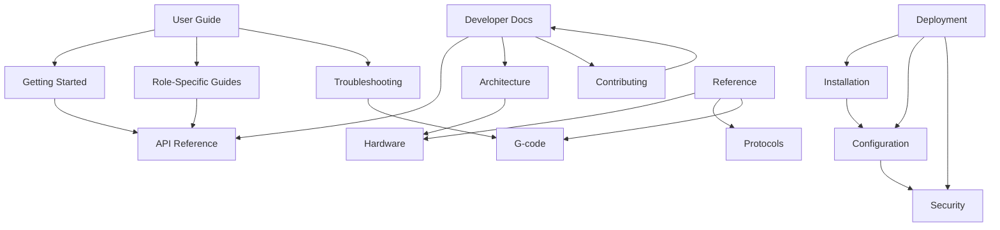

# Documentation Architecture Plan

## 🏗️ Complete Documentation Structure Design

This document defines the comprehensive information architecture for the Arctos Robot Controller documentation ecosystem, designed to serve multiple audiences with clear navigation and maintainable content organization.

## 🎯 Architecture Principles

### **1. Audience-First Organization**
- Structure content by user role and use case, not by technical implementation
- Provide clear entry points for different user types
- Enable progressive disclosure from basic to advanced topics

### **2. Task-Oriented Design**  
- Organize information around user goals and workflows
- Provide action-oriented navigation and content structure
- Include clear next steps and related tasks in all content

### **3. Maintainable Hierarchy**
- Logical directory structure that scales with project growth
- Clear ownership and maintenance responsibilities for each section
- Automated content validation and consistency checking

### **4. Integration with Development**
- Documentation updates integrated into development workflow
- Automated generation where possible (API docs, code examples)
- Version control aligned with software releases

## 📁 Proposed Directory Structure

### **Root Level Documentation**

```
/
├── README.md                    # Project overview and quick navigation
├── CONTRIBUTING.md              # Contributor onboarding and guidelines  
├── CODE_OF_CONDUCT.md          # Community standards and behavior
├── LICENSE.md                   # Legal and licensing information
├── CHANGELOG.md                 # Release notes and version history
├── SECURITY.md                  # Security policies and procedures
└── ROADMAP.md                   # Feature roadmap and future plans
```

**Purpose**: Essential project information that users encounter first. Focused on orientation and establishing credibility.

**Maintenance**: Updated with each major release, reviewed quarterly.

### **User-Focused Documentation (`docs/user-guide/`)**

```
docs/user-guide/
├── index.md                     # User guide overview and navigation
├── getting-started/
│   ├── index.md                 # Getting started overview
│   ├── for-operators.md         # Robot operator quick start
│   ├── for-administrators.md    # System admin quick start  
│   ├── for-integrators.md       # Developer/integrator quick start
│   └── first-time-setup.md      # Initial system configuration
│
├── operators/
│   ├── index.md                 # Operator documentation overview
│   ├── daily-operations.md      # Routine operational procedures
│   ├── manual-control.md        # Manual robot control guide
│   ├── position-management.md   # Saving and replaying positions
│   ├── g-code-programs.md       # Running G-code programs
│   ├── monitoring-status.md     # System monitoring and alerts
│   ├── safety-procedures.md     # Safety protocols and emergency stops
│   └── common-tasks.md          # Frequently performed tasks
│
├── administrators/
│   ├── index.md                 # Administrator documentation overview
│   ├── user-management.md       # Managing users and permissions
│   ├── system-configuration.md  # System settings and preferences
│   ├── security-setup.md        # Security configuration and monitoring
│   ├── backup-restore.md        # Data backup and restoration
│   ├── performance-tuning.md    # System optimization and tuning
│   ├── monitoring-alerts.md     # Setting up monitoring and alerts
│   └── maintenance-tasks.md     # Regular maintenance procedures
│
└── troubleshooting/
    ├── index.md                 # Troubleshooting overview
    ├── common-issues.md         # Most frequently encountered problems
    ├── connection-problems.md   # Network and hardware connectivity
    ├── robot-control-issues.md  # Robot movement and control problems
    ├── g-code-errors.md         # G-code execution issues
    ├── performance-issues.md    # System performance problems
    ├── error-messages.md        # Error message reference and solutions
    └── getting-help.md          # How to get additional support
```

**Purpose**: Task-oriented documentation for end users performing specific roles.

**Audience**: Robot operators, system administrators, and end users.

**Content Style**: Step-by-step procedures, screenshots, safety warnings, clear outcomes.

### **Developer Documentation (`docs/developer/`)**

```
docs/developer/
├── index.md                     # Developer documentation overview
├── getting-started/
│   ├── index.md                 # Developer onboarding overview
│   ├── development-environment.md # Setting up dev environment
│   ├── running-locally.md       # Local development workflow
│   ├── testing-guide.md         # Running and writing tests
│   └── debugging-tips.md        # Common debugging techniques
│
├── api-reference/
│   ├── index.md                 # API overview and authentication
│   ├── rest-endpoints.md        # REST API endpoints reference
│   ├── websocket-events.md      # WebSocket/Socket.IO events
│   ├── authentication.md       # Authentication and authorization
│   ├── rate-limiting.md         # Rate limiting and quotas
│   ├── error-handling.md        # Error codes and handling
│   └── examples/                # Code examples and tutorials
│       ├── basic-usage.md
│       ├── authentication-flow.md
│       ├── real-time-updates.md
│       └── integration-patterns.md
│
├── architecture/
│   ├── index.md                 # Architecture overview
│   ├── system-overview.md       # High-level system architecture
│   ├── backend-architecture.md  # Node.js backend design
│   ├── frontend-architecture.md # React frontend design
│   ├── database-design.md       # Database schema and design decisions
│   ├── hardware-abstraction.md  # Hardware communication layer
│   ├── real-time-communication.md # WebSocket architecture
│   ├── security-architecture.md # Security design and implementation
│   └── deployment-architecture.md # Production deployment patterns
│
├── contributing/
│   ├── index.md                 # Contributing overview
│   ├── code-standards.md        # Coding standards and style guide
│   ├── pull-request-process.md  # PR workflow and review process
│   ├── testing-requirements.md  # Testing standards and requirements
│   ├── documentation-guide.md   # Documentation contribution guide
│   └── release-process.md       # Release workflow and procedures
│
└── testing/
    ├── index.md                 # Testing documentation overview
    ├── unit-testing.md          # Unit test guidelines and examples
    ├── integration-testing.md   # Integration test patterns
    ├── e2e-testing.md           # End-to-end testing with Playwright
    ├── performance-testing.md   # Performance test setup and execution
    ├── security-testing.md      # Security testing procedures
    └── test-data-management.md  # Test data creation and management
```

**Purpose**: Technical documentation for developers, contributors, and integrators.

**Audience**: Software developers, system integrators, and technical contributors.

**Content Style**: Technical depth, code examples, architectural diagrams, implementation details.

### **Deployment Documentation (`docs/deployment/`)**

```
docs/deployment/
├── index.md                     # Deployment documentation overview
├── installation/
│   ├── index.md                 # Installation overview
│   ├── system-requirements.md   # Hardware and software requirements
│   ├── local-development.md     # Local installation for development
│   ├── production-server.md     # Production server installation
│   ├── docker-deployment.md     # Docker containerized deployment
│   ├── cloud-deployment.md      # Cloud platform deployment (AWS, Azure, GCP)
│   └── embedded-systems.md      # Installation on embedded hardware
│
├── configuration/
│   ├── index.md                 # Configuration overview
│   ├── environment-variables.md # Environment configuration reference
│   ├── robot-configuration.md   # Robot and hardware configuration
│   ├── network-configuration.md # Network and communication settings
│   ├── database-configuration.md # Database setup and optimization
│   ├── logging-configuration.md # Logging setup and management
│   └── advanced-configuration.md # Advanced configuration options
│
├── security/
│   ├── index.md                 # Security deployment overview
│   ├── ssl-certificates.md      # SSL/TLS certificate management
│   ├── firewall-configuration.md # Network security configuration
│   ├── user-authentication.md   # User authentication setup
│   ├── api-security.md          # API security configuration
│   ├── audit-logging.md         # Security audit logging setup
│   └── compliance-requirements.md # Regulatory compliance guidelines
│
└── maintenance/
    ├── index.md                 # Maintenance overview
    ├── monitoring-setup.md      # System monitoring configuration
    ├── backup-procedures.md     # Automated backup setup
    ├── update-procedures.md     # Software update procedures
    ├── performance-optimization.md # Performance tuning guide
    ├── disaster-recovery.md     # Disaster recovery planning
    └── health-checks.md         # System health monitoring
```

**Purpose**: Production deployment and operational documentation.

**Audience**: System administrators, DevOps engineers, and IT professionals.

**Content Style**: Step-by-step procedures, configuration examples, best practices, security considerations.

### **Technical Reference (`docs/reference/`)**

```
docs/reference/
├── index.md                     # Reference documentation overview
├── hardware/
│   ├── index.md                 # Hardware reference overview
│   ├── supported-controllers.md # Supported robot controllers
│   ├── mks57d-integration.md    # MKS57D controller specifics
│   ├── mks42d-integration.md    # MKS42D controller specifics  
│   ├── communication-protocols.md # Serial, CAN, RS485 protocols
│   ├── wiring-diagrams.md       # Hardware connection diagrams
│   └── troubleshooting-hardware.md # Hardware troubleshooting
│
├── protocols/
│   ├── index.md                 # Communication protocols overview
│   ├── serial-communication.md  # Serial protocol specification
│   ├── can-bus-protocol.md      # CAN bus communication details
│   ├── rs485-protocol.md        # RS485 protocol implementation
│   ├── modbus-integration.md    # Modbus protocol support
│   └── custom-protocols.md      # Implementing custom protocols
│
├── g-code/
│   ├── index.md                 # G-code reference overview
│   ├── supported-commands.md    # Supported G-code commands
│   ├── coordinate-systems.md    # Coordinate system definitions
│   ├── motion-commands.md       # Motion control G-code reference
│   ├── tool-commands.md         # Tool control G-code reference
│   ├── program-structure.md     # G-code program organization
│   └── custom-commands.md       # Custom G-code extensions
│
└── glossary/
    ├── index.md                 # Glossary overview
    ├── robotics-terms.md        # Robotics terminology
    ├── software-terms.md        # Software development terms
    ├── hardware-terms.md        # Hardware and electronics terms
    └── acronyms.md              # Acronyms and abbreviations
```

**Purpose**: Quick reference materials and detailed specifications.

**Audience**: All user types needing specific technical information.

**Content Style**: Reference format, searchable, concise definitions, cross-referenced.

### **Internal Documentation (`docs/internal/`)**

```
docs/internal/
├── index.md                     # Internal documentation overview
├── decisions/
│   ├── index.md                 # ADR index and template
│   ├── 001-architecture-decisions.md # Architecture Decision Records
│   ├── 002-technology-choices.md
│   ├── 003-security-framework.md
│   └── template.md              # ADR template for new decisions
│
├── analysis/
│   ├── index.md                 # Analysis documentation overview
│   ├── business-requirements/   # Business analyst outputs
│   ├── technical-architecture/  # System architect outputs  
│   ├── testing-strategy/        # Test architect outputs
│   ├── security-assessment/     # Security engineer outputs
│   └── performance-analysis/    # Performance engineer outputs
│
├── planning/
│   ├── index.md                 # Planning documentation overview
│   ├── project-roadmap.md       # Detailed project roadmap
│   ├── work-breakdown.md        # Work breakdown structure
│   ├── resource-planning.md     # Resource allocation and planning
│   ├── risk-assessment.md       # Project risks and mitigation
│   └── milestone-tracking.md    # Milestone progress tracking
│
└── templates/
    ├── index.md                 # Template library overview
    ├── documentation-templates/ # Documentation templates
    │   ├── user-guide-template.md
    │   ├── api-reference-template.md
    │   ├── troubleshooting-template.md
    │   └── adr-template.md
    ├── code-templates/          # Code templates and examples
    │   ├── component-template.tsx
    │   ├── api-endpoint-template.js
    │   └── test-template.js
    └── process-templates/       # Process and workflow templates
        ├── pr-template.md
        ├── issue-template.md
        └── release-notes-template.md
```

**Purpose**: Internal project documentation for team collaboration and decision tracking.

**Audience**: Development team, project stakeholders, and future maintainers.

**Content Style**: Technical depth, decision rationale, historical context, templates.

## 🔗 Cross-Reference and Navigation Strategy

### **Navigation Hierarchy**

1. **Primary Navigation**: Role-based entry points (Operators, Administrators, Developers)
2. **Secondary Navigation**: Task-based organization within each role
3. **Cross-Reference Links**: Related content across different sections
4. **Search Functionality**: Full-text search with filtering by audience and content type

### **Content Relationships**



### **Link Strategy**

- **Contextual Links**: Related content suggested at end of each page
- **Progressive Disclosure**: Basic → Intermediate → Advanced content paths
- **Task Completion**: Clear next steps and related procedures
- **Bi-directional References**: Links work in both directions where appropriate

## 📋 Content Standards by Section

### **User Guide Standards**
- **Format**: Step-by-step procedures with screenshots
- **Language**: Clear, non-technical language with defined terms
- **Structure**: Goal → Steps → Verification → Next Steps
- **Visuals**: Screenshots for every major step, safety warnings highlighted

### **Developer Documentation Standards**
- **Format**: Technical explanation + code examples + references
- **Language**: Technical but accessible, assume development background
- **Structure**: Concept → Implementation → Examples → Best Practices
- **Code Examples**: Working, tested code with explanations

### **Reference Documentation Standards**
- **Format**: Structured reference with searchable sections
- **Language**: Precise technical language with clear definitions
- **Structure**: Overview → Detailed Specifications → Examples → See Also
- **Completeness**: Comprehensive coverage of all options and parameters

## 🔄 Maintenance and Update Workflows

### **Content Ownership Model**

| Section | Primary Owner | Update Trigger | Review Frequency |
|---------|---------------|----------------|------------------|
| User Guide | Product Manager | Feature releases | Monthly |
| Developer Docs | Tech Lead | Code changes | Weekly |
| API Reference | Backend Developer | API changes | Automated |
| Deployment | DevOps Engineer | Infrastructure changes | Quarterly |
| Reference | Subject Matter Expert | Specification changes | As needed |

### **Update Automation**

- **API Documentation**: Auto-generated from code comments and OpenAPI specs
- **Code Examples**: Automated testing ensures examples stay current  
- **Link Checking**: Automated broken link detection and reporting
- **Content Freshness**: Automated alerts for outdated content

### **Review Process**

1. **Content Changes**: All changes reviewed by section owner
2. **Technical Accuracy**: Technical reviews by relevant SMEs
3. **User Experience**: Usability testing for user-facing content
4. **Consistency**: Style and template compliance checking

## 🎯 Success Metrics and Analytics

### **Discoverability Metrics**
- Time to find relevant information (target: <2 minutes)
- Search success rate (target: >90%)
- Navigation path analysis
- Most accessed content identification

### **Content Quality Metrics**  
- User satisfaction ratings (target: >4.0/5.0)
- Content freshness (target: 100% updated within 30 days)
- Error/issue reports per page
- Completion rate for task-oriented content

### **Maintenance Efficiency Metrics**
- Documentation maintenance time per release
- Automated vs manual content updates ratio
- Time from code change to documentation update
- Review and approval cycle time

This architecture provides a solid foundation for scalable, maintainable documentation that serves all stakeholders while integrating seamlessly with the development workflow.