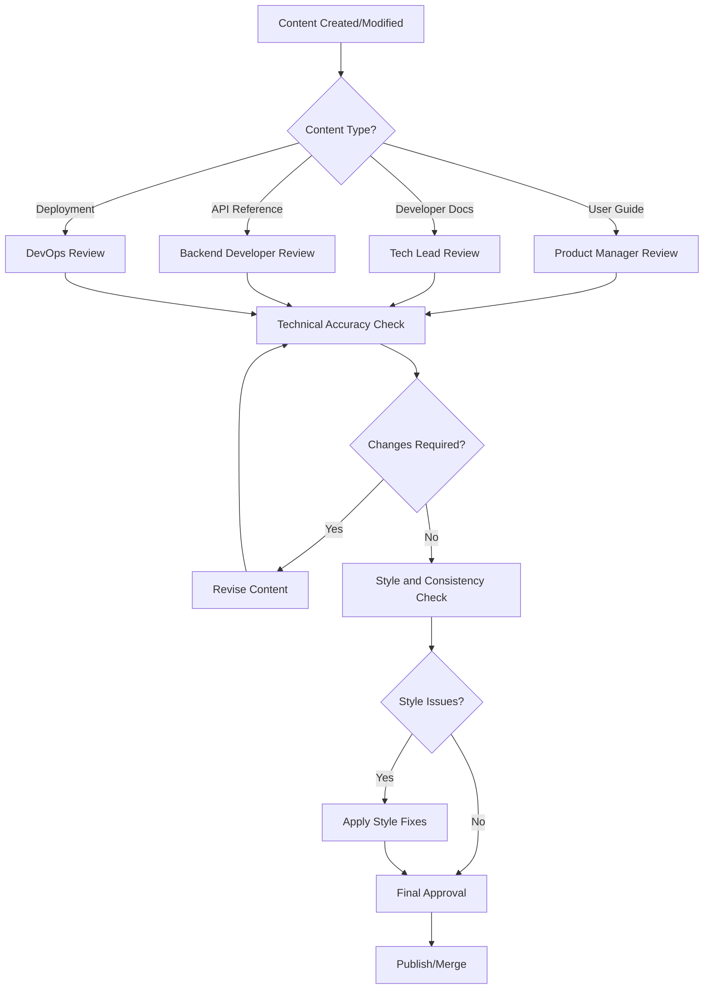

# Documentation Standards and Guidelines

## 📝 Comprehensive Documentation Framework

This guide establishes the standards, templates, and processes for creating and maintaining high-quality documentation across the Arctos Robot Controller project.

## 🎯 Documentation Philosophy

### **Core Principles**

1. **User-Centered**: Documentation serves user needs first, not internal convenience
2. **Action-Oriented**: Focus on what users need to accomplish, not just features
3. **Consistent Experience**: Uniform structure, style, and navigation across all content
4. **Living Documentation**: Documentation evolves with the product through integrated workflows
5. **Accessible Design**: Content accessible to users with diverse backgrounds and abilities

### **Quality Standards**

- **Accuracy**: All information verified and tested before publication
- **Completeness**: No gaps in critical user workflows or API coverage
- **Clarity**: Complex concepts explained in understandable terms with examples
- **Currency**: Content updated within 48 hours of related changes
- **Consistency**: Uniform terminology, style, and structure across all documentation

## 📚 Content Templates

### **User Guide Template**

```markdown
# [Task/Feature Name] Guide

## Overview
Brief description of what this guide covers and who should use it.

## Prerequisites
- Required knowledge or preparation
- System requirements
- Access permissions needed

## Step-by-Step Instructions

### Step 1: [Action Description]
1. Detailed instruction with specific actions
2. Expected outcomes or visual cues
3. Common variations or options


> ⚠️ **Safety Warning**: Critical safety information highlighted
> 
> 💡 **Tip**: Helpful hints for better results

### Step 2: [Next Action]
[Continue pattern...]

## Verification
How to confirm the task was completed successfully:
- [ ] Expected outcome 1
- [ ] Expected outcome 2
- [ ] Expected outcome 3

## Troubleshooting
Common issues and solutions:

| Problem | Cause | Solution |
|---------|-------|----------|
| Specific error message | Root cause | Step-by-step fix |

## Next Steps
- Related tasks users might need
- Links to advanced features
- Additional resources

## Related Documentation
- [Link to related guide](../link)
- [API Reference](../../developer/api-reference/)
- [Troubleshooting Guide](../troubleshooting/)
```

### **API Reference Template**

```markdown
# [API Endpoint/Feature Name]

## Overview
Brief description of the API functionality and use cases.

## Authentication
Required authentication method and permissions.

## Endpoint Details

### Request
```http
POST /api/endpoint
Content-Type: application/json
Authorization: Bearer {token}

{
  "parameter": "value",
  "required_param": "string",
  "optional_param": 123
}
```

### Parameters

| Parameter | Type | Required | Description | Default | Example |
|-----------|------|----------|-------------|---------|---------|
| parameter | string | Yes | Detailed description | N/A | "example" |
| optional_param | integer | No | Optional parameter | 0 | 123 |

### Response

#### Success Response (200)
```json
{
  "success": true,
  "data": {
    "id": "12345",
    "status": "completed"
  },
  "message": "Operation completed successfully"
}
```

#### Error Responses

**400 Bad Request**
```json
{
  "success": false,
  "error": "Invalid parameter",
  "code": "INVALID_PARAMETER",
  "details": {
    "parameter": "Value must be a positive integer"
  }
}
```

## Code Examples

### JavaScript/Node.js
```javascript
const response = await fetch('/api/endpoint', {
  method: 'POST',
  headers: {
    'Content-Type': 'application/json',
    'Authorization': `Bearer ${accessToken}`
  },
  body: JSON.stringify({
    parameter: 'value',
    required_param: 'example'
  })
});

const data = await response.json();
console.log(data);
```

### Python
```python
import requests

response = requests.post(
    'http://localhost:5000/api/endpoint',
    headers={
        'Content-Type': 'application/json',
        'Authorization': f'Bearer {access_token}'
    },
    json={
        'parameter': 'value',
        'required_param': 'example'
    }
)

data = response.json()
print(data)
```

## Rate Limiting
- Rate limit information
- Headers returned
- Handling rate limit responses

## See Also
- [Related API endpoints](../related-endpoint/)
- [User Guide](../../user-guide/related-feature/)
- [Code Examples](../examples/related-examples/)
```

### **Troubleshooting Template**

```markdown
# [Problem Category] Troubleshooting

## Quick Diagnosis

Use this checklist to quickly identify the issue:

- [ ] Check 1: Most common cause
- [ ] Check 2: Second most common
- [ ] Check 3: Third most common

## Common Issues

### Issue: [Specific Problem Description]

**Symptoms:**
- Exact error message or behavior
- When it occurs
- Affected functionality

**Cause:**
Root cause explanation in simple terms.

**Solution:**
1. Step-by-step resolution
2. Expected outcomes at each step
3. Verification of fix

**Prevention:**
How to avoid this issue in the future.

---

### Issue: [Another Problem]
[Follow same pattern...]

## Advanced Troubleshooting

### Diagnostic Tools
Tools and methods for deeper investigation:

```bash
# Command to check system status
npm run status

# Command to view logs
tail -f logs/error.log

# Command to test connections
npm run test:connection
```

### Log Analysis
How to interpret log files and error messages:

```
[ERROR] Connection failed: timeout after 5000ms
```
**Meaning**: Network connection to robot controller timed out
**Action**: Check network configuration and hardware connections

### Getting Help
When to escalate and how to provide useful information:

**Before contacting support:**
- [ ] Follow all troubleshooting steps
- [ ] Collect system information
- [ ] Document exact error messages
- [ ] Note recent changes or updates

**Information to include:**
- System version and environment
- Complete error messages
- Steps to reproduce
- Screenshots or log files
```

### **Architecture Decision Record (ADR) Template**

```markdown
# ADR-XXX: [Decision Title]

**Status**: [Proposed | Accepted | Superseded | Deprecated]
**Date**: YYYY-MM-DD
**Deciders**: [List of decision makers]

## Context and Problem Statement

Describe the context and problem statement that leads to this decision.

## Decision Drivers

* Factor 1 that influences the decision
* Factor 2 that influences the decision
* Factor 3 that influences the decision

## Considered Options

* Option 1: [Brief description]
* Option 2: [Brief description]  
* Option 3: [Brief description]

## Decision Outcome

**Chosen option**: "Option X", because [justification]

### Positive Consequences

* Benefit 1
* Benefit 2
* Benefit 3

### Negative Consequences

* Drawback 1
* Drawback 2
* Mitigation strategy for drawbacks

## Implementation

### Technical Details
How the decision will be implemented technically.

### Timeline
Key milestones and deadlines.

### Success Criteria
How to measure if the decision was successful.

## Links

* [Related ADR](../adr-related/)
* [Technical specification](../../developer/architecture/)
* [Implementation issue](https://github.com/project/issues/123)
```

## 🎨 Style Guide

### **Writing Style**

#### **Voice and Tone**
- **Voice**: Professional, helpful, and confident
- **Tone**: Friendly but authoritative, encouraging but realistic
- **Perspective**: Second person ("you") for procedures, third person for descriptions

#### **Language Guidelines**

**Use This** | **Instead of This**
-------------|-------------------
"Click the Save button" | "Click on Save"
"The system displays..." | "The system will display..."
"Complete these steps..." | "You need to complete..."
"Robot controller" | "The robot controller device"

#### **Technical Writing Rules**

1. **Active Voice**: "Configure the settings" not "Settings should be configured"
2. **Present Tense**: "The system displays" not "The system will display"
3. **Specific Actions**: "Click Save" not "Save your work"
4. **Parallel Structure**: Lists and headings use consistent grammatical structure

### **Formatting Standards**

#### **Headings**
```markdown
# H1: Page Title (One per page)
## H2: Major Section
### H3: Subsection
#### H4: Minor Subsection (Avoid if possible)
```

#### **Lists**
**Ordered Lists**: Use for sequential steps
```markdown
1. First step
2. Second step
3. Third step
```

**Unordered Lists**: Use for non-sequential items
```markdown
- Feature benefit
- Another benefit
- Third benefit
```

**Task Lists**: Use for checklists
```markdown
- [ ] Incomplete task
- [x] Completed task
```

#### **Code Formatting**

**Inline Code**: Use for short code snippets, filenames, and parameters
```markdown
Use the `npm start` command to launch the server.
Edit the `config.json` file.
Set the `robotType` parameter to "MKS57D".
```

**Code Blocks**: Use for multi-line code with language specification
```markdown
```javascript
const config = {
  robotType: 'MKS57D',
  protocol: 'Serial'
};
```
```

#### **Emphasis**
```markdown
**Bold**: Use for UI elements, important terms first use
*Italic*: Use for emphasis, file paths, variable names
```

#### **Links**
```markdown
[Link text](../relative/path/)  # Internal links (relative)
[External link](https://example.com)  # External links (absolute)
```

#### **Images**
```markdown


<!-- For images that need specific sizing -->

```

#### **Callout Boxes**
```markdown
> ⚠️ **Warning**: Critical information that prevents errors or safety issues
> 
> 💡 **Tip**: Helpful hints that improve user experience
> 
> ℹ️ **Note**: Additional context or clarification
> 
> 🚧 **Coming Soon**: Features in development
```

### **Terminology Standards**

#### **Consistent Terms**

Use this exact term throughout all documentation:

| Concept | Use This | Not This |
|---------|----------|----------|
| Software | Arctos Robot Controller | robot controller, ARC, the application |
| User interface | interface, UI | front-end, client |
| Server application | backend, server | backend API, server-side |
| Robot hardware | robot controller, hardware | device, robot |
| User access levels | Admin, Operator, Viewer | admin user, operator role |
| Position storage | saved position | stored position, position data |

#### **Technical Terms**
- **API**: Application Programming Interface (spell out on first use)
- **WebSocket**: Real-time communication protocol (capitalize both parts)
- **G-code**: Machine control programming language (capitalize G, lowercase code)
- **CAN bus**: Controller Area Network bus (spell out on first use)

## 📋 Review and Approval Process

### **Content Review Workflow**



### **Review Checklist**

#### **Content Quality**
- [ ] Information is accurate and tested
- [ ] All steps/examples work as described
- [ ] Content matches user needs and use cases
- [ ] No missing steps or unexplained assumptions
- [ ] Appropriate level of detail for audience

#### **Structure and Navigation**
- [ ] Follows appropriate template structure
- [ ] Headings create logical hierarchy
- [ ] Cross-references and links are helpful and working
- [ ] Page fits logically within site structure
- [ ] Clear next steps and related content

#### **Style and Language**
- [ ] Follows style guide consistently
- [ ] Uses approved terminology
- [ ] Writing is clear and concise
- [ ] Voice and tone appropriate for audience
- [ ] Grammar and spelling are correct

#### **Technical Implementation**
- [ ] Images include alt text and appropriate sizing
- [ ] Code examples are tested and working
- [ ] Internal links use relative paths
- [ ] Markdown formatting is correct
- [ ] File naming follows conventions

### **Approval Authority**

| Content Type | Primary Reviewer | Technical Review | Final Approval |
|--------------|------------------|------------------|----------------|
| User Guides | Product Manager | SME | Product Manager |
| Developer Docs | Tech Lead | Developer | Tech Lead |
| API Reference | Backend Developer | Tech Lead | Backend Developer |
| Security Docs | Security Lead | IT Admin | Security Lead |
| Deployment | DevOps Engineer | Sysadmin | DevOps Engineer |

## 🔄 Maintenance Procedures

### **Content Lifecycle**

#### **Creation Phase**
1. **Research**: Understand user needs and current gaps
2. **Planning**: Define scope, audience, and success criteria
3. **Creation**: Write content following templates and style guide
4. **Review**: Complete review process with stakeholders
5. **Publication**: Publish to documentation site

#### **Maintenance Phase**
1. **Monitoring**: Track usage analytics and user feedback
2. **Updates**: Regular updates based on product changes
3. **Optimization**: Improve based on user behavior data
4. **Archive**: Remove or update outdated content

### **Update Triggers**

**Immediate Updates Required (Within 24 hours)**:
- API endpoint changes or deprecations
- Security procedure changes
- Critical bug fixes affecting documented procedures
- Safety-related hardware changes

**Regular Updates Required (Within 1 week)**:
- New feature releases
- UI/UX changes affecting user guides
- Configuration option changes
- New supported hardware or protocols

**Periodic Reviews (Monthly)**:
- User guide accuracy verification
- Link checking and cleanup
- Analytics review and content optimization
- Style guide compliance audit

### **Automated Maintenance**

#### **Link Checking**
```bash
# Automated link validation
npm run docs:check-links

# Generate link report
npm run docs:link-report
```

#### **Content Freshness**
```bash
# Check for outdated content
npm run docs:freshness-check

# Generate content age report
npm run docs:age-report
```

#### **Style Compliance**
```bash
# Check style guide compliance
npm run docs:style-check

# Auto-fix common style issues
npm run docs:style-fix
```

### **Feedback Integration**

#### **User Feedback Collection**
- Feedback widget on every documentation page
- Quarterly user satisfaction surveys
- GitHub issues for documentation bugs
- Direct feedback through support channels

#### **Analytics Tracking**
- Page view statistics and user flow analysis
- Search query analysis for content gaps
- Exit page analysis for improvement opportunities
- Mobile vs desktop usage patterns

## 🛠️ Tools and Implementation

### **Documentation Tools Stack**

#### **Primary Authoring**
- **Markdown**: All content written in Markdown for version control integration
- **GitBook**: Documentation site generation and hosting
- **Mermaid**: Diagram creation embedded in Markdown
- **PlantUML**: Complex architectural diagrams

#### **Quality Assurance**
- **Vale**: Automated prose style checking
- **markdownlint**: Markdown formatting validation
- **Dead Link Checker**: Automated link validation
- **Grammarly**: Grammar and style assistance

#### **Asset Management**
- **Git LFS**: Large file storage for images and videos
- **ImageOptim**: Automated image optimization
- **Screenshot Tools**: Standardized screenshot capture

### **Integration with Development**

#### **Git Workflow Integration**
```yaml
# .github/workflows/docs.yml
name: Documentation Quality Check
on:
  pull_request:
    paths:
      - 'docs/**'
      - '*.md'

jobs:
  docs-quality:
    runs-on: ubuntu-latest
    steps:
      - uses: actions/checkout@v3
      - name: Check Markdown
        uses: markdownlint/markdownlint@v1
      - name: Check Links
        uses: gaurav-nelson/github-action-markdown-link-check@v1
      - name: Style Check
        uses: errata-ai/vale-action@v2
```

#### **Automated API Documentation**
```javascript
// Auto-generate API docs from code
const swaggerJsdoc = require('swagger-jsdoc');
const swaggerSpec = swaggerJsdoc({
  definition: {
    openapi: '3.0.0',
    info: {
      title: 'Arctos Robot Controller API',
      version: '1.0.0',
    },
  },
  apis: ['./server.js', './lib/*.js'],
});
```

This comprehensive standards guide ensures consistent, high-quality documentation that serves all users effectively while maintaining efficiency through automation and clear processes.