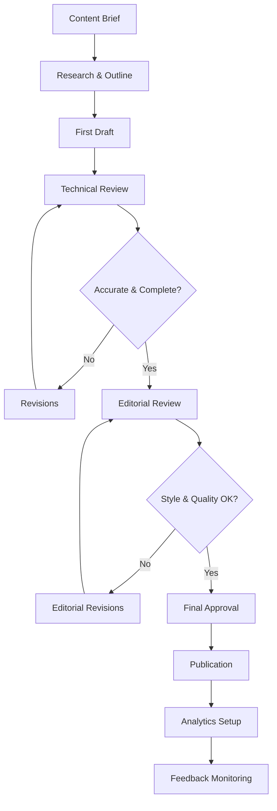

# Content Strategy and Lifecycle Management

## 🎯 Strategic Content Framework

This document defines the comprehensive content strategy for the Arctos Robot Controller documentation, establishing sustainable processes for creating, maintaining, and evolving content that serves multiple audiences effectively.

## 📊 Audience Analysis and Content Mapping

### **Primary Audience Segments**

#### **1. Robot Operators (40% of documentation users)**

**Profile:**
- Manufacturing technicians, lab operators, production workers
- Technical background varies from basic to intermediate
- Need quick, reliable procedures for daily tasks
- Value safety information and troubleshooting guides
- Often work in time-pressured environments

**Content Needs:**
- Visual step-by-step procedures
- Safety warnings and emergency procedures
- Quick reference materials
- Common problem solutions
- Mobile-friendly content for shop floor use

**Success Metrics:**
- Task completion time (target: <5 minutes for common tasks)
- Error reduction in operations
- Safety incident prevention
- User satisfaction scores (target: >4.2/5.0)

#### **2. System Administrators (25% of documentation users)**

**Profile:**
- IT professionals, maintenance engineers, facility managers
- Strong technical background in systems administration
- Responsible for system uptime and performance
- Need comprehensive configuration and security information
- Focus on long-term system reliability

**Content Needs:**
- Detailed installation and configuration guides
- Security implementation procedures
- Performance monitoring and optimization
- Backup and disaster recovery procedures
- Integration with enterprise systems

**Success Metrics:**
- System uptime improvement
- Security compliance achievement
- Reduced support ticket volume
- Implementation time reduction (target: 50% faster deployments)

#### **3. Developers and Integrators (25% of documentation users)**

**Profile:**
- Software developers, system integrators, automation engineers
- High technical proficiency
- Building custom solutions and integrations
- Need comprehensive API documentation and examples
- Value architectural insights and best practices

**Content Needs:**
- Complete API reference with examples
- Architecture documentation and design patterns
- Code samples and integration tutorials
- Contribution guidelines and development setup
- Advanced configuration and customization options

**Success Metrics:**
- API adoption rate
- Integration success rate (target: >90%)
- Community contribution volume
- Developer satisfaction scores (target: >4.5/5.0)

#### **4. Decision Makers and Evaluators (10% of documentation users)**

**Profile:**
- Engineering managers, procurement specialists, C-level executives
- High-level technical understanding
- Evaluating solution fit and ROI
- Need business value and competitive analysis
- Time-constrained, need concise information

**Content Needs:**
- Executive summaries and business value propositions
- Comparison with alternatives
- Implementation cost and timeline estimates
- Security and compliance documentation
- Success stories and case studies

**Success Metrics:**
- Evaluation-to-adoption conversion rate
- Time to decision reduction
- Stakeholder buy-in achievement
- Business value communication effectiveness

### **Content Mapping Matrix**

| Content Type | Operators | Administrators | Developers | Decision Makers |
|--------------|-----------|----------------|------------|-----------------|
| **Getting Started** | Quick setup | Installation guide | Dev environment | Executive overview |
| **Daily Tasks** | Operations manual | Monitoring dashboard | API usage patterns | Status reporting |
| **Problem Solving** | Troubleshooting | System diagnostics | Debug procedures | Escalation paths |
| **Configuration** | Basic settings | Advanced config | Integration setup | Compliance settings |
| **Security** | Safety procedures | Security config | Auth integration | Compliance reports |
| **Performance** | Optimal usage | Tuning guide | Optimization tips | Performance metrics |

## 📝 Content Lifecycle Management

### **Content Planning Phase**

#### **Content Gap Analysis Process**

1. **User Research**
   ```markdown
   ## Content Gap Analysis Template
   
   **Audience Segment**: [Target user group]
   **Current Pain Points**:
   - Issue 1: [Description and frequency]
   - Issue 2: [Description and frequency]
   - Issue 3: [Description and frequency]
   
   **Proposed Content**:
   - Content 1: [Type and justification]
   - Content 2: [Type and justification]
   
   **Success Criteria**:
   - Metric 1: [Measurable outcome]
   - Metric 2: [Measurable outcome]
   
   **Priority**: [High/Medium/Low]
   **Estimated Effort**: [Hours/Days/Weeks]
   **Dependencies**: [Technical, resource, or content dependencies]
   ```

2. **Content Inventory and Audit**
   ```bash
   # Content audit checklist
   - [ ] Catalog all existing content
   - [ ] Assess content quality and accuracy
   - [ ] Identify outdated or redundant content
   - [ ] Map content to user needs
   - [ ] Prioritize gaps and improvements
   ```

3. **Editorial Calendar Planning**
   ```markdown
   ## Monthly Content Planning
   
   ### Q1 2024 Content Roadmap
   
   **January**:
   - [ ] Operator safety procedures update
   - [ ] New hardware integration guide
   - [ ] API v2 migration documentation
   
   **February**:
   - [ ] Mobile interface user guide
   - [ ] Performance tuning advanced guide
   - [ ] Security compliance documentation
   
   **March**:
   - [ ] Troubleshooting guide expansion
   - [ ] Video tutorial series launch
   - [ ] Developer onboarding improvements
   ```

### **Content Creation Phase**

#### **Content Brief Template**

```markdown
# Content Brief: [Content Title]

## Objective
Clear statement of what this content should accomplish.

## Target Audience
Primary and secondary audience segments.

## User Goals
What users need to accomplish with this content.

## Content Specifications
- **Format**: [Guide/Reference/Tutorial/FAQ]
- **Length**: [Target word count or page estimate]
- **Media**: [Screenshots/Diagrams/Videos needed]
- **Complexity**: [Beginner/Intermediate/Advanced]

## Key Messages
1. Primary message or learning objective
2. Secondary messages or takeaways
3. Call-to-action or next steps

## Success Criteria
How to measure if content achieves its objectives.

## Timeline
- **Draft**: [Date]
- **Review**: [Date] 
- **Revision**: [Date]
- **Publication**: [Date]

## Resources and References
- Existing content to reference or update
- SME contacts for technical review
- External resources or standards
```

#### **Content Production Workflow**



### **Content Maintenance Phase**

#### **Automated Content Health Monitoring**

```javascript
// Content freshness monitoring
const contentAudit = {
  // Check for outdated content
  checkFreshness: async () => {
    const cutoffDate = new Date();
    cutoffDate.setMonth(cutoffDate.getMonth() - 6);
    
    const outdatedContent = await findContentOlderThan(cutoffDate);
    return outdatedContent.map(content => ({
      path: content.path,
      lastUpdated: content.lastModified,
      owner: content.maintainer,
      priority: calculateUpdatePriority(content)
    }));
  },
  
  // Analyze content performance
  analyzePerformance: async () => {
    const analytics = await getContentAnalytics();
    return analytics.map(page => ({
      path: page.path,
      views: page.pageviews,
      bounceRate: page.bounceRate,
      feedbackScore: page.userRating,
      needsAttention: page.bounceRate > 0.7 || page.userRating < 3.0
    }));
  }
};
```

#### **Content Update Triggers**

**Immediate Updates (Within 24 hours)**:
- Product feature changes affecting documented procedures
- Security vulnerabilities or procedure changes
- Critical bug fixes that invalidate existing instructions
- Safety-related changes or incidents

**Scheduled Updates (Weekly)**:
- New feature releases and enhancements
- API changes and deprecations
- UI/UX updates affecting user guides
- Hardware compatibility updates

**Periodic Reviews (Monthly/Quarterly)**:
- Analytics-driven content optimization
- User feedback incorporation
- Competitive analysis updates
- SEO and discoverability improvements

#### **Content Retirement Process**

```markdown
## Content Retirement Checklist

**Before Retiring Content**:
- [ ] Analyze usage data (views, engagement, feedback)
- [ ] Check for incoming links from other content
- [ ] Identify users who might be affected
- [ ] Create redirect strategy for replaced content

**Retirement Process**:
1. Add deprecation notice with timeline
2. Update navigation to remove prominent links
3. Set up redirects to replacement content
4. Archive content with timestamp and reason
5. Monitor for broken link reports

**Post-Retirement**:
- [ ] Update related content and cross-references
- [ ] Monitor user feedback and confusion
- [ ] Maintain redirects for at least 12 months
- [ ] Document retirement in change log
```

### **Content Quality Assurance**

#### **Quality Assessment Framework**

**Content Quality Scorecard**:

| Criteria | Weight | Score (1-5) | Weighted Score |
|----------|--------|-------------|----------------|
| **Accuracy** | 25% | [Score] | [Calculation] |
| **Completeness** | 20% | [Score] | [Calculation] |
| **Clarity** | 20% | [Score] | [Calculation] |
| **Usefulness** | 15% | [Score] | [Calculation] |
| **Currency** | 10% | [Score] | [Calculation] |
| **Findability** | 10% | [Score] | [Calculation] |
| **Total** | 100% | | **[Final Score]** |

**Quality Criteria Definitions**:

- **Accuracy (25%)**: Information is correct, tested, and validated
- **Completeness (20%)**: No missing steps, covers all necessary scenarios
- **Clarity (20%)**: Easy to understand, well-structured, appropriate language
- **Usefulness (15%)**: Helps users accomplish their goals effectively
- **Currency (10%)**: Up-to-date with current software version and features
- **Findability (10%)**: Easy to discover through navigation and search

#### **Automated Quality Checks**

```bash
# Daily automated quality checks
npm run docs:quality-check

# Checks include:
- Markdown formatting validation
- Link checking (internal and external)
- Image optimization and alt text validation
- Style guide compliance
- Readability analysis
- SEO optimization check
```

## 🔄 Content Performance Analytics

### **Key Performance Indicators (KPIs)**

#### **User Engagement Metrics**

**Page-Level Metrics**:
- Page views and unique visitors
- Time on page and scroll depth
- Bounce rate and exit rate
- User flow through related content
- Search queries leading to content

**Task Completion Metrics**:
- Tutorial completion rates
- Procedure success rates (via surveys)
- Time to complete documented tasks
- Error rates in following instructions
- Support ticket reduction after content publication

**User Satisfaction Metrics**:
- Content rating scores (1-5 scale)
- Feedback comments and suggestions
- Net Promoter Score for documentation
- User retention and return visits
- Referral rates to other users

#### **Content Health Metrics**

**Freshness Indicators**:
- Days since last update
- Percentage of content updated in last 90 days
- Number of outdated references or broken links
- Version alignment with software releases

**Quality Indicators**:
- Style guide compliance percentage
- Grammar and spelling error rates
- Image quality and optimization scores
- Mobile compatibility scores

### **Analytics Implementation**

#### **Google Analytics 4 Setup**

```html
<!-- Enhanced documentation tracking -->
<script>
// Track documentation usage patterns
gtag('event', 'page_view', {
  'page_title': document.title,
  'page_location': window.location.href,
  'content_group1': 'Documentation',
  'content_group2': getDocumentationSection(),
  'content_group3': getUserRole()
});

// Track content interactions
function trackContentInteraction(action, content_id) {
  gtag('event', action, {
    'event_category': 'Documentation',
    'event_label': content_id,
    'value': getEngagementScore()
  });
}

// Track task completion
function trackTaskCompletion(task_name, success) {
  gtag('event', 'task_completion', {
    'event_category': 'User_Task',
    'event_label': task_name,
    'value': success ? 1 : 0
  });
}
</script>
```

#### **Feedback Collection System**

```javascript
// In-page feedback widget
const feedbackWidget = {
  // Collect feedback on content helpfulness
  collectFeedback: (rating, comments, page_url) => {
    fetch('/api/feedback', {
      method: 'POST',
      headers: {'Content-Type': 'application/json'},
      body: JSON.stringify({
        rating,
        comments,
        page_url,
        user_role: getUserRole(),
        timestamp: new Date().toISOString()
      })
    });
  },
  
  // A/B test different content versions
  trackContentVariation: (variation_id, user_action) => {
    analytics.track('content_variation', {
      variation: variation_id,
      action: user_action,
      page: window.location.pathname
    });
  }
};
```

## 🚀 Content Innovation and Optimization

### **Emerging Content Formats**

#### **Interactive Documentation**

**Implementation Plan**:
1. **Interactive Tutorials**: Step-by-step guides with embedded simulations
2. **Live Code Examples**: Editable code snippets with real-time results
3. **Configuration Wizards**: Guided setup tools for complex configurations
4. **Troubleshooting Flowcharts**: Interactive decision trees for problem-solving

```html
<!-- Interactive tutorial component -->
<interactive-tutorial 
  title="Setting Up Your First Robot"
  steps="5"
  estimated-time="10 minutes"
  difficulty="beginner">
  
  <tutorial-step id="1" 
                 title="Connect Hardware"
                 validation="hardware-connected">
    <!-- Step content with validation -->
  </tutorial-step>
</interactive-tutorial>
```

#### **Video and Multimedia Integration**

**Content Strategy**:
- **Screen Recordings**: For UI-based procedures and configurations
- **Hardware Demonstrations**: For physical setup and maintenance
- **Expert Interviews**: For best practices and advanced techniques
- **Animated Explanations**: For complex concepts and workflows

**Production Standards**:
- 1080p minimum resolution for screen recordings
- Closed captions for accessibility compliance
- Consistent branding and visual style
- Mobile-optimized encoding and delivery

### **Personalization and Adaptive Content**

#### **Role-Based Content Customization**

```javascript
// Content personalization engine
const contentPersonalization = {
  // Customize content based on user role
  customizeForRole: (role) => {
    const content = getPageContent();
    return {
      ...content,
      sections: filterSectionsByRole(content.sections, role),
      navigation: getRelevantNavigation(role),
      recommendations: getPersonalizedRecommendations(role)
    };
  },
  
  // Adaptive content based on user behavior
  adaptContent: (userHistory, currentPage) => {
    const experience_level = determineExperienceLevel(userHistory);
    const content_preferences = analyzeContentPreferences(userHistory);
    
    return adjustContentComplexity(currentPage, experience_level, content_preferences);
  }
};
```

#### **Progressive Content Disclosure**

**Implementation Strategy**:
- **Beginner Mode**: Simplified instructions with more explanation
- **Intermediate Mode**: Standard detail level with relevant context
- **Expert Mode**: Concise instructions focusing on key information
- **Custom Mode**: User-configurable detail level and content focus

### **Content Accessibility and Inclusion**

#### **Accessibility Standards Compliance**

**WCAG 2.1 AA Compliance Checklist**:
- [ ] **Perceivable**: Alt text for images, captions for videos, color contrast ratios
- [ ] **Operable**: Keyboard navigation, no seizure-inducing content, sufficient time limits
- [ ] **Understandable**: Clear language, consistent navigation, error identification
- [ ] **Robust**: Compatible with assistive technologies, valid HTML markup

#### **Inclusive Content Guidelines**

**Language and Tone**:
- Use clear, simple language avoiding jargon when possible
- Define technical terms on first use
- Provide multiple explanation approaches for complex concepts
- Consider diverse cultural contexts and perspectives

**Visual Design**:
- High contrast color schemes for readability
- Scalable fonts and responsive design for different devices
- Alternative text that conveys meaning, not just description
- Consistent visual hierarchy and navigation patterns

## 📅 Content Governance and Ownership

### **Editorial Governance Structure**

#### **Roles and Responsibilities**

**Content Steering Committee**:
- **Chair**: Documentation Manager
- **Members**: Product Manager, Tech Lead, UX Designer, Support Manager
- **Frequency**: Monthly strategic review meetings
- **Responsibilities**: Content strategy, resource allocation, quality standards

**Content Owners by Domain**:

| Domain | Primary Owner | Backup Owner | Review Frequency |
|--------|---------------|--------------|------------------|
| User Guides | Product Manager | UX Designer | Bi-weekly |
| Developer Docs | Tech Lead | Senior Developer | Weekly |
| API Reference | Backend Lead | API Developer | With each release |
| Installation | DevOps Engineer | System Admin | Monthly |
| Security | Security Officer | IT Manager | Monthly |
| Hardware | Hardware Engineer | Support Manager | Quarterly |

#### **Content Approval Matrix**

| Content Type | Creator | Technical Review | Editorial Review | Final Approval |
|--------------|---------|------------------|------------------|----------------|
| User Guide | Product Manager | SME | Tech Writer | Product Manager |
| API Docs | Developer | Tech Lead | Tech Writer | Tech Lead |
| Security Docs | Security Officer | IT Manager | Compliance | Security Officer |
| Tutorial | Content Creator | SME | UX Designer | Domain Owner |

### **Sustainable Content Operations**

#### **Resource Planning**

**Content Team Structure**:
- **1 Documentation Manager** (0.5 FTE): Strategy, oversight, quality assurance
- **1 Technical Writer** (1.0 FTE): Content creation, editing, maintenance
- **SME Contributors** (0.25 FTE each): Domain expertise, technical review
- **UX Designer** (0.25 FTE): Visual design, user experience optimization

**Budget Allocation**:
- **Personnel (70%)**: Writing, editing, and review resources
- **Tools and Technology (20%)**: Documentation platforms, analytics, automation
- **Content Production (10%)**: Video production, graphic design, external services

#### **Scalability Planning**

**Growth Stage Triggers**:
- **Stage 1** (Current): Single technical writer with SME support
- **Stage 2** (50+ content pages): Add dedicated content creator
- **Stage 3** (100+ pages): Add content strategist and video producer
- **Stage 4** (200+ pages): Full content team with specialization by audience

This comprehensive content strategy ensures sustainable, user-focused documentation that evolves with the project while maintaining high quality and effectiveness across all audience segments.