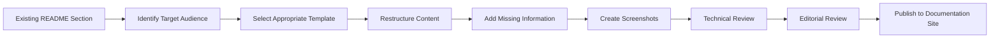

# Implementation Roadmap: Documentation Architecture

## 🚀 Phased Implementation Strategy

This roadmap provides a comprehensive, phased approach to implementing the new documentation architecture for the Arctos Robot Controller project, ensuring minimal disruption while delivering maximum value to users.

## 📊 Implementation Overview

### **Success Criteria**

| Phase | Timeline | Key Deliverables | Success Metrics |
|-------|----------|------------------|-----------------|
| **Phase 1** | Weeks 1-2 | Foundation & Structure | Directory structure, templates created |
| **Phase 2** | Weeks 3-4 | Content Migration | 80% of existing content migrated |
| **Phase 3** | Weeks 5-6 | Enhancement & Polish | User satisfaction >4.0/5.0 |
| **Phase 4** | Weeks 7-8 | Automation & Optimization | 90% automated maintenance |

### **Resource Requirements**

**Personnel**:
- **Documentation Architect** (0.5 FTE): Strategy, architecture design, quality oversight
- **Technical Writer** (1.0 FTE): Content creation, migration, editing
- **Developer** (0.25 FTE): Tool integration, automation development
- **Designer** (0.25 FTE): Visual assets, user experience optimization

**Technology**:
- Documentation platform (GitBook, Docusaurus, or similar)
- Analytics and feedback tools
- Content management automation
- Design and screenshot tools

## 📋 Phase 1: Foundation and Structure (Weeks 1-2)

### **Week 1: Architecture Setup**

#### **Day 1-2: Directory Structure Implementation**

```bash
# Create new documentation architecture
mkdir -p docs/{user-guide,developer,deployment,reference,internal}
mkdir -p docs/user-guide/{getting-started,operators,administrators,troubleshooting}
mkdir -p docs/developer/{getting-started,api-reference,architecture,contributing,testing}
mkdir -p docs/deployment/{installation,configuration,security,maintenance}
mkdir -p docs/reference/{hardware,protocols,g-code,glossary}
mkdir -p docs/internal/{decisions,analysis,planning,templates}

# Set up assets and media directories
mkdir -p docs/assets/{images,videos,diagrams,downloads}
mkdir -p docs/assets/images/{screenshots,diagrams,icons}
```

**Deliverables**:
- [ ] Complete directory structure created
- [ ] Navigation hierarchy documented
- [ ] File naming conventions established
- [ ] Asset organization system implemented

#### **Day 3-4: Template Library Creation**

**Templates to Create**:

1. **User Guide Template** (`docs/internal/templates/user-guide-template.md`)
2. **API Reference Template** (`docs/internal/templates/api-reference-template.md`)
3. **Troubleshooting Template** (`docs/internal/templates/troubleshooting-template.md`)
4. **Architecture Decision Record Template** (`docs/internal/templates/adr-template.md`)
5. **Getting Started Template** (`docs/internal/templates/getting-started-template.md`)

**Template Implementation Checklist**:
- [ ] User guide template with screenshot placeholders
- [ ] API reference template with code example structure
- [ ] Troubleshooting template with diagnostic flowchart
- [ ] ADR template following industry standards
- [ ] Content brief template for planning new content

#### **Day 5: Style Guide Implementation**

```markdown
# Style Guide Implementation Checklist

## Writing Standards
- [ ] Voice and tone guidelines documented
- [ ] Terminology dictionary created
- [ ] Grammar and punctuation rules established
- [ ] Code formatting standards defined

## Visual Standards  
- [ ] Screenshot standards and tools selected
- [ ] Image optimization guidelines established
- [ ] Diagram style and tool selection completed
- [ ] Brand consistency guidelines documented

## Technical Standards
- [ ] Markdown formatting rules documented
- [ ] Link structure and conventions established
- [ ] File naming conventions finalized
- [ ] Version control integration planned
```

### **Week 2: Process and Workflow Setup**

#### **Day 6-7: Review and Approval Workflows**

```yaml
# .github/workflows/documentation-review.yml
name: Documentation Review Process

on:
  pull_request:
    paths:
      - 'docs/**'
      - '*.md'

jobs:
  documentation-quality:
    runs-on: ubuntu-latest
    steps:
      - name: Checkout code
        uses: actions/checkout@v3
        
      - name: Setup Node.js
        uses: actions/setup-node@v3
        with:
          node-version: '18'
          
      - name: Install dependencies
        run: npm install
        
      - name: Lint markdown
        run: npx markdownlint docs/**/*.md
        
      - name: Check links
        run: npx markdown-link-check docs/**/*.md
        
      - name: Style check
        run: npx vale docs/
        
      - name: Generate documentation preview
        run: npm run docs:build
```

**Process Documentation**:
- [ ] Content creation workflow documented
- [ ] Review and approval process established
- [ ] Quality assurance checklist created
- [ ] Escalation procedures defined

#### **Day 8-10: Tool Selection and Setup**

**Primary Documentation Platform Evaluation**:

| Platform | Pros | Cons | Cost | Decision |
|----------|------|------|------|----------|
| **GitBook** | Easy editing, good UX, Git integration | Limited customization | $8/user/month | ✅ Recommended |
| **Docusaurus** | Free, highly customizable, React-based | More technical setup | Free | Alternative |
| **GitLab Pages** | Free with GitLab, CI/CD integration | Basic features | Free | Budget option |
| **Notion** | Collaborative, easy to use | Not developer-friendly | $8/user/month | Not suitable |

**Selected Tools Stack**:
```json
{
  "primary_platform": "GitBook",
  "authoring_tools": ["Markdown", "GitBook editor"],
  "quality_assurance": ["markdownlint", "vale", "link-checker"],
  "asset_management": ["Git LFS", "ImageOptim"],
  "analytics": ["Google Analytics", "GitBook analytics"],
  "feedback": ["GitBook feedback widget", "GitHub issues"]
}
```

## 📝 Phase 2: Content Migration and Organization (Weeks 3-4)

### **Week 3: Core Content Migration**

#### **Day 11-12: README Restructuring**

**Current README Analysis**:
- **Total Length**: 1,196 lines
- **Content Types**: Installation, usage, API reference, troubleshooting, architecture
- **Target Audiences**: Mixed (developers, operators, administrators)

**Migration Strategy**:

```markdown
# README Migration Plan

## Content Distribution
- **Keep in README**: Project overview, quick start, basic installation
- **Move to User Guide**: Detailed usage instructions, troubleshooting
- **Move to Developer Docs**: API reference, architecture details
- **Move to Deployment**: Production deployment, security configuration

## New README Structure (Target: ~200 lines)
1. Project overview and key features
2. Quick start guide with links to detailed docs
3. Architecture overview with diagram
4. Link directory to all documentation sections
5. Contributing and community information
```

**Migration Tasks**:
- [ ] Extract user-focused content to `docs/user-guide/`
- [ ] Move API reference to `docs/developer/api-reference/`
- [ ] Transfer deployment content to `docs/deployment/`
- [ ] Create concise README with navigation links
- [ ] Set up redirects for existing anchor links

#### **Day 13-15: User Guide Creation**

**Priority Content for User Guides**:

1. **Getting Started Guides** (`docs/user-guide/getting-started/`)
   - [ ] For robot operators (daily usage focus)
   - [ ] For system administrators (installation and config focus)
   - [ ] For developers (integration and customization focus)

2. **Operator Documentation** (`docs/user-guide/operators/`)
   - [ ] Daily operations manual
   - [ ] Manual control procedures
   - [ ] Position management guide
   - [ ] G-code program execution
   - [ ] Safety procedures

3. **Administrator Documentation** (`docs/user-guide/administrators/`)
   - [ ] User management
   - [ ] System configuration
   - [ ] Security setup
   - [ ] Backup and maintenance

**Content Creation Workflow**:


### **Week 4: Developer and Technical Documentation**

#### **Day 16-17: API Reference Migration**

**Current API Documentation Assessment**:
- **Location**: Embedded within main README
- **Coverage**: REST endpoints, WebSocket events, examples
- **Quality**: Good technical depth, needs better organization

**Enhanced API Documentation Structure**:

```markdown
# docs/developer/api-reference/index.md
- API overview and base URL
- Authentication and authorization
- Rate limiting and quotas
- Common patterns and conventions

# docs/developer/api-reference/rest-endpoints.md
- Configuration management endpoints
- Position management endpoints  
- Robot control endpoints
- G-code execution endpoints
- User management endpoints (if auth implemented)

# docs/developer/api-reference/websocket-events.md
- Real-time position updates
- System status notifications
- G-code execution progress
- Error and alert events

# docs/developer/api-reference/examples/
- Basic usage examples
- Authentication flow examples
- Real-time integration examples
- Error handling patterns
```

**API Documentation Enhancement Tasks**:
- [ ] Extract API content from README
- [ ] Create comprehensive endpoint documentation
- [ ] Add request/response examples for all endpoints
- [ ] Document error codes and handling
- [ ] Create interactive API explorer (if possible)
- [ ] Add language-specific code examples (JavaScript, Python, curl)

#### **Day 18-20: Architecture and Developer Resources**

**Architecture Documentation** (`docs/developer/architecture/`):
- [ ] System overview with diagrams
- [ ] Backend architecture (Node.js, Express, Socket.IO)
- [ ] Frontend architecture (React, TypeScript)
- [ ] Database design and models
- [ ] Hardware communication layer
- [ ] Real-time communication architecture
- [ ] Security architecture

**Developer Resources** (`docs/developer/`):
- [ ] Development environment setup
- [ ] Running locally guide
- [ ] Testing procedures and requirements
- [ ] Contribution guidelines
- [ ] Code standards and style guide
- [ ] Release process documentation

## 🎨 Phase 3: Enhancement and User Experience (Weeks 5-6)

### **Week 5: Visual and Interactive Enhancements**

#### **Day 21-22: Screenshot and Visual Asset Creation**

**Screenshot Standards Implementation**:
```javascript
// Screenshot automation tool
const puppeteer = require('puppeteer');

const screenshotStandards = {
  viewport: { width: 1200, height: 800 },
  quality: 90,
  format: 'png',
  fullPage: false,
  clip: null // Will be set per screenshot
};

async function captureUIScreenshot(url, selector, filename) {
  const browser = await puppeteer.launch();
  const page = await browser.newPage();
  await page.setViewport(screenshotStandards.viewport);
  await page.goto(url);
  
  const element = await page.$(selector);
  const screenshot = await element.screenshot({
    path: `docs/assets/images/screenshots/${filename}`,
    quality: screenshotStandards.quality
  });
  
  await browser.close();
  return screenshot;
}
```

**Visual Asset Creation Plan**:
- [ ] **Application Screenshots**: All major UI screens and workflows
- [ ] **Configuration Examples**: Settings panels and forms
- [ ] **Hardware Setup**: Connection diagrams and physical setup
- [ ] **Troubleshooting Visuals**: Error messages and diagnostic screens
- [ ] **Architecture Diagrams**: System components and data flow

#### **Day 23-25: Interactive Elements and Navigation**

**Interactive Documentation Features**:

1. **Interactive Tutorials**:
   ```html
   <!-- Example interactive tutorial component -->
   <div class="interactive-tutorial">
     <div class="tutorial-step" data-step="1">
       <h3>Step 1: Connect Hardware</h3>
       <p>Follow these steps to connect your robot controller...</p>
       <div class="step-validation">
         <button onclick="validateStep(1)">Verify Connection</button>
       </div>
     </div>
   </div>
   ```

2. **Configuration Wizards**:
   ```html
   <!-- Configuration wizard for complex setups -->
   <div class="config-wizard">
     <div class="wizard-step active" id="robot-type">
       <h3>Select Robot Type</h3>
       <div class="robot-options">
         <button class="robot-option" data-type="MKS57D">
           
           <span>MKS57D Controller</span>
         </button>
       </div>
     </div>
   </div>
   ```

3. **Troubleshooting Flowcharts**:
   ```html
   <!-- Interactive troubleshooting decision tree -->
   <div class="troubleshooting-tree">
     <div class="decision-node active" id="start">
       <h4>What type of issue are you experiencing?</h4>
       <button onclick="navigateToNode('connection')">Connection Problems</button>
       <button onclick="navigateToNode('movement')">Robot Movement Issues</button>
       <button onclick="navigateToNode('software')">Software Errors</button>
     </div>
   </div>
   ```

**Enhanced Navigation Implementation**:
- [ ] Breadcrumb navigation for all pages
- [ ] "What's Next" suggestions at end of articles
- [ ] Related content recommendations
- [ ] Progress indicators for multi-step procedures
- [ ] Mobile-optimized navigation menu

### **Week 6: Search, Feedback, and Optimization**

#### **Day 26-27: Search and Discovery Implementation**

**Search Functionality Requirements**:

```javascript
// Documentation search implementation
const searchConfig = {
  // Index all documentation content
  content_types: ['user-guide', 'developer', 'api-reference', 'troubleshooting'],
  
  // Search filters
  filters: {
    audience: ['operators', 'administrators', 'developers'],
    content_type: ['guide', 'reference', 'tutorial', 'troubleshooting'],
    difficulty: ['beginner', 'intermediate', 'advanced']
  },
  
  // Search result enhancement
  result_enhancement: {
    snippet_length: 200,
    highlight_matches: true,
    show_related_content: true,
    track_search_analytics: true
  }
};
```

**Search Implementation Tasks**:
- [ ] Configure full-text search (Algolia, GitBook search, or similar)
- [ ] Implement search filtering by audience and content type
- [ ] Add search analytics to track popular queries
- [ ] Create search result optimization based on user behavior
- [ ] Implement "Did you mean?" suggestions for common misspellings

#### **Day 28-30: Feedback Systems and Analytics**

**User Feedback Collection**:

```html
<!-- Embedded feedback widget -->
<div class="feedback-widget">
  <div class="feedback-header">
    <h4>Was this helpful?</h4>
  </div>
  <div class="feedback-options">
    <button class="feedback-btn positive" onclick="submitFeedback(1)">
      👍 Yes
    </button>
    <button class="feedback-btn negative" onclick="submitFeedback(0)">
      👎 No
    </button>
  </div>
  <div class="feedback-comment" style="display: none;">
    <textarea placeholder="How can we improve this content?"></textarea>
    <button onclick="submitDetailedFeedback()">Submit Feedback</button>
  </div>
</div>
```

**Analytics Implementation**:

```javascript
// Enhanced documentation analytics
const docAnalytics = {
  // Track user journey through documentation
  trackUserFlow: (fromPage, toPage, method) => {
    gtag('event', 'page_navigation', {
      'from_page': fromPage,
      'to_page': toPage,
      'navigation_method': method // link, search, breadcrumb, etc.
    });
  },
  
  // Track task completion
  trackTaskCompletion: (taskName, completed, timeSpent) => {
    gtag('event', 'task_completion', {
      'task_name': taskName,
      'completed': completed,
      'time_spent': timeSpent
    });
  },
  
  // Track content effectiveness
  trackContentEngagement: (pageId, scrollDepth, timeOnPage) => {
    gtag('event', 'content_engagement', {
      'page_id': pageId,
      'scroll_depth': scrollDepth,
      'time_on_page': timeOnPage
    });
  }
};
```

## 🤖 Phase 4: Automation and Continuous Improvement (Weeks 7-8)

### **Week 7: Automation Infrastructure**

#### **Day 31-32: Automated Content Generation**

**API Documentation Automation**:

```javascript
// Automated API doc generation from code
const swaggerJSDoc = require('swagger-jsdoc');
const fs = require('fs').promises;

const apiDocGeneration = {
  // Generate API docs from code comments
  generateApiDocs: async () => {
    const options = {
      definition: {
        openapi: '3.0.0',
        info: {
          title: 'Arctos Robot Controller API',
          version: '1.0.0',
          description: 'Comprehensive API for robot control and management'
        },
        servers: [
          { url: 'http://localhost:5000', description: 'Development server' },
          { url: 'https://api.arctos-robot.com', description: 'Production server' }
        ]
      },
      apis: ['./server.js', './lib/*.js', './routes/*.js']
    };
    
    const specs = swaggerJSDoc(options);
    await fs.writeFile('docs/developer/api-reference/openapi.json', 
                       JSON.stringify(specs, null, 2));
    
    // Generate markdown documentation
    const markdownDocs = await generateMarkdownFromOpenAPI(specs);
    await fs.writeFile('docs/developer/api-reference/generated-api.md', markdownDocs);
  },
  
  // Update code examples automatically
  updateCodeExamples: async () => {
    const examples = await extractCodeExamples('test/api/*.test.js');
    await updateDocumentationWithExamples(examples);
  }
};
```

**Automated Content Validation**:

```bash
#!/bin/bash
# scripts/validate-documentation.sh

echo "🔍 Running documentation validation..."

# 1. Check markdown formatting
echo "Checking markdown formatting..."
npx markdownlint docs/**/*.md --config .markdownlint.json

# 2. Validate all internal links
echo "Validating internal links..."
npx markdown-link-check docs/**/*.md --config .markdown-link-check.json

# 3. Check for broken external links
echo "Checking external links..."
npx markdown-link-check docs/**/*.md --config .external-link-check.json

# 4. Verify all images exist and are optimized
echo "Validating images..."
python scripts/validate-images.py docs/assets/images/

# 5. Check style guide compliance
echo "Checking style compliance..."
npx vale docs/

# 6. Verify code examples work
echo "Testing code examples..."
python scripts/test-code-examples.py docs/

echo "✅ Documentation validation complete!"
```

#### **Day 33-35: Continuous Integration Setup**

**Documentation CI/CD Pipeline**:

```yaml
# .github/workflows/documentation-ci.yml
name: Documentation CI/CD

on:
  push:
    paths:
      - 'docs/**'
      - '*.md'
      - 'package.json'
  pull_request:
    paths:
      - 'docs/**'
      - '*.md'

jobs:
  validate-docs:
    name: Validate Documentation
    runs-on: ubuntu-latest
    
    steps:
      - name: Checkout repository
        uses: actions/checkout@v3
        
      - name: Setup Node.js
        uses: actions/setup-node@v3
        with:
          node-version: '18'
          
      - name: Install dependencies
        run: npm install
        
      - name: Validate markdown
        run: |
          npx markdownlint docs/**/*.md
          npx markdown-link-check docs/**/*.md
          
      - name: Check style compliance
        uses: errata-ai/vale-action@reviewdog
        with:
          files: docs/
          
      - name: Test code examples
        run: npm run test:docs-examples
        
      - name: Generate API documentation
        run: npm run generate:api-docs
        
      - name: Build documentation site
        run: npm run docs:build
        
  deploy-docs:
    name: Deploy Documentation
    needs: validate-docs
    runs-on: ubuntu-latest
    if: github.ref == 'refs/heads/main'
    
    steps:
      - name: Deploy to GitBook
        env:
          GITBOOK_TOKEN: ${{ secrets.GITBOOK_TOKEN }}
        run: |
          curl -X POST "https://api.gitbook.com/v1/spaces/$GITBOOK_SPACE_ID/content/sync" \
               -H "Authorization: Bearer $GITBOOK_TOKEN"
               
  analytics-report:
    name: Generate Analytics Report
    runs-on: ubuntu-latest
    if: github.event_name == 'schedule'
    
    steps:
      - name: Generate monthly analytics report
        env:
          ANALYTICS_API_KEY: ${{ secrets.ANALYTICS_API_KEY }}
        run: |
          python scripts/generate-analytics-report.py
          # Send report to stakeholders
```

### **Week 8: Optimization and Performance**

#### **Day 36-37: Performance Optimization**

**Documentation Site Performance**:

```javascript
// Documentation performance optimization
const performanceOptimization = {
  // Image optimization and lazy loading
  optimizeImages: () => {
    // Implement responsive images with multiple formats
    return `
      <picture>
        <source srcset="image.webp" type="image/webp">
        <source srcset="image.avif" type="image/avif">
        
      </picture>
    `;
  },
  
  // Content delivery optimization
  enableCDN: () => {
    // Configure CDN for static assets
    const cdnConfig = {
      static_assets: 'https://cdn.arctos-docs.com/assets/',
      images: 'https://cdn.arctos-docs.com/images/',
      videos: 'https://cdn.arctos-docs.com/videos/'
    };
    return cdnConfig;
  },
  
  // Search performance optimization
  optimizeSearch: () => {
    // Implement search result caching and indexing
    const searchConfig = {
      index_update_frequency: 'hourly',
      result_caching: true,
      progressive_search: true,
      search_analytics: true
    };
    return searchConfig;
  }
};
```

**Content Performance Monitoring**:

```javascript
// Monitor documentation performance
const performanceMonitoring = {
  // Track page load times
  trackPagePerformance: () => {
    window.addEventListener('load', () => {
      const perfData = performance.getEntriesByType('navigation')[0];
      gtag('event', 'page_performance', {
        'load_time': perfData.loadEventEnd - perfData.loadEventStart,
        'dom_content_loaded': perfData.domContentLoadedEventEnd - perfData.domContentLoadedEventStart,
        'page_size': document.documentElement.innerHTML.length
      });
    });
  },
  
  // Monitor search performance
  trackSearchPerformance: (query, resultCount, responseTime) => {
    gtag('event', 'search_performance', {
      'query_length': query.length,
      'result_count': resultCount,
      'response_time': responseTime
    });
  }
};
```

#### **Day 38-40: Launch and Iteration Setup**

**Go-Live Checklist**:

```markdown
# Documentation Launch Checklist

## Pre-Launch Validation
- [ ] All migration content reviewed and approved
- [ ] Navigation and search functionality tested
- [ ] Mobile responsiveness verified across devices
- [ ] Analytics and feedback systems operational
- [ ] Performance optimization implemented
- [ ] Accessibility compliance verified (WCAG 2.1 AA)

## Launch Activities
- [ ] DNS and domain configuration completed
- [ ] SSL certificates installed and validated
- [ ] Content delivery network (CDN) configured
- [ ] Search engine optimization (SEO) implemented
- [ ] Social media and external link updates
- [ ] Internal team training on new documentation

## Post-Launch Monitoring
- [ ] Analytics dashboard setup and monitoring
- [ ] User feedback collection and analysis
- [ ] Performance monitoring and optimization
- [ ] Content accuracy validation from real usage
- [ ] Search query analysis for content gaps
- [ ] Accessibility testing with real users

## Iteration Planning
- [ ] Weekly analytics review meetings scheduled
- [ ] Monthly content optimization planning
- [ ] Quarterly user satisfaction surveys
- [ ] Continuous improvement process established
```

**Continuous Improvement Framework**:

```javascript
// Documentation improvement automation
const improvementFramework = {
  // Analyze user behavior for improvement opportunities
  analyzeUserBehavior: async () => {
    const analytics = await getDocumentationAnalytics();
    
    const improvements = {
      high_bounce_pages: analytics.pages.filter(p => p.bounceRate > 0.7),
      low_satisfaction: analytics.feedback.filter(f => f.rating < 3),
      popular_searches: analytics.searches.mostCommon(10),
      navigation_pain_points: analytics.navigation.problemAreas
    };
    
    return generateImprovementRecommendations(improvements);
  },
  
  // Automated content freshness monitoring
  monitorContentFreshness: async () => {
    const cutoffDate = new Date();
    cutoffDate.setMonth(cutoffDate.getMonth() - 3);
    
    const staleContent = await findContentOlderThan(cutoffDate);
    await notifyContentOwners(staleContent);
    
    return staleContent;
  },
  
  // A/B testing for documentation improvements
  runDocumentationExperiments: () => {
    const experiments = [
      {
        name: 'navigation_structure_test',
        variants: ['current', 'role_based', 'task_based'],
        success_metric: 'task_completion_rate'
      },
      {
        name: 'content_depth_test',
        variants: ['detailed', 'concise', 'progressive'],
        success_metric: 'user_satisfaction'
      }
    ];
    
    return setupExperiments(experiments);
  }
};
```

## 📈 Success Metrics and Validation

### **Phase Success Criteria**

#### **Phase 1: Foundation Success Metrics**
- [ ] Complete directory structure implemented (100% of planned structure)
- [ ] All templates created and validated (5 core templates minimum)
- [ ] Style guide documented and approved by stakeholders
- [ ] Review workflow automated and tested

#### **Phase 2: Migration Success Metrics**
- [ ] 90% of existing README content successfully migrated
- [ ] All API endpoints documented with examples
- [ ] User guides created for 3 primary audiences
- [ ] Navigation structure tested and validated

#### **Phase 3: Enhancement Success Metrics**
- [ ] User satisfaction score >4.0/5.0 (based on feedback widgets)
- [ ] Page load times <3 seconds on average
- [ ] Mobile compatibility validated across major devices
- [ ] Search functionality returning relevant results >90% of the time

#### **Phase 4: Automation Success Metrics**
- [ ] 80% of routine documentation tasks automated
- [ ] Content freshness monitoring operational with <1 week alert time
- [ ] CI/CD pipeline catching 95% of documentation issues before publication
- [ ] Performance monitoring providing actionable insights

### **Long-term Success Indicators**

**6-Month Targets**:
- Documentation usage increase by 200%
- Support ticket reduction by 40% for documented issues
- User onboarding time reduced by 50%
- Developer integration time reduced by 60%

**12-Month Targets**:
- 95% user satisfaction with documentation experience
- Self-service resolution rate >80% for common issues
- Documentation maintenance time reduced by 70%
- New feature adoption rate improved by 100%

This comprehensive implementation roadmap ensures a systematic, measurable approach to transforming the Arctos Robot Controller documentation from its current state to a world-class, user-centered documentation ecosystem.