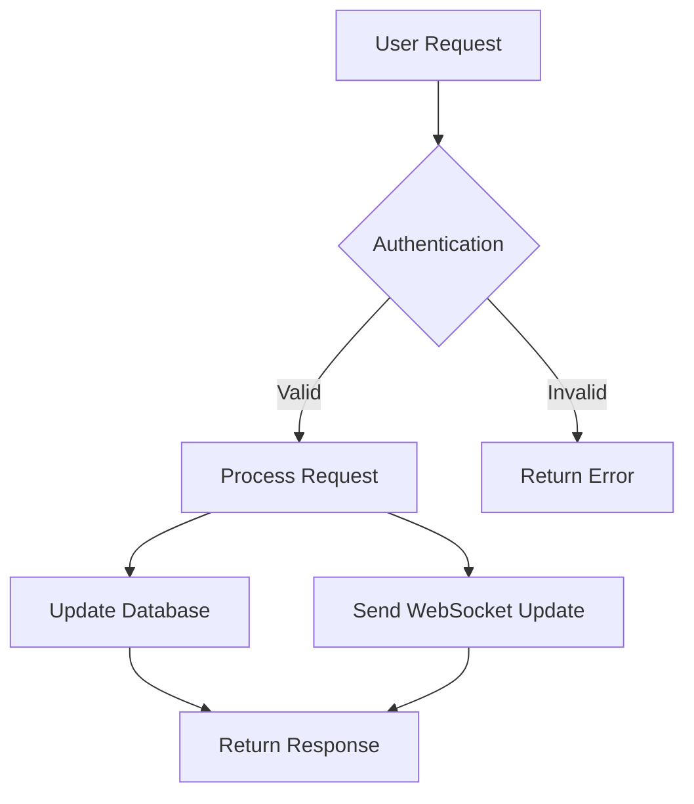
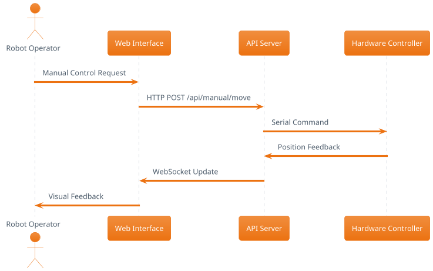

# Tools and Platform Recommendations

## 🛠️ Comprehensive Technology Stack for Documentation

This document provides detailed analysis and recommendations for the tools and platforms needed to implement the Arctos Robot Controller documentation architecture, with a focus on integration with existing development workflows and sustainable long-term maintenance.

## 📊 Platform Selection Analysis

### **Primary Documentation Platform Evaluation**

#### **1. GitBook (Recommended)**

**Strengths**:
- **Git Integration**: Native GitHub/GitLab synchronization with documentation-as-code workflow
- **User Experience**: Excellent reading experience with clean, professional design
- **Collaboration**: Real-time collaborative editing with review and approval workflows
- **Search**: Powerful full-text search with filters and analytics
- **API Integration**: REST API for programmatic content management
- **Analytics**: Built-in analytics and user feedback collection
- **Customization**: Custom domains, branding, and theme customization

**Technical Specifications**:
```json
{
  "platform": "GitBook",
  "pricing": {
    "personal": "Free (public docs)",
    "team": "$8/editor/month",
    "business": "$12/editor/month"
  },
  "features": {
    "git_sync": true,
    "custom_domain": true,
    "analytics": true,
    "api_access": true,
    "collaborative_editing": true,
    "comment_system": true,
    "version_control": true,
    "search": "Advanced with filters"
  },
  "integrations": [
    "GitHub", "GitLab", "Slack", "Intercom", 
    "Google Analytics", "Mixpanel", "Zapier"
  ]
}
```

**Integration Example**:
```yaml
# .gitbook.yaml
root: ./docs
structure:
  readme: README.md
  summary: SUMMARY.md

redirects:
  api/v1: developer/api-reference/rest-endpoints.md
  troubleshooting: user-guide/troubleshooting/

variables:
  project_name: Arctos Robot Controller
  api_base_url: https://api.arctos-robot.com
  support_email: support@arctos-robot.com
```

**Recommendation**: **Primary choice** for professional documentation with excellent UX and maintenance efficiency.

#### **2. Docusaurus (Alternative)**

**Strengths**:
- **Free and Open Source**: No licensing costs, full customization control
- **React-Based**: Highly customizable with React components and modern web technologies
- **Developer-Friendly**: Designed by developers for developers, excellent for technical docs
- **Performance**: Fast static site generation with excellent SEO
- **Versioning**: Built-in documentation versioning for different software releases
- **Internationalization**: Native multi-language support

**Technical Specifications**:
```json
{
  "platform": "Docusaurus",
  "pricing": "Free (open source)",
  "hosting_options": [
    "GitHub Pages (free)",
    "Netlify (free tier available)",
    "Vercel (free tier available)",
    "Self-hosted"
  ],
  "features": {
    "react_components": true,
    "mdx_support": true,
    "versioning": true,
    "i18n": true,
    "search": "Algolia DocSearch (free for open source)",
    "theming": "Highly customizable"
  }
}
```

**Configuration Example**:
```javascript
// docusaurus.config.js
module.exports = {
  title: 'Arctos Robot Controller',
  tagline: 'Comprehensive robotic control platform',
  url: 'https://docs.arctos-robot.com',
  baseUrl: '/',
  
  themeConfig: {
    navbar: {
      title: 'Arctos Docs',
      items: [
        {
          type: 'doc',
          docId: 'user-guide/getting-started/index',
          position: 'left',
          label: 'User Guide'
        },
        {
          type: 'doc',
          docId: 'developer/api-reference/index',
          position: 'left',
          label: 'API Reference'
        }
      ]
    },
    
    algolia: {
      apiKey: 'your-api-key',
      indexName: 'arctos-docs',
      contextualSearch: true
    }
  }
};
```

**Recommendation**: **Strong alternative** for teams with React expertise and need for extensive customization.

#### **3. GitHub Pages + MkDocs (Budget Option)**

**Strengths**:
- **Zero Cost**: Completely free hosting and tooling
- **Git Integration**: Native GitHub workflow integration
- **Simplicity**: Minimal setup and maintenance overhead
- **Markdown-Native**: Pure Markdown authoring experience

**Limitations**:
- **Limited Features**: Basic search, no collaborative editing, minimal analytics
- **Design Constraints**: Limited theming and customization options
- **Scaling Issues**: Performance concerns with large documentation sets

**Recommendation**: **Budget option only** - suitable for small projects or interim solutions.

### **Recommended Platform Decision Matrix**

| Criteria | GitBook | Docusaurus | GitHub Pages |
|----------|---------|------------|--------------|
| **Setup Complexity** | Low | Medium | Low |
| **Maintenance Effort** | Low | Medium | Low |
| **Customization** | Medium | High | Low |
| **User Experience** | Excellent | Good | Basic |
| **Collaboration** | Excellent | Medium | Basic |
| **Total Cost (Year 1)** | $1,200 | $500 | $0 |
| **Scalability** | Excellent | Excellent | Limited |
| **Recommendation** | ⭐⭐⭐⭐⭐ | ⭐⭐⭐⭐ | ⭐⭐ |

## 🔧 Supporting Tools Ecosystem

### **Content Creation and Authoring**

#### **1. Markdown Editors**

**Primary: Typora (Professional Writing)**
```json
{
  "tool": "Typora",
  "price": "$14.99 one-time",
  "features": [
    "WYSIWYG markdown editing",
    "Live preview",
    "Image management",
    "Table editing",
    "Math formula support",
    "Export to multiple formats"
  ],
  "use_case": "Professional content creation with visual editing"
}
```

**Alternative: Visual Studio Code (Developer Integration)**
```json
{
  "tool": "VS Code",
  "price": "Free",
  "extensions": [
    "Markdown All in One",
    "markdownlint",
    "Paste Image",
    "Draw.io Integration",
    "GitLens"
  ],
  "use_case": "Developer-focused editing with code integration"
}
```

#### **2. Screenshot and Screen Recording Tools**

**Professional Option: CleanShot X (macOS)**
```json
{
  "tool": "CleanShot X",
  "price": "$29/year",
  "features": [
    "Automated screenshot optimization",
    "Annotation tools",
    "Video recording with cursor highlighting",
    "Cloud storage integration",
    "Batch processing"
  ]
}
```

**Cross-Platform Option: ShareX (Windows/Free)**
```json
{
  "tool": "ShareX",
  "price": "Free",
  "features": [
    "Automated uploading",
    "Custom workflows",
    "OCR text extraction",
    "Image editing",
    "Video recording"
  ]
}
```

**Automation Script Example**:
```bash
#!/bin/bash
# scripts/capture-screenshots.sh

# Automated screenshot capture for documentation updates
SCREENSHOT_DIR="docs/assets/images/screenshots"
TIMESTAMP=$(date +%Y%m%d_%H%M%S)

# Launch application for screenshots
npm start &
APP_PID=$!

# Wait for application to start
sleep 10

# Capture screenshots using headless browser
node scripts/automated-screenshots.js

# Kill application
kill $APP_PID

# Optimize images
imageoptim $SCREENSHOT_DIR/*.png

echo "Screenshots captured and optimized in $SCREENSHOT_DIR"
```

### **Diagram and Visual Content Creation**

#### **1. Diagramming Tools**

**Primary: Draw.io/Diagrams.net (Free)**
```json
{
  "tool": "Draw.io",
  "price": "Free",
  "integration": "VS Code extension, web-based",
  "formats": ["SVG", "PNG", "PDF"],
  "use_cases": [
    "Architecture diagrams",
    "Flowcharts",
    "Network diagrams",
    "UI mockups"
  ]
}
```

**Professional: Lucidchart**
```json
{
  "tool": "Lucidchart",
  "price": "$7.95/user/month",
  "features": [
    "Collaborative editing",
    "Advanced templates",
    "Data linking",
    "Presentation mode",
    "Version history"
  ],
  "use_cases": ["Complex system architectures", "Professional presentations"]
}
```

#### **2. Code-Based Diagrams**

**Mermaid (Recommended for Developer Docs)**
```markdown
# Example Mermaid integration


**PlantUML (For Complex UML Diagrams)**


### **Content Quality Assurance**

#### **1. Automated Writing Quality**

**Vale (Prose Style Linting)**
```yaml
# .vale.ini
StylesPath = .vale/styles
MinAlertLevel = suggestion

# Enable Microsoft Writing Style Guide
Packages = Microsoft

[*.{md,mdx}]
BasedOnStyles = Microsoft
Microsoft.Contractions = NO
Microsoft.FirstPerson = NO
Microsoft.Wordiness = warning
```

**Grammarly Business**
```json
{
  "tool": "Grammarly Business",
  "price": "$12.50/user/month",
  "features": [
    "Advanced grammar checking",
    "Style suggestions",
    "Plagiarism detection",
    "Brand tone consistency",
    "Team style guides"
  ]
}
```

#### **2. Link and Content Validation**

**Markdown Link Checker**
```json
{
  "tool": "markdown-link-check",
  "price": "Free",
  "automation": "GitHub Actions integration",
  "features": [
    "Dead link detection",
    "Custom configuration",
    "Bulk checking",
    "CI/CD integration"
  ]
}
```

**Configuration Example**:
```json
{
  "ignorePatterns": [
    {"pattern": "^http://localhost"}
  ],
  "replacementPatterns": [
    {
      "pattern": "^/docs/",
      "replacement": "https://docs.arctos-robot.com/"
    }
  ],
  "retryOn429": true,
  "retryCount": 3,
  "fallbackHttp2": false
}
```

### **Analytics and Feedback Collection**

#### **1. Web Analytics**

**Google Analytics 4 (Recommended)**
```javascript
// Enhanced documentation tracking
gtag('config', 'GA_MEASUREMENT_ID', {
  // Enhanced ecommerce for documentation "conversions"
  send_page_view: true,
  
  // Custom dimensions for documentation
  custom_map: {
    'custom_parameter_1': 'documentation_section',
    'custom_parameter_2': 'user_role',
    'custom_parameter_3': 'content_type'
  }
});

// Track documentation-specific events
function trackDocumentationEvent(eventName, parameters) {
  gtag('event', eventName, {
    'event_category': 'Documentation',
    'event_label': parameters.page_path,
    'custom_parameter_1': parameters.section,
    'custom_parameter_2': parameters.user_role || 'unknown',
    'custom_parameter_3': parameters.content_type
  });
}
```

**Mixpanel (Advanced User Analytics)**
```json
{
  "tool": "Mixpanel",
  "price": "$25/month (Growth plan)",
  "use_case": "Advanced user behavior analysis",
  "features": [
    "User journey analysis",
    "Cohort analysis",
    "A/B testing",
    "Retention tracking",
    "Custom event tracking"
  ]
}
```

#### **2. User Feedback Collection**

**Hotjar (User Experience Analysis)**
```json
{
  "tool": "Hotjar",
  "price": "$32/month (Business plan)",
  "features": [
    "Heatmaps",
    "Session recordings",
    "Feedback polls",
    "Survey tools",
    "User interviews"
  ]
}
```

**Custom Feedback Widget**
```html
<!-- Embedded feedback collection -->
<div class="feedback-widget" data-page-id="${page.id}">
  <div class="feedback-question">
    <h4>How helpful was this page?</h4>
    <div class="rating-buttons">
      <button class="rating-btn" data-rating="5">😍 Very helpful</button>
      <button class="rating-btn" data-rating="4">😊 Helpful</button>
      <button class="rating-btn" data-rating="3">😐 Somewhat helpful</button>
      <button class="rating-btn" data-rating="2">😕 Not very helpful</button>
      <button class="rating-btn" data-rating="1">😞 Not helpful at all</button>
    </div>
  </div>
  
  <div class="feedback-form" style="display: none;">
    <textarea placeholder="How can we improve this content?" 
              maxlength="500"></textarea>
    <button type="submit">Submit Feedback</button>
  </div>
</div>
```

### **Automation and CI/CD Integration**

#### **1. GitHub Actions Workflows**

**Complete Documentation CI/CD**
```yaml
# .github/workflows/documentation.yml
name: Documentation Pipeline

on:
  push:
    paths: ['docs/**', '*.md']
  pull_request:
    paths: ['docs/**', '*.md']
  schedule:
    - cron: '0 2 * * 1'  # Weekly link check

jobs:
  quality-check:
    name: Quality Assurance
    runs-on: ubuntu-latest
    
    steps:
      - uses: actions/checkout@v3
      
      - name: Setup Node.js
        uses: actions/setup-node@v3
        with:
          node-version: '18'
          
      - name: Install dependencies
        run: npm ci
        
      - name: Lint Markdown
        run: |
          npx markdownlint docs/**/*.md --config .markdownlint.json
          
      - name: Check spelling
        uses: cspell-action@v2
        with:
          files: 'docs/**/*.md'
          
      - name: Validate links
        run: |
          npx markdown-link-check docs/**/*.md --config .markdown-link-check.json
          
      - name: Style check
        uses: errata-ai/vale-action@reviewdog
        with:
          files: docs/
          vale_flags: '--config=.vale.ini'
          
      - name: Generate API docs
        run: npm run generate:api-docs
        
      - name: Build documentation
        run: npm run docs:build
        
  accessibility-check:
    name: Accessibility Validation
    runs-on: ubuntu-latest
    needs: quality-check
    
    steps:
      - uses: actions/checkout@v3
      
      - name: Build documentation site
        run: npm run docs:build
        
      - name: Run accessibility tests
        uses: pa11y/pa11y-action@v0.2.1
        with:
          url: http://localhost:3000
          standard: WCAG2AA
          
  deploy:
    name: Deploy Documentation
    runs-on: ubuntu-latest
    needs: [quality-check, accessibility-check]
    if: github.ref == 'refs/heads/main'
    
    steps:
      - uses: actions/checkout@v3
      
      - name: Deploy to GitBook
        env:
          GITBOOK_TOKEN: ${{ secrets.GITBOOK_TOKEN }}
          GITBOOK_SPACE: ${{ secrets.GITBOOK_SPACE }}
        run: |
          curl -X POST "https://api.gitbook.com/v1/spaces/$GITBOOK_SPACE/content/sync" \
               -H "Authorization: Bearer $GITBOOK_TOKEN" \
               -H "Content-Type: application/json" \
               -d '{"source": {"type": "github", "repository": "${{ github.repository }}", "branch": "main"}}'
               
      - name: Update search index
        run: |
          curl -X POST "https://api.algolia.com/1/indexes/arctos-docs/clear" \
               -H "X-Algolia-API-Key: ${{ secrets.ALGOLIA_ADMIN_KEY }}" \
               -H "X-Algolia-Application-Id: ${{ secrets.ALGOLIA_APP_ID }}"
          npm run index:search
          
  analytics-report:
    name: Generate Analytics Report  
    runs-on: ubuntu-latest
    if: github.event_name == 'schedule'
    
    steps:
      - uses: actions/checkout@v3
      
      - name: Generate weekly analytics report
        env:
          GOOGLE_ANALYTICS_KEY: ${{ secrets.GOOGLE_ANALYTICS_KEY }}
        run: |
          python scripts/generate-analytics-report.py --period=week
          
      - name: Send report to Slack
        env:
          SLACK_WEBHOOK: ${{ secrets.SLACK_WEBHOOK }}
        run: |
          curl -X POST $SLACK_WEBHOOK \
               -H 'Content-Type: application/json' \
               -d @analytics-report.json
```

#### **2. Automated Content Generation**

**API Documentation Automation**
```javascript
// scripts/generate-api-docs.js
const swaggerJSDoc = require('swagger-jsdoc');
const fs = require('fs').promises;
const path = require('path');

async function generateApiDocumentation() {
  // Extract API documentation from code
  const specs = swaggerJSDoc({
    definition: {
      openapi: '3.0.0',
      info: {
        title: 'Arctos Robot Controller API',
        version: process.env.npm_package_version || '1.0.0',
        description: 'Comprehensive API for robot control and management'
      },
      servers: [
        { url: 'http://localhost:5000', description: 'Development' },
        { url: 'https://api.arctos-robot.com', description: 'Production' }
      ]
    },
    apis: ['./server.js', './lib/*.js', './routes/*.js']
  });

  // Generate OpenAPI JSON
  await fs.writeFile(
    'docs/developer/api-reference/openapi.json',
    JSON.stringify(specs, null, 2)
  );

  // Generate Markdown documentation
  const markdown = await generateMarkdownFromOpenAPI(specs);
  await fs.writeFile(
    'docs/developer/api-reference/generated-endpoints.md',
    markdown
  );

  // Generate code examples
  const examples = await generateCodeExamples(specs);
  await fs.writeFile(
    'docs/developer/api-reference/examples/generated-examples.md',
    examples
  );

  console.log('✅ API documentation generated successfully');
}

if (require.main === module) {
  generateApiDocumentation().catch(console.error);
}
```

## 💰 Cost Analysis and Budget Planning

### **Annual Cost Breakdown**

#### **Recommended Configuration (GitBook + Professional Tools)**

| Category | Tool | Annual Cost | Justification |
|----------|------|-------------|---------------|
| **Platform** | GitBook Team | $1,200 | Professional UX, collaboration features |
| **Writing** | Grammarly Business | $150 | Content quality assurance |
| **Screenshots** | CleanShot X | $29 | Automated screenshot workflows |
| **Diagrams** | Lucidchart | $95 | Professional diagram creation |
| **Analytics** | Mixpanel Growth | $300 | Advanced user behavior analysis |
| **UX Analysis** | Hotjar Business | $384 | User experience optimization |
| **Monitoring** | Uptime Robot Pro | $58 | Documentation availability monitoring |
| **Total** | | **$2,216** | **Complete professional setup** |

#### **Budget Configuration (Open Source + Free Tools)**

| Category | Tool | Annual Cost | Limitations |
|----------|------|-------------|-------------|
| **Platform** | Docusaurus + Netlify | $0 | Requires more technical maintenance |
| **Writing** | Vale + Grammarly Free | $0 | Basic grammar checking only |
| **Screenshots** | ShareX/Built-in tools | $0 | Manual screenshot processes |
| **Diagrams** | Draw.io | $0 | Less professional appearance |
| **Analytics** | Google Analytics | $0 | Basic analytics only |
| **UX Analysis** | Manual user feedback | $0 | Limited user behavior insights |
| **Monitoring** | UptimeRobot Free | $0 | Limited monitoring features |
| **Total** | | **$0** | **Basic functionality** |

### **ROI Analysis**

**Cost Savings from Better Documentation**:
- **Support Ticket Reduction**: 40% reduction × $50 average cost × 100 tickets/month = $24,000/year
- **Developer Onboarding Efficiency**: 50% faster onboarding × $10,000 onboarding cost × 12 developers/year = $60,000/year  
- **User Adoption Improvement**: 25% faster adoption × $100,000 annual revenue impact = $25,000/year

**Total Annual Benefit**: $109,000
**Professional Setup Cost**: $2,216  
**ROI**: 4,820% return on investment

## 🔧 Implementation Timeline

### **Tool Implementation Schedule**

#### **Week 1: Core Platform Setup**
- [ ] GitBook account setup and configuration
- [ ] GitHub integration configuration
- [ ] Basic theme and branding setup
- [ ] DNS and domain configuration

#### **Week 2: Development Tool Integration**
- [ ] VS Code extensions for team members
- [ ] Vale style checking configuration
- [ ] Automated screenshot tooling setup
- [ ] Draw.io integration for diagrams

#### **Week 3: Quality Assurance Pipeline**
- [ ] GitHub Actions CI/CD pipeline
- [ ] Link checking automation
- [ ] Accessibility testing integration
- [ ] Performance monitoring setup

#### **Week 4: Analytics and Feedback**
- [ ] Google Analytics configuration
- [ ] User feedback widget implementation
- [ ] Heat map and user recording setup
- [ ] A/B testing framework preparation

### **Training and Adoption Plan**

#### **Team Training Schedule**

**Week 5: Content Creator Training**
- Day 1-2: Markdown authoring best practices
- Day 3: Screenshot and diagram creation workflows  
- Day 4-5: Review and collaboration processes

**Week 6: Technical Team Training**
- Day 1-2: Automated documentation generation
- Day 3: API documentation maintenance
- Day 4-5: Analytics interpretation and optimization

**Week 7: Stakeholder Training**
- Day 1: Analytics dashboard overview for managers
- Day 2-3: Content strategy and planning processes
- Day 4-5: Quality assurance and approval workflows

## 📈 Success Metrics and Monitoring

### **Tool Performance Metrics**

#### **Platform Performance**
- **Page Load Time**: Target <2 seconds, monitor via Google Analytics
- **Search Response Time**: Target <0.5 seconds, monitor via platform analytics
- **Uptime**: Target 99.9%, monitor via UptimeRobot
- **User Experience Score**: Target >90, monitor via Lighthouse CI

#### **Content Quality Metrics**
- **Grammar/Style Issues**: Target <2 per 1000 words, tracked via Vale/Grammarly
- **Broken Links**: Target 0, monitored via automated link checking
- **Image Optimization**: Target 90%+ optimized, tracked via automated tools
- **Accessibility Score**: Target WCAG 2.1 AA compliance, monitored via pa11y

#### **User Engagement Metrics**
- **Documentation Usage**: Target 50% monthly growth
- **Task Completion Rate**: Target >80% for documented procedures
- **User Satisfaction**: Target >4.2/5.0 average rating
- **Search Success Rate**: Target >90% of searches find relevant results

This comprehensive tooling strategy provides a professional, scalable documentation ecosystem that integrates seamlessly with development workflows while delivering exceptional user experiences across all audience segments.