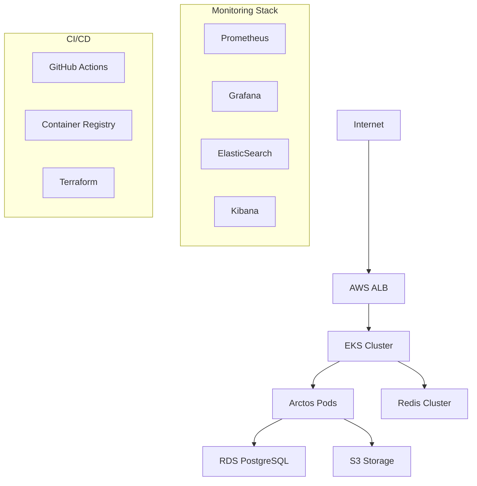

# DevOps Implementation Guide

## Overview

This document outlines the comprehensive DevOps implementation for the Arctos Robot Controller application, including infrastructure as code, CI/CD pipelines, monitoring, backup/recovery, and operational procedures.

## Table of Contents

1. [Architecture Overview](#architecture-overview)
2. [Infrastructure as Code](#infrastructure-as-code)
3. [CI/CD Pipelines](#cicd-pipelines)
4. [Monitoring and Observability](#monitoring-and-observability)
5. [Backup and Disaster Recovery](#backup-and-disaster-recovery)
6. [Security and Compliance](#security-and-compliance)
7. [Deployment Strategies](#deployment-strategies)
8. [Operational Procedures](#operational-procedures)
9. [Troubleshooting Guide](#troubleshooting-guide)

## Architecture Overview

### Infrastructure Components



### Environment Structure

- **Development**: Single-node cluster, SQLite database, local Redis
- **Staging**: Production-like environment with reduced capacity
- **Production**: Multi-AZ deployment with high availability

## Infrastructure as Code

### Terraform Configuration

All infrastructure is managed through Terraform with the following structure:

```
terraform/
├── main.tf              # Provider configuration
├── variables.tf         # Input variables
├── outputs.tf          # Output values
├── vpc.tf              # Network configuration
├── eks.tf              # Kubernetes cluster
├── rds.tf              # Database configuration
├── redis.tf            # Cache configuration
├── terraform.dev.tfvars
├── terraform.staging.tfvars
└── terraform.prod.tfvars
```

### Deployment Commands

```bash
# Plan infrastructure changes
./scripts/terraform-deploy.sh dev plan

# Apply infrastructure changes
./scripts/terraform-deploy.sh dev apply

# Destroy infrastructure (careful!)
./scripts/terraform-deploy.sh dev destroy
```

### Environment Configuration

#### Development
```bash
export TF_VAR_environment=dev
export TF_VAR_node_group_desired_capacity=1
export TF_VAR_rds_instance_class=db.t3.micro
```

#### Production
```bash
export TF_VAR_environment=prod
export TF_VAR_node_group_desired_capacity=3
export TF_VAR_rds_instance_class=db.t3.small
```

## CI/CD Pipelines

### Pipeline Stages

1. **Code Quality**: Linting, formatting, security scanning
2. **Testing**: Unit, integration, and E2E tests
3. **Building**: Docker image creation and vulnerability scanning
4. **Deployment**: Environment-specific deployments
5. **Monitoring**: Post-deployment verification

### Key Workflows

#### Main CI/CD Pipeline
- **File**: `.github/workflows/advanced-cicd.yml`
- **Triggers**: Push to main/develop, tags
- **Features**: Multi-environment deployment, security scanning, artifact management

#### Dependency Management
- **File**: `.github/workflows/dependency-security.yml`
- **Schedule**: Daily at 2 AM UTC
- **Features**: Automated updates, security audits, license compliance

### Deployment Strategies

#### Blue-Green Deployment
```bash
# Deploy to production with zero downtime
./scripts/blue-green-deploy.sh production ghcr.io/user/arctos-robot-controller:v1.2.0
```

#### Canary Deployment
```bash
# Gradual rollout with traffic splitting
kubectl apply -f k8s/canary-deployment.yaml
```

## Monitoring and Observability

### Monitoring Stack

The monitoring infrastructure includes:

- **Prometheus**: Metrics collection and alerting
- **Grafana**: Visualization and dashboards
- **ElasticSearch**: Log aggregation and search
- **Kibana**: Log visualization
- **Jaeger**: Distributed tracing

### Setup Monitoring

```bash
# Start monitoring stack
cd monitoring
docker-compose -f docker-compose.monitoring.yml up -d

# Access dashboards
# Grafana: http://localhost:3001 (admin/admin123)
# Prometheus: http://localhost:9090
# Kibana: http://localhost:5601
```

### Key Metrics Monitored

- **Application**: Response time, error rate, throughput
- **Infrastructure**: CPU, memory, disk usage
- **Business**: Robot control operations, G-code processing
- **Security**: Failed authentication attempts, suspicious activity

### Alerting Rules

Critical alerts are configured for:
- Application downtime
- High error rates (>5%)
- Database connection failures
- Resource exhaustion (>80% CPU/memory)
- Security incidents

## Backup and Disaster Recovery

### Backup Strategy

#### Automated Backups
```bash
# Full backup (database + application data + K8s resources)
./scripts/backup.sh production full

# Incremental backup (data only)
./scripts/backup.sh production incremental

# Configuration backup
./scripts/backup.sh production config-only
```

#### Backup Schedule
- **Full Backup**: Daily at 2 AM
- **Incremental**: Every 6 hours
- **Configuration**: After each deployment

### Disaster Recovery

#### Recovery Process
```bash
# List available backups
aws s3 ls s3://arctos-backups-production/

# Restore from specific backup
./scripts/disaster-recovery.sh production 20241201_020000 full

# Verify recovery
kubectl get pods -n arctos-robot-controller
curl http://arctos-service/api/health
```

#### RTO/RPO Targets
- **Recovery Time Objective (RTO)**: < 4 hours
- **Recovery Point Objective (RPO)**: < 1 hour

## Security and Compliance

### Security Measures

1. **Container Security**
   - Base image vulnerability scanning
   - Runtime security policies
   - Non-root user execution

2. **Network Security**
   - Network policies for pod isolation
   - TLS encryption for all communications
   - WAF protection for external traffic

3. **Access Control**
   - RBAC for Kubernetes resources
   - IAM roles for AWS services
   - Secrets management with AWS Secrets Manager

4. **Compliance**
   - License compliance checking
   - Security audit automation
   - Vulnerability management

### Security Scanning

```bash
# Manual security scan
npm audit
snyk test
trivy image arctos-robot-controller:latest
```

## Deployment Strategies

### Environment Promotion Flow

```
Developer → Development → Staging → Production
     ↓           ↓          ↓         ↓
   feature    develop     main     tags/v*
```

### Rollback Procedures

#### Application Rollback
```bash
# Kubernetes rollback
kubectl rollout undo deployment/arctos-robot-controller -n arctos-robot-controller

# Helm rollback
helm rollback arctos-robot-controller 1 -n arctos-robot-controller
```

#### Database Rollback
```bash
# Restore from backup
./scripts/disaster-recovery.sh production 20241201_010000 data-only
```

## Operational Procedures

### Daily Operations

1. **Health Checks**
   - Monitor Grafana dashboards
   - Review application logs
   - Check backup completion

2. **Security Updates**
   - Review dependency update PRs
   - Apply security patches
   - Update base images

3. **Capacity Planning**
   - Monitor resource usage
   - Plan scaling requirements
   - Optimize costs

### Weekly Operations

1. **Backup Verification**
   - Test backup restoration
   - Verify backup integrity
   - Update disaster recovery plans

2. **Security Review**
   - Review access logs
   - Update security policies
   - Conduct vulnerability assessments

### Monthly Operations

1. **Infrastructure Review**
   - Review and update Terraform configurations
   - Optimize resource allocation
   - Plan infrastructure upgrades

2. **Disaster Recovery Testing**
   - Conduct DR drills
   - Update runbooks
   - Train team members

## Troubleshooting Guide

### Common Issues

#### Application Won't Start
```bash
# Check pod status
kubectl get pods -n arctos-robot-controller

# Check pod logs
kubectl logs deployment/arctos-robot-controller -n arctos-robot-controller

# Check events
kubectl get events -n arctos-robot-controller --sort-by=.metadata.creationTimestamp
```

#### Database Connection Issues
```bash
# Test database connectivity
kubectl exec -it deployment/arctos-robot-controller -n arctos-robot-controller -- \
  node -e "console.log('Testing DB connection...'); process.exit(0);"

# Check database status
aws rds describe-db-instances --db-instance-identifier arctos-robot-controller-postgres
```

#### High Memory Usage
```bash
# Check resource usage
kubectl top pods -n arctos-robot-controller

# Check memory limits
kubectl describe pod <pod-name> -n arctos-robot-controller

# Scale horizontally
kubectl scale deployment arctos-robot-controller --replicas=5 -n arctos-robot-controller
```

### Performance Issues

#### Slow Response Times
1. Check application metrics in Grafana
2. Review database query performance
3. Analyze Redis cache hit rates
4. Consider horizontal scaling

#### High Error Rates
1. Check application logs for error patterns
2. Review recent deployments
3. Check external service dependencies
4. Consider rollback if necessary

### Emergency Procedures

#### Complete System Failure
1. Activate disaster recovery plan
2. Notify stakeholders
3. Restore from latest backup
4. Conduct post-mortem analysis

#### Security Incident
1. Isolate affected components
2. Preserve evidence
3. Apply security patches
4. Review and update security measures

## Contact Information

- **DevOps Team**: devops@example.com
- **On-Call Rotation**: +1-555-ONCALL
- **Emergency Escalation**: emergency@example.com

## Additional Resources

- [Kubernetes Documentation](https://kubernetes.io/docs/)
- [AWS EKS Best Practices](https://aws.github.io/aws-eks-best-practices/)
- [Terraform Documentation](https://www.terraform.io/docs)
- [Monitoring Best Practices](./monitoring/README.md)

---

**Last Updated**: December 2024  
**Document Version**: 1.0  
**Maintained By**: DevOps Team