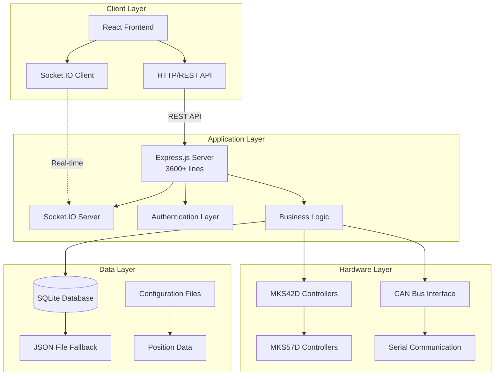
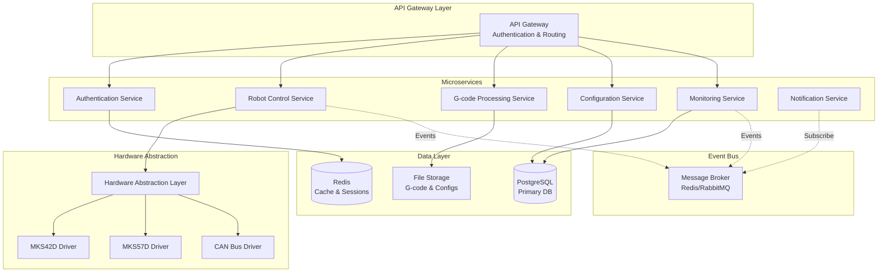

# System Architecture Analysis & Design

**Arctos Robot Controller - Comprehensive System Architecture Assessment**

_Generated by: System Architect Persona_  
_Date: 2025-01-27_  
_Target Application: /Users/jenna/code/arctos-robot-controller_

---

## Executive Summary

The Arctos Robot Controller exhibits a **sophisticated yet monolithic
architecture** with excellent real-time capabilities and comprehensive security
features. While the current system demonstrates strong engineering practices in
authentication, monitoring, and hardware integration, it requires architectural
evolution to achieve enterprise-scale reliability, maintainability, and
scalability.

**Key Findings:**

- ✅ **Strengths**: Real-time communication, comprehensive security, flexible
  deployment options
- ⚠️ **Critical Issues**: Monolithic structure (3600+ lines in server.js), mixed
  architectural patterns
- 🎯 **Opportunity**: Transform to microservices architecture with improved
  separation of concerns

---

## Current State Architecture Analysis

### 1. System Overview



### 2. Technology Stack Assessment

#### 2.1 Backend Architecture ⭐⭐⭐⭐⚪

- **Framework**: Node.js + Express.js (Excellent choice for real-time
  applications)
- **Real-time**: Socket.IO implementation (Outstanding real-time capabilities)
- **Database**: SQLite + Sequelize ORM with JSON fallback (Good for development,
  limited for production)
- **Authentication**: JWT + 2FA + bcrypt (Enterprise-grade security)
- **Logging**: Winston multi-transport logging (Professional implementation)

#### 2.2 Frontend Architecture ⭐⭐⭐⭐⭐

- **Framework**: React 18 + TypeScript (Modern, type-safe)
- **State Management**: React hooks + Context API (Appropriate for current
  scale)
- **Real-time**: Socket.IO client integration (Seamless real-time updates)
- **3D Visualization**: Three.js + React Three Fiber (Advanced 3D capabilities)
- **Responsive Design**: Mobile-optimized layout (Excellent UX consideration)

#### 2.3 Infrastructure & Deployment ⭐⭐⭐⭐⚪

- **Containerization**: Docker + Docker Compose (Production-ready)
- **Desktop App**: Electron integration (Cross-platform desktop support)
- **Process Management**: PM2 support (Production deployment consideration)
- **Security**: Comprehensive middleware stack (Enterprise security standards)

### 3. Architecture Patterns Analysis

#### 3.1 Current Patterns

- **Primary**: Monolithic 3-tier architecture
- **Communication**: Event-driven (Socket.IO) + REST API
- **Data Access**: Repository pattern (partially implemented)
- **Security**: JWT-based token authentication with role-based access control

#### 3.2 Pattern Consistency Issues

- **Mixed Data Access**: Both ORM (Sequelize) and direct file I/O
- **Inconsistent Error Handling**: Various error handling approaches across
  modules
- **Business Logic Scatter**: Domain logic mixed with infrastructure concerns

---

## Critical Architecture Issues

### 1. Monolithic Complexity 🚨 **HIGH PRIORITY**

**Issue**: Single 3600+ line server.js file handling multiple concerns

```javascript
// Current problematic structure
server.js contains:
- Authentication routes (150+ lines)
- Robot control logic (200+ lines)
- G-code processing (300+ lines)
- Configuration management (200+ lines)
- Real-time event handling (100+ lines)
- Database operations (scattered throughout)
```

**Impact**:

- Difficult maintenance and debugging
- High risk of introducing breaking changes
- Poor testability and code reusability
- Challenging team collaboration

### 2. Hardware Abstraction Coupling 🚨 **HIGH PRIORITY**

**Issue**: Tight coupling between business logic and hardware controllers

```javascript
// Problematic coupling example from server.js:1500+
if (mks42d && robotConfig.mks42d.enabled) {
  // Direct hardware calls mixed with business logic
  const results = await mks42d.moveAbsolute(
    controllerId,
    axisNumber,
    value,
    1000
  );
  // Business logic continues...
}
```

**Impact**:

- Difficult hardware abstraction testing
- Poor support for multiple robot types
- Inflexible hardware integration

### 3. Data Consistency Architecture ⚠️ **MEDIUM PRIORITY**

**Issue**: Mixed storage approaches (SQLite + JSON files)

- User data: SQLite database
- Configuration: JSON files
- Positions: JSON files
- Session data: JSON files

**Impact**:

- Data synchronization challenges
- Backup and recovery complexity
- Transaction integrity risks

### 4. Scalability Constraints ⚠️ **MEDIUM PRIORITY**

**Current Limitations**:

- Single-instance deployment model
- File-based session storage
- In-memory state management
- No horizontal scaling support

---

## Future State Architecture Design

### 1. Microservices Architecture Vision



### 2. Domain-Driven Design Implementation

#### 2.1 Domain Boundaries

```
Authentication Domain
├── User Management
├── Role-Based Access Control
├── Session Management
└── Two-Factor Authentication

Robot Control Domain
├── Motion Control
├── Position Management
├── Emergency Procedures
└── Hardware Communication

G-code Processing Domain
├── G-code Parsing & Validation
├── Execution Engine
├── Program Management
└── Coordinate Systems

Configuration Domain
├── Robot Profiles
├── System Settings
├── Hardware Configuration
└── User Preferences

Monitoring Domain
├── Performance Metrics
├── Error Tracking
├── Audit Logging
└── System Health
```

#### 2.2 Clean Architecture Implementation

```
┌─────────────────────────────────────────────┐
│              Presentation Layer              │
│  ┌─────────────────────────────────────────┐ │
│  │           React Frontend              │ │
│  │  ┌─────────────────────────────────┐   │ │
│  │  │        UI Components           │   │ │
│  │  └─────────────────────────────────┘   │ │
│  └─────────────────────────────────────────┘ │
└─────────────────────────────────────────────┘
┌─────────────────────────────────────────────┐
│              Application Layer               │
│  ┌─────────────────────────────────────────┐ │
│  │           Use Cases                   │ │
│  │  ┌─────────────────────────────────┐   │ │
│  │  │      Service Orchestration      │   │ │
│  │  └─────────────────────────────────┘   │ │
│  └─────────────────────────────────────────┘ │
└─────────────────────────────────────────────┘
┌─────────────────────────────────────────────┐
│               Business Layer                 │
│  ┌─────────────────────────────────────────┐ │
│  │          Domain Entities              │ │
│  │  ┌─────────────────────────────────┐   │ │
│  │  │      Business Rules             │   │ │
│  │  └─────────────────────────────────┘   │ │
│  └─────────────────────────────────────────┘ │
└─────────────────────────────────────────────┘
┌─────────────────────────────────────────────┐
│             Infrastructure Layer             │
│  ┌─────────────────────────────────────────┐ │
│  │       Database & External APIs         │ │
│  │  ┌─────────────────────────────────┐   │ │
│  │  │    Hardware Abstraction         │   │ │
│  │  └─────────────────────────────────┘   │ │
│  └─────────────────────────────────────────┘ │
└─────────────────────────────────────────────┘
```

### 3. Hardware Abstraction Layer Design

```typescript
// Proposed Hardware Abstraction Layer
interface RobotController {
  connect(): Promise<boolean>;
  disconnect(): Promise<void>;
  moveAbsolute(axis: Axis, position: number): Promise<MoveResult>;
  moveRelative(axis: Axis, distance: number): Promise<MoveResult>;
  getCurrentPosition(): Promise<Position>;
  executeGCode(gcode: string): Promise<ExecutionResult>;
  emergencyStop(): Promise<void>;
  getStatus(): Promise<ControllerStatus>;
}

class ControllerFactory {
  static create(
    type: ControllerType,
    config: ControllerConfig
  ): RobotController {
    switch (type) {
      case 'MKS42D':
        return new MKS42DController(config);
      case 'MKS57D':
        return new MKS57DController(config);
      case 'Generic':
        return new GenericController(config);
      default:
        throw new Error(`Unsupported controller type: ${type}`);
    }
  }
}
```

### 4. Event-Driven Architecture

```typescript
// Event-Driven Communication Pattern
interface RobotEvent {
  type: string;
  payload: any;
  timestamp: Date;
  source: string;
}

class EventBus {
  private subscribers: Map<string, Function[]> = new Map();

  subscribe(eventType: string, handler: Function): void;
  publish(event: RobotEvent): void;
  unsubscribe(eventType: string, handler: Function): void;
}

// Example Events
const events = {
  ROBOT_POSITION_CHANGED: 'robot.position.changed',
  GCODE_EXECUTION_STARTED: 'gcode.execution.started',
  EMERGENCY_STOP_TRIGGERED: 'emergency.stop.triggered',
  HARDWARE_ERROR_DETECTED: 'hardware.error.detected',
};
```

---

## Migration Strategy & Implementation Roadmap

### Phase 1: Foundation (Months 1-2) 🎯

**Objective**: Establish architectural foundation without breaking changes

#### 1.1 Modularization

- **Extract Authentication Module** from server.js
- **Create Hardware Abstraction Layer** interfaces
- **Implement Event Bus** for internal communication
- **Separate Configuration Management** into dedicated module

#### 1.2 Database Standardization

- **Migrate JSON data** to SQLite for consistency
- **Implement Repository Pattern** for data access
- **Add Transaction Support** for critical operations
- **Create Database Migration System**

#### 1.3 Testing Infrastructure

- **Add Unit Tests** for extracted modules
- **Implement Integration Tests** for API endpoints
- **Create Hardware Mock Layer** for testing
- **Set up CI/CD Pipeline** with automated testing

### Phase 2: Service Extraction (Months 3-4) 🎯

**Objective**: Extract major services while maintaining functionality

#### 2.1 Authentication Service

```typescript
// Extracted Authentication Service
class AuthenticationService {
  private userRepository: UserRepository;
  private sessionManager: SessionManager;
  private twoFactorAuth: TwoFactorAuth;

  async authenticateUser(credentials: LoginCredentials): Promise<AuthResult>;
  async validateToken(token: string): Promise<User | null>;
  async refreshToken(refreshToken: string): Promise<TokenPair>;
}
```

#### 2.2 Robot Control Service

```typescript
// Extracted Robot Control Service
class RobotControlService {
  private controllerManager: ControllerManager;
  private positionManager: PositionManager;
  private gcodeExecutor: GCodeExecutor;

  async moveRobot(moveCommand: MoveCommand): Promise<MoveResult>;
  async executeGCode(program: GCodeProgram): Promise<ExecutionResult>;
  async savePosition(position: RobotPosition): Promise<SaveResult>;
}
```

#### 2.3 Configuration Service

```typescript
// Extracted Configuration Service
class ConfigurationService {
  private configRepository: ConfigRepository;
  private validator: ConfigValidator;

  async getRobotConfig(): Promise<RobotConfig>;
  async updateRobotConfig(config: Partial<RobotConfig>): Promise<UpdateResult>;
  async validateConfig(config: RobotConfig): Promise<ValidationResult>;
}
```

### Phase 3: Microservices Architecture (Months 5-6) 🎯

**Objective**: Complete transformation to microservices

#### 3.1 Service Communication

- **Implement Message Broker** (Redis/RabbitMQ)
- **Add Circuit Breakers** for resilience
- **Implement Service Discovery** mechanism
- **Create API Gateway** for unified access

#### 3.2 Data Consistency

- **Implement Distributed Transactions** where necessary
- **Add Event Sourcing** for audit trails
- **Create Data Synchronization** mechanisms
- **Implement Conflict Resolution** strategies

#### 3.3 Deployment & Operations

- **Containerize Individual Services**
- **Implement Service Health Checks**
- **Add Distributed Logging & Monitoring**
- **Create Automated Deployment Pipeline**

---

## Architecture Decision Records (ADRs)

### ADR-001: Migrate from Monolithic to Microservices Architecture

**Status**: Proposed  
**Decision**: Adopt microservices architecture to improve maintainability,
scalability, and team productivity  
**Rationale**: Current monolithic structure (3600+ lines) is becoming
unmaintainable  
**Consequences**:

- ✅ Improved maintainability and testability
- ✅ Better team collaboration and parallel development
- ✅ Enhanced scalability and deployment flexibility
- ❌ Increased operational complexity
- ❌ Network latency between services

### ADR-002: Implement Hardware Abstraction Layer

**Status**: Proposed  
**Decision**: Create unified hardware abstraction layer for robot controller
integration  
**Rationale**: Current tight coupling makes hardware integration inflexible  
**Consequences**:

- ✅ Support for multiple robot types
- ✅ Improved testability with mock hardware
- ✅ Easier integration of new hardware
- ❌ Initial development complexity
- ❌ Potential performance overhead

### ADR-003: Standardize Data Storage on PostgreSQL

**Status**: Proposed  
**Decision**: Migrate from mixed storage (SQLite + JSON) to PostgreSQL  
**Rationale**: Need for better data consistency, ACID transactions, and
scalability  
**Consequences**:

- ✅ Better data integrity and consistency
- ✅ Advanced querying capabilities
- ✅ Better backup and recovery options
- ❌ Increased infrastructure complexity
- ❌ Learning curve for team

### ADR-004: Implement Event-Driven Architecture

**Status**: Proposed  
**Decision**: Use event-driven patterns for service communication  
**Rationale**: Need for loose coupling and real-time responsiveness  
**Consequences**:

- ✅ Loose coupling between services
- ✅ Better scalability and resilience
- ✅ Real-time event processing
- ❌ Debugging complexity
- ❌ Message ordering challenges

---

## Quality Attributes Assessment

### Performance 📊

**Current**: ⭐⭐⭐⭐⚪ (Good)

- Real-time Socket.IO communication: Excellent
- Database performance: Good for current scale
- Memory usage: Moderate due to single process

**Future Target**: ⭐⭐⭐⭐⭐ (Excellent)

- Horizontal scaling capability
- Distributed caching with Redis
- Optimized database queries and indexing

### Scalability 📈

**Current**: ⭐⭐⚪⚪⚪ (Limited)

- Single instance deployment
- File-based session storage
- No horizontal scaling support

**Future Target**: ⭐⭐⭐⭐⭐ (Highly Scalable)

- Microservices with independent scaling
- Load balancing and service discovery
- Distributed session management

### Maintainability 🔧

**Current**: ⭐⭐⚪⚪⚪ (Challenging)

- 3600+ line monolithic file
- Mixed architectural patterns
- Limited test coverage

**Future Target**: ⭐⭐⭐⭐⭐ (Highly Maintainable)

- Clear separation of concerns
- Comprehensive test coverage
- Clean architecture principles

### Reliability 🛡️

**Current**: ⭐⭐⭐⭐⚪ (Good)

- Comprehensive error handling
- Robust authentication system
- Good logging infrastructure

**Future Target**: ⭐⭐⭐⭐⭐ (Highly Reliable)

- Circuit breakers and bulkheads
- Distributed fault tolerance
- Advanced monitoring and alerting

### Security 🔒

**Current**: ⭐⭐⭐⭐⭐ (Excellent)

- JWT authentication with 2FA
- Role-based access control
- Comprehensive security middleware
- Rate limiting and input validation

**Future Target**: ⭐⭐⭐⭐⭐ (Maintain Excellence)

- Zero-trust security model
- Service-to-service authentication
- Advanced threat detection

---

## Technology Recommendations

### Backend Stack Evolution

```yaml
Current → Future:
Express.js Monolith → Express.js Microservices + API Gateway
SQLite + JSON → PostgreSQL + Redis
File Sessions → Distributed Sessions
Winston Logging → ELK Stack (Elasticsearch, Logstash, Kibana)
```

### Infrastructure & DevOps

```yaml
Recommended Stack:
  - Container Orchestration: Kubernetes or Docker Swarm
  - Message Broker: Redis Streams or RabbitMQ
  - API Gateway: Kong or Ambassador
  - Service Mesh: Istio (for advanced deployments)
  - Monitoring: Prometheus + Grafana
  - Log Aggregation: ELK Stack or Fluentd
```

### Development & Testing

```yaml
Recommended Tools:
  - API Testing: Jest + Supertest
  - Load Testing: k6 or Artillery
  - Contract Testing: Pact.js
  - Infrastructure as Code: Terraform or Ansible
  - CI/CD: GitHub Actions or GitLab CI/CD
```

---

## Risk Assessment & Mitigation

### High-Risk Areas 🔴

#### 1. Hardware Integration Complexity

**Risk**: Disruption to existing hardware communication during refactoring  
**Mitigation**:

- Implement comprehensive hardware mocking layer
- Parallel implementation with gradual cutover
- Extensive hardware integration testing

#### 2. Real-time Communication Reliability

**Risk**: WebSocket connection stability in distributed architecture  
**Mitigation**:

- Implement connection pooling and failover
- Add message persistence and replay capabilities
- Use proven technologies (Socket.IO clustering)

#### 3. Data Migration Complexity

**Risk**: Data loss or corruption during migration from JSON to database  
**Mitigation**:

- Comprehensive backup strategy
- Parallel data validation systems
- Gradual migration with rollback capabilities

### Medium-Risk Areas 🟡

#### 1. Team Learning Curve

**Risk**: Development velocity impact during architecture transition  
**Mitigation**:

- Comprehensive training program
- Gradual responsibility transfer
- External consultants for knowledge transfer

#### 2. Performance Degradation

**Risk**: Temporary performance issues during transition  
**Mitigation**:

- Performance monitoring throughout migration
- Load testing at each phase
- Capacity planning and resource optimization

---

## Success Metrics & KPIs

### Technical Metrics

- **Code Maintainability**: Cyclomatic complexity < 10, Test coverage > 85%
- **Performance**: API response time < 200ms, Real-time event latency < 50ms
- **Reliability**: System uptime > 99.5%, Error rate < 0.1%
- **Scalability**: Support for 100+ concurrent users, Horizontal scaling
  capability

### Business Metrics

- **Development Velocity**: Feature delivery time reduction by 40%
- **Bug Reduction**: Production defects reduction by 60%
- **Team Productivity**: Developer satisfaction increase by 50%
- **System Flexibility**: Time to integrate new hardware reduced by 70%

---

## Conclusion

The Arctos Robot Controller demonstrates excellent technical capabilities but
requires architectural evolution to achieve enterprise-scale requirements. The
proposed migration from monolithic to microservices architecture, combined with
improved separation of concerns and modern DevOps practices, will transform the
system into a maintainable, scalable, and resilient platform.

**Immediate Actions Required:**

1. **Begin Phase 1** modularization within 30 days
2. **Establish testing infrastructure** for safe refactoring
3. **Create detailed service boundaries** and API contracts
4. **Plan team training** for architectural patterns

**Expected Outcomes:**

- 40% improvement in development velocity
- 60% reduction in production defects
- Enhanced support for multiple robot types
- Improved system reliability and maintainability

The architectural transformation will position Arctos Robot Controller as a
leading platform in the industrial robotics control space, capable of supporting
enterprise-scale deployments while maintaining the excellent real-time
capabilities that make it unique.

---

_This analysis provides a comprehensive roadmap for architectural evolution. The
recommendations balance technical excellence with practical implementation
considerations, ensuring successful transformation while minimizing business
disruption._
