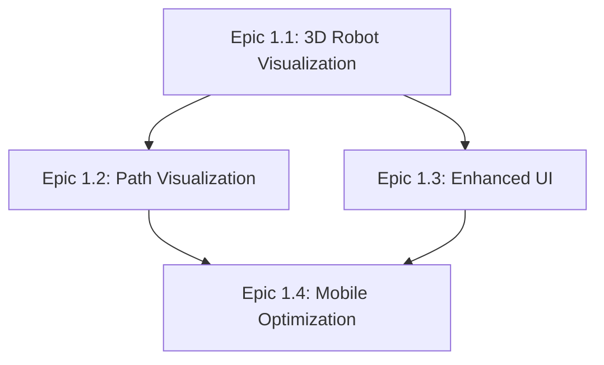
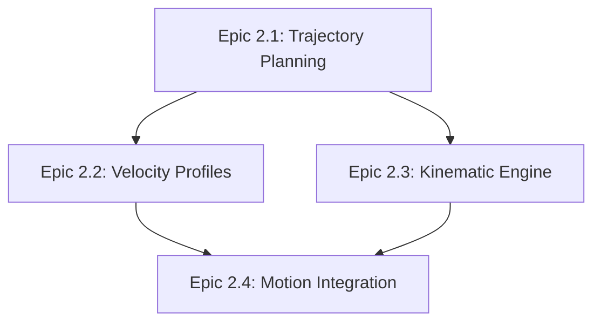
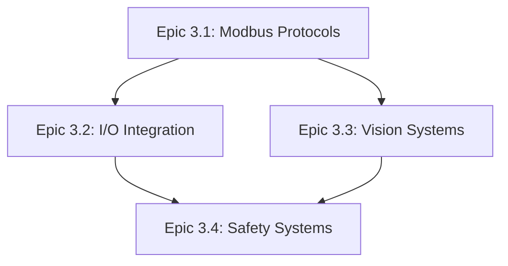
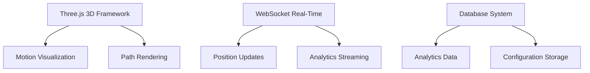

# Work Breakdown Structure - Task Dependencies Matrix

## Epic Context

**Complete Project Dependencies Analysis**  
**All Phases: 1-6 Comprehensive Dependency Mapping**

## Dependency Management Framework

### Critical Path Analysis

The critical path determines the minimum project duration and identifies tasks
that cannot be delayed without affecting the overall timeline.

### Primary Critical Path (18 months)

```
Phase 1 (3D Visualization) → Phase 2 (Motion Control) → Phase 4 (Analytics) → Phase 5 (Production) → Phase 6 (Platform)
```

### Parallel Development Opportunities

Phase 3 (Industrial Integration) can run parallel with Phase 2 after Phase 1
completion.

## Phase-Level Dependencies

### Phase 1: 3D Visualization & User Experience

**Prerequisites**: None (can start immediately)  
**Duration**: Months 1-3  
**Dependent Phases**: All subsequent phases depend on 3D foundation

#### Epic Dependencies within Phase 1



### Phase 2: Advanced Motion Control

**Prerequisites**: Phase 1 completion (3D visualization framework)  
**Duration**: Months 4-9  
**Dependent Phases**: Phase 4, 5 depend on motion control data

#### Epic Dependencies within Phase 2



### Phase 3: Industrial Integration & Hardware

**Prerequisites**: Phase 1 completion (3D framework for visualization)  
**Duration**: Months 6-12  
**Parallel Opportunity**: Can run parallel with Phase 2 after month 6

#### Epic Dependencies within Phase 3



### Phase 4: Analytics & Intelligence

**Prerequisites**: Phase 2 completion (motion data) + Phase 3 sensors  
**Duration**: Months 10-15  
**Data Requirements**: Minimum 3 months operational data

### Phase 5: Production Workflows & Enterprise

**Prerequisites**: Phases 2, 3, 4 completion for complete integration  
**Duration**: Months 13-18  
**Integration Requirements**: All core systems operational

### Phase 6: Platform & DevOps Infrastructure

**Prerequisites**: Core functionality stable (Phases 1-5)  
**Duration**: Months 16-18  
**Focus**: Operational excellence and scalability

## Story-Level Dependencies

### High-Priority Story Dependencies

#### 1.1.1.1 → 1.1.1.2 → 1.2.1.1

**Dependency Chain**: 3D Model → Real-Time Updates → Path Visualization  
**Reasoning**: Each builds upon previous visualization capability  
**Risk**: Delays cascade through entire visualization system

#### 2.1.1.1 → 2.1.1.2 → 2.2.1.1

**Dependency Chain**: Polynomial Trajectories → Splines → S-Curve Profiles  
**Reasoning**: Mathematical foundation → Advanced algorithms → Real-time
application  
**Risk**: Complex mathematics requires sequential validation

#### 3.1.1.1 → 3.1.1.2 → 3.2.1.1

**Dependency Chain**: Modbus RTU → Modbus TCP → Digital I/O  
**Reasoning**: Protocol foundation → Network extension → Device integration  
**Risk**: Hardware compatibility issues affect entire industrial integration

## Cross-Phase Dependencies

### Phase 1 → Phase 2 Dependencies

- **3D Framework**: Motion visualization requires 3D rendering infrastructure
- **Real-Time System**: Motion control needs real-time update capabilities
- **UI Integration**: Motion controls integrate with established UI framework

### Phase 1 → Phase 3 Dependencies

- **Visualization**: Industrial device status requires 3D visualization
  framework
- **Dashboard**: I/O monitoring integrates with established dashboard system
- **Configuration**: Device setup uses established configuration UI patterns

### Phase 2 → Phase 4 Dependencies

- **Motion Data**: Analytics requires motion execution data for ML training
- **Performance Metrics**: Predictive models need motion performance history
- **Real-Time Stream**: Analytics dashboard needs live motion data feeds

### Phase 3 → Phase 4 Dependencies

- **Sensor Data**: ML models require sensor data from industrial integration
- **Device Status**: Analytics includes industrial device health monitoring
- **I/O Events**: Event correlation requires industrial I/O integration

### Phases 2,3,4 → Phase 5 Dependencies

- **Motion Control**: Production workflows require advanced motion capabilities
- **Industrial I/O**: Manufacturing integration needs complete I/O support
- **Analytics**: Quality control requires predictive analytics capabilities

## Technical Dependencies

### Technology Stack Dependencies



### External Library Dependencies

- **Three.js**: All 3D visualization features depend on Three.js framework
- **ML Libraries**: TensorFlow.js/PyTorch for predictive analytics
- **Modbus Libraries**: Industrial integration depends on protocol libraries
- **Math Libraries**: Advanced motion control requires numerical computation
  libraries

### Hardware Dependencies

- **RS485 Interface**: Modbus RTU communication requires hardware interface
- **Sensor Integration**: Analytics requires sensor data collection hardware
- **Performance Requirements**: Real-time features require adequate computing
  resources

## Risk Assessment by Dependency

### High-Risk Dependencies (Project Critical)

1. **Phase 1 Foundation Risk**: All phases depend on 3D visualization foundation
   - **Impact**: Project failure if Phase 1 fails
   - **Mitigation**: Phase 1 priority focus, expert resources, early prototyping

2. **Motion Control Mathematics Risk**: Complex algorithms affect multiple
   phases
   - **Impact**: Precision manufacturing market entry failure
   - **Mitigation**: Mathematics expert consultant, incremental validation

3. **Real-Time Performance Risk**: Multiple phases depend on real-time
   capabilities
   - **Impact**: System performance degradation affects user experience
   - **Mitigation**: Performance testing throughout, optimization expertise

### Medium-Risk Dependencies

1. **Hardware Integration Risk**: Industrial features depend on hardware
   availability
   - **Impact**: Delayed market entry to industrial segment
   - **Mitigation**: Early hardware procurement, alternative supplier
     identification

2. **Data Quality Risk**: Analytics depend on sufficient training data
   - **Impact**: Reduced ML model accuracy affects predictive capabilities
   - **Mitigation**: Early data collection, synthetic data generation

3. **Integration Complexity Risk**: Late phases require multiple system
   integration
   - **Impact**: Extended testing and debugging phases
   - **Mitigation**: Incremental integration, comprehensive testing framework

## Mitigation Strategies

### Dependency Management Process

1. **Weekly Dependency Review**: Team assessment of dependency status and risks
2. **Monthly Stakeholder Update**: Formal dependency impact communication
3. **Quarterly Architecture Review**: Long-term dependency validation and
   adjustment
4. **Continuous Risk Monitoring**: Automated dependency tracking and alerting

### Parallel Development Strategies

1. **Interface Definition**: Early API and interface definition enables parallel
   work
2. **Mock Implementation**: Mock services enable dependent work to proceed
3. **Incremental Integration**: Continuous integration reduces integration risk
4. **Feature Flags**: Enable controlled rollout of dependent features

### Contingency Planning

1. **Alternative Approaches**: Technical alternatives for high-risk dependencies
2. **Scope Reduction**: Minimum viable features if dependencies fail
3. **Timeline Adjustment**: Schedule buffers for critical dependency paths
4. **Resource Reallocation**: Flexible team assignment based on dependency
   priorities

## Success Metrics for Dependency Management

### Dependency Health Indicators

- **Dependency Satisfaction Rate**: 95%+ dependencies met on schedule
- **Critical Path Adherence**: Zero critical path delays >1 week
- **Integration Success Rate**: 90%+ first-time integration success
- **Risk Mitigation Effectiveness**: 100% high-risk dependencies have active
  mitigation

### Early Warning Systems

- **Dependency Dashboard**: Real-time visualization of dependency status
- **Automated Alerts**: Early warning for dependency delays or failures
- **Impact Analysis**: Automatic calculation of downstream delay impacts
- **Escalation Process**: Clear escalation for dependency failures

## Conclusion

This comprehensive dependency analysis ensures:

1. **Clear Understanding**: All team members understand dependency requirements
2. **Risk Management**: Proactive identification and mitigation of dependency
   risks
3. **Parallel Optimization**: Maximum parallel development while respecting
   dependencies
4. **Timeline Protection**: Critical path protection through focused dependency
   management
5. **Quality Assurance**: Dependencies validated through comprehensive testing

The dependency framework enables successful delivery of the complete 547 story
point project within the 18-month timeline while minimizing risks and maximizing
development efficiency.
